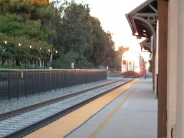

Every journey begins with a single step, and this journey began with a very familiar one. The first leg of my travel to China took me through Harvey Mudd College, to tie up loose ends, see old friends, and most importantly to prevent those friends from auctioning away all of the crap that I left in their storage room. The dorm was in great shape. Somehow, with our class out of the way, the dorm has become clean and strangely presentable, although I did my best to clutter the common area with all of my wordly belongings. Hopefully, it will be back to its old ways once dry week ends.

The next day I headed off to LAX for my 15-hour flight to Guangzhou, China. Now, even the shortest car ride in Los Angeles is unpredictable, at best. Public transportation, on the other hand, is extremely reliable--every ride is expected to be slow, frustrating, even dangerous. I'm happy to report, though, that this trip was one of the most pleasant I've ever experienced. The metrolink ride from Claremont to Union Station in East LA was a relaxing 40-minute jaunt. It's hard to express the joy of passing gridlocked traffic on the 10 Freeway atop a double-decker Amtrak train clipping along at 70mph. Even the trip from Union Station to LAX, which used to require several cumbersome connections, was delightfully easy thanks to the new FlyAway Bus service. Anyone going from HMC to LAX should definitely consider this option--it's stress-free, takes roughly two hours, and costs only about $10.

The 15-hour trip from LAX to Guangzhou Baiyun International Airport was easily tolerable (which is the best that could be hoped for), and the Guangzhou airport itself was indescribably opulent. The airport was built in 2004 at a cost of $2.5 billion US, and is five times larger than its predecessor. By 2009, the airport will double in size yet again. The construction was of a quality that I've never witnessed in the US, the facilities were clean, and the employees remarkably pleasant. It's hard to believe how quickly China--parts of it, at least--has modernized.

Soon, I was on a brief plane ride to Guilin--more on that, hopefully with pictures, in my next post.
