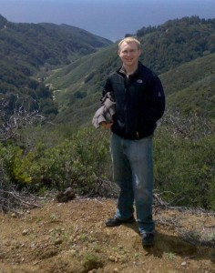
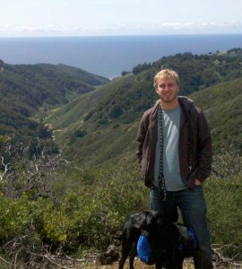
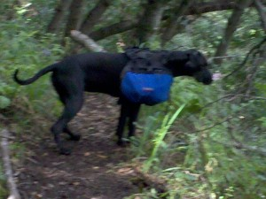

 Although the road trip hasn't technically started yet, I might as well keep the blog updated so I don't fall out of the habit. In this edition: Dan Strenge, Big Sur, moving out, and a final weekend in San Jose.  
  
Dan (a Harvey Mudd friend) just finished a 1 week trip up and down the West Coast, all the way to Seattle (I believe). He spent the next few days hanging in Berkeley (where Jaclyn and I visited him), and then came down to see me in Menlo Park. Being an awesome guy, he spent an entire night helping me move out of my apartment. Then, since neither of us had a place to stay, we headed down to Big Sur.  
  
  
Had a great hike out to the ocean from Big Sur Station with the dog (see images at right). One highlight was when the dog climbed under a sturdy wood fence and then lost her collar and her backpack (including all of our food) in a thorn thicket. I hopped the fence and found the backpack, but not the collar.  
  
  
We spent a night in Santa Cruz, a town that I'm growing increasingly fond of. Then, Dan headed back to Berkeley to play some weird board game that I cannot pronounce, and I spent the weekend with Jaclyn at her house.  
  
All in all, the homelessness is going quite well. But, today I plan to finally start the real road trip, and probably sleep somewhere near Tahoe or Reno. Possibly in Donner pass? That'd be cool.  
  
I'll try my best to keep this thing updated.  
  
  

