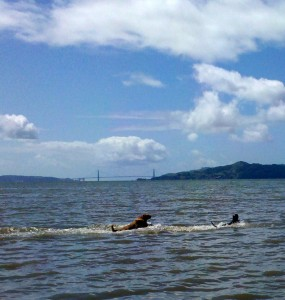

Today, the day of the big first step of my trip, finally came. I feel sad to be leaving so many people and memories (even if it is, hopefully, temporary), but I also feel wonderful and free to be finally moving again.  
  
I began the day running errands and selling the last of my stuff. I still wasn't sure if I was going to leave today, but ultimately I just couldn't stay any longer. I hate goodbyes, so I mostly just didn't say any (sorry to anyone who I missed!!) and took off.  
  
I stopped at Point Isabel just North of Berkeley. It's, I believe, the most popular dog park in the country. There's not even really an official "start" to it... there just seems to be more and more dogs the further into it you drive. Maddy had an awesome time and swam so far out into the bay that a small crowd gathered to watch her. To the let is her playing with a friend, with the golden gate bridge in the background.  
  
With the dog tired out, I headed off towards Reno. Wow, does California have highways. Even out past Sacramento the I-80 has six lanes on a side. Who lives out there? But, the highway got smaller as I approached the Sierra Nevadas, and just about the time it got down to 2 lanes on a side, there was a drastic change from rolling grassy hills to steeper, craggy little peaks with conifers. I just love that look--it seems so strangely clean and pristine.  
  
Up around 3000 ft, we started to run into a bit of snow. It got increasingly bad around Donner pass (named for the infamous Donner Party) just before Truckee. I stopped at a rest stop so that Maddy could see snow for the first time, but both of us were too turned off the by frigid temperature and wind to enjoy it. Then, I had quite a time merging back onto the highway with the snow; I need to get new tires before I hit snow again.  
  
Maddy finally got to really see snow at Boca Reservoir, a gorgeous reservoir that I happened across just East of Truckee. The video is below; the highlight is at 1:35 when she jumps into the water after a duck. I don't think she's ever seen cold water before, so it must have been quite a surprise. She was shivering pretty bad by the time she got back.  
  
  
  
  
  
I ate at a Denny's in a big ugly Casino. This was a really, really dumb move. I just don't get casinos. All the games are fixed so that you lose. But, worse, they're sooo loud and sooo overstimulating. I decided to deal with Denny's and the Disney-World ambiance of the casino because the food deal was so good, but I won't make that mistake again. There's an Indian buffet and an all-y0u-can-eat sushi restaurant adjoining my motel, and I sorely regret not being hungry.  
  
Motel cost: $29.99 (no pet fee). $2.99 for wifi, which pisses me off. It's not even good wifi, although I guess I'm pretty spoiled in that respect.  
  
Selected Media from the car ride:  
1) Part I of the audiobook "[The Art of Mindful Living](http://www.amazon.com/Art-Mindful-Living-Compassion-Nonfiction/dp/1615877436/ref=sr_1_1?ie=UTF8&s=books&qid=1270527976&sr=8-1)" by Thich Nhat Hanh. At first, his books always seem simplistic to me. But, in the end, the ideas he's talking about are simple, and his way of phrasing them does seem to stick with me.  
2) The first half of the episode ["Nummi"](http://www.thisamericanlife.org/radio-archives/episode/403/nummi) of the show This American Life. It's about the joint GM-Toyota car plant in Nummi, started in 1984, and how (a) it was so successful, but (b) GM didnt' seem to learn any lessons from it. Nummi was in Fremont, CA, and it was \*just\* shut down a few days ago (it was all over the news). I highly recommend the episode (downloadable from their site).  
  
Still trying to decide what to do tomorrow... might start heading towards Salt Lake, or might double back and spend some time at a campground in the Sierra Nevadas. I'm kindof leaning towards the former, since I'd like to get some miles under my belt before I start diddling around.
