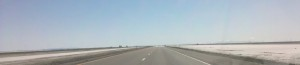
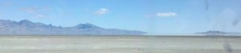

I could've pushed on to Salt Lake last night, but didn't want to miss the experience of seeing the Bonneville Salt Flats, a huge, incredibly flat dried lake bed (made essentially of salt). It's where most landspeed records are set, although I wonder why people aren't looking for areas at higher elevation to set these records (it seems that ~100% of your power goes to air resistance, so why not minimize it?)

Anyways, the image below is a side view of the distant mountains. At first, I thought that the reflections below the mountains were from a very, very still lake; in retrospect, I'm pretty sure that they were mirages because I've never seen reflections so perfect. I wish I had a good camera that could convey the effect, because the reflected image was virtually identical to the real one.

