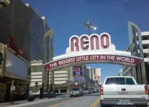
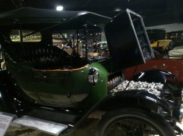
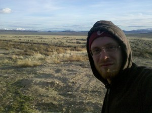

  
  
Today, I mostly just drove. I'm trying to write less, and post better pictures, so I'll keep it short. Had a nice time rollerblading the dog around a lake (Lake Victoria?) when I woke up, and I took my time cleaning the car and organizing my crap.  
  
Although I managed almost completely avoid Reno's casinos, I did take the morning to visit the National Automobile Museum near downtown Reno. You wouldn't expect it, but it's actually a really wonderful museum. It was cool to see how cars went from tiny little one-horsepower carriages in 1900 to full-fledged, almost modern cars by 1920. From then on, it seemed like they just got cheaper, more reliable, and more boring.  
  
Below is a "Detroit Electric" from around 1915--it was pretty popular in its day. You can see the lead-acid batteries under the front hood. It got something like 70 miles on a charge--I'll be impressed if the new Chevy Volt can manage that.  
  
  
  
  
I pushed through the rest of Nevada. Quite an amazing state. Near about 2/3 of the way through it, the hills turned grassy and much more rolling, and even the smaller mountains were snow covered. It reminded me a lot of the Tibetan Plateau... certainly not the same scale, but kindof the same desolate feeling.  
  
  
  
Tomorrow is Salt Lake City. I want to find a campground and spend a full day or maybe more just hanging out, hopefully near a lake.  
  
Media from the car ride: A few chapters of "Brave New World". I just can't get into Fiction audiobooks... how does anyone pay attention to them? I keep losing the story.  
  
Also: A great Phish concert, and a few chapters of a book by the Dalai Lama.
