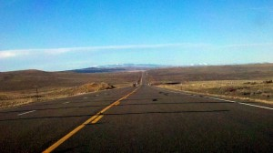
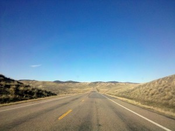
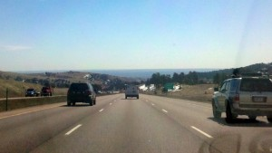
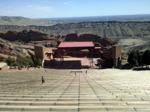
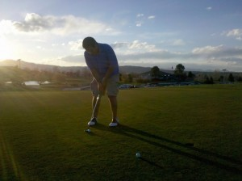
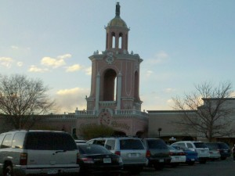

Taking Highway 40 was an excellent choice. The lame thing about driving cross country in a car, with a dog, is that it's much harder to meet people than with public transportation. Plus, I can't stay in hostels (no dogs) or do anything that means leaving the car for more than a couple of hours.

But, taking less-traveled roads means (1) seeing restaurants, etc. that aren't attached to oversized gas stations, (2) actually being able to slow down and see things that interest you, and (3) having an excuse to talk to the locals about which roads to take, what's passable this time of year, and which ones are most scenic. For some reason, people (especially dudes) just love to talk about roads.

Highway 40 cut 100 miles off my drive from SLC to Denver (550 --> 450 miles), but added a couple of hours. It was wwaayyy cooler than driving through Wyoming (reportedly a "wasteland").  
  
  
I camped near Hot Sulphur Springs (2 hours outside of Denver). It was ass cold, just 21 degrees. Unbelievably, Maddy actually slept with me in my backpacking hammock. The more you know about backpacking hammocks, the more you realize how ridiculous that is. Eventually, we were too cold and cramped, so we moved into the car which was a much better idea.

The next day I made it to Denver. The view coming out of the mountains was amazing; it's not terribly clear in this picture, but it's an incredibly abrupt change from 12,000-ft peaks to perfectly flat plains.

  
Near the bottom of the mountain slope is Redrock Ampitheater, which is kindof naturally built into the mountain and is surrounded by a beautiful, unreal-looking formations of red rock.

  
I met up with my grad school friend Dan Gonzales. We played a beautiful, reasonably priced round of golf.

Afterwards I was starving and we went to Casa Bonita, of South Park fame:

  
It was totally awesome, better than I ever expected it. The food gave me such a stomach ache that I could hardly sleep, but that's definitely part of the experience.
