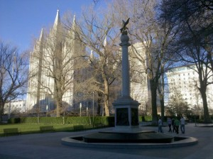

I was really excited about Salt Lake City. I figured, since these people don't drink, smoke, or seemingly do any of the things that take up most of the energy of a big city, they must have lots of fun non-bar stuff to do. It turns out that, in fact, they just spend most of their energy building temples and trying to convert you.

  
Plus, everything has a generally creepy vibe to it. However, I did love their depiction of blonde, white jesus posing with demi moore:

  
And, my favorite part, Wasatch High School had perhaps the most fitting mascot ever:  
  
Altogether, Salt Lake was a bit of a disappointment. For a city that hosted the olympics and has such natural beauty around it, it just was a bit of an underwhelming experience. Plus, the Mormon visitors centers really toned down the ridiculousness. No exhibits of their special underwear, no statues of Jesus with the native americans, etc. I had some overpriced sushi, talked with some locals for a while, and decided to leave I-80 for highway 40, which is a shorter but much slower route to Denver. I'd planned to spend a few nights in Salt Lake, but couldn't muster the willpower to stay there any longer.
