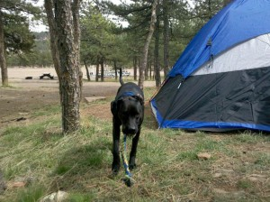
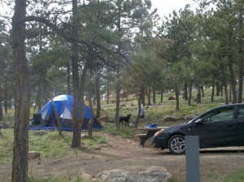

After hanging out with Dan on Saturday, I checked into an awesome motel called the Silver Saddle in Boulder. It was $60/night, which is way beyond my price range, but Boulder seems to be one of those cities that has strategically purged of itself of anything that's reasonably priced or convenient.

I spent most of the day in and out of sports bars, watching Tiger be an extra big tool while Phil Mickelson put on an awesome show to win the Masters. Boulder is an awesome city, and they've done a great job building lots of hiking paths and parks which Maddy and I enjoyed. I must say that I was surprised how in some ways commercial Pearl Street was; all the bars were basically Gordon Biersch lookalikes, and most of the clothing stores were quite pricey. But, then, I'm sure the cooler places are a bit hidden.

I wanted to take some time to relax, read, and hike, so I decided to spend two nights at Carter Lake reservoir, about an hour north of Denver.

  
I knew it wasn't the greatest scenery, but after getting bitch-slapped by mother nature on the way to Denver, I wanted to camp at a more reasonable elevation. Throw in the water, good fishing, and the fact that there wouldn't be any more mountains for about 1,000 miles, and I think it made sense.

  
Maddy loved it. I didn't catch any fish, but I had a great time reading and finally allowing myself to fully relax. By the end, I was really ready to get moving again (36 hours alone in the woods seems longer than it is).
