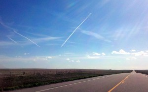
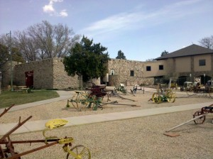
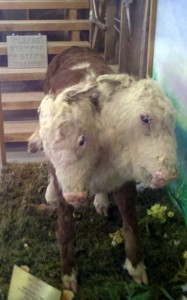

By Tuesday, I was chomping at the bit to get driving again. I drove 550 miles, and really enjoyed the breathtaking desolation of the scenery and the ease of the driving.  
  
For most of the way through Colorado, I took back-roads (still 65mph speed limit) bordering several national grasslands. Now, National Parks are places so beautiful that we've decided not to let anyone develop them; National Grasslands are places so desolate that nobody could really find a use for them, and consequently we've roped them off and allowed Buffalo and other herd animals to repopulate them. It was really cool to see such a large, desolate grassland, and to think how for eons much of the U.S. had looked that way.  
  
At one point, I happened upon the "Overland Trails History Museum".  
  
It was only $3 admission, and it was actually really, really cool. It had grown from a small WPA project in the 30s to a quite large museum, and in the process had become a bit unfocused. Basically, it just collected all the old crap that nobody wanted within a 30 mile radius, such as furniture, photos, and even entire houses; the back of it was a 13-building villages with in-tact barber shops, barns, farmhouses, and even railroad stations from the turn of the century. One of the most popular exhibits was a 2-headed calf; a sort of siamese twin that didn't last long after birth, but truly looks like a calf with 2 heads.  
  
The entire drive was absurdly windy. Winds were 35 mph, but I'm sure the gusts were up to 50mph or more, always coming from the South. Every time I passed a tree or a bridge which broke the wind, the car would lurch 3 ft to the left. I had to look ahead to make sure nothing was near the highway before I passed a Semi, as the crosswinds often pushed them into adjacent lanes. After 550 miles of that bullshit, I was definitely happy to rest for the night.
