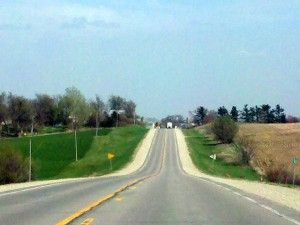
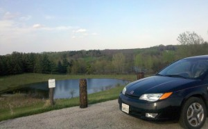
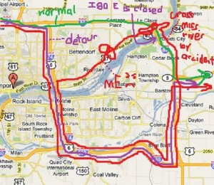
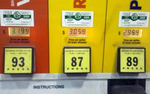

I've noticed that after driving the first thousand miles across country, the next 1500 seem to go really smoothly. Maybe that's why driving across the middle states isn't so bad--you just get in the mood to drive. But, if you actually live in these states you don't have time to warm up, and the 3 hour featureless drive to the nearest town must seem insurmountable. Maybe that's why everybody I talk to has barely left the town where they were born.

The scenery is getting better as I go further East, though. There are now more trees, and they have leaves. Maddy and I happened across a nice little park where she chased ducks and terrorized the locals.

  
We crossed the Mississippi near Davenport, but it didn't go so smoothly. Allow me to demonstrate with this diagram.

1) I was heading on I-80 E, but wanted to switch to I-88 so as to approach Chicago from the Northwest and avoid some of the trucking traffic.

2. The I-80 E bridge was closed, so I dutifully took the detour down I-74, cut back up I-80W to I-88.

3. Deciding that Maddy really should take a swim in the Mississippi (which is so pretty), I turned back towards it, but unbelievably, I missed the last exit and crossed the river. Because the Eastbound span was closed, I had to repeat the entire detour.

This was incredibly frustrating. It was getting late at night and I was traveling these completely unnecessary roads through featureless land for the second time, when I shouldn't have had to do it once.

The I-88, it turns out, is the more boring road in the world, especially at night. There wasn't a Motel-6 until near Chicago, and none of the motels I could find took pets. I found a sign for a roadjammer cafe in the middle of the wilderness, but it turned out to be biker night and it was completely packed and not at all a place to eat dinner.

I continued on and found a solitary gas station, which I went to. An enormous trucker entered in front of me, looked back as he was about to close the door, and then stopped, held it open, and when I said "thanks" he said "Absolutely, No Problem" with a huge smile. It was a bit unexpected.

As I walked through the aisles, I kindof nudged a 12-year-old kid out of the way who was loitering in an aisle. But, as I looked back, I realized he was actually a short guy, maybe 4' 6", probably 40 years old, wearing the same kind of clothes as 12 year old would. I felt really bad for misreading the situation.

Continuing on to get a snack, this enormous dude was just staring at the rotating pizza warmer. After a minute I asked him to move and, without taking his eyes off of the sausage pizza, just kindof shuffled to the side. After I'd taken a slice, he shuffled back.

As I was leaving, the woman who tended the pizza walked by; she was thin, with striking blond hair, but with the wrinkled skin of a 70-year-old and with a distinct gray beard, perhaps 1/4" long.

I felt like I was in a freak show. I went up to pay, and overheard that the (normal-looking) girl at the checkout had worked there for 4 years. Poor thing.

To make small talk, I asked her about something that puzzled me: the Premium fuel was a full 10 cents cheaper than the regular. She said that this is just "how it is around here."

  
She said it so nonchalantly that I had to press the issue. I pointed out that it wasn't an arbitrary distinction; the 89 octane is simply superior fuel. It is more scarce than the 87, and should cost more. It seemed confusing.

She responded that "Yeah, my boyfriend is from Connecticut, and there the premium is more expensive than the regular. It's weird." It was clear from her intonation that Connecticut had the weird situation. I was so tired and frustrated from my detour, and as she stared at me blankly, considering how weird Connecticut's gas prices are, I just broke down, laughing out loud at the ridiculousnss of the situation. Which, of course, caused the dwarf and the pizza-staring giant and the transgendered grandmother to stare at me, so I took a cue and left to go see my friend George Malikov in Chicago.
