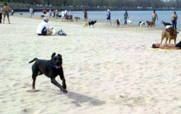
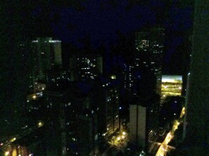
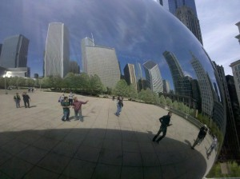
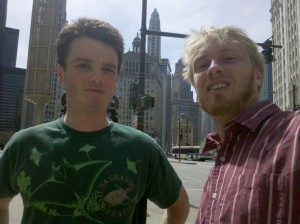
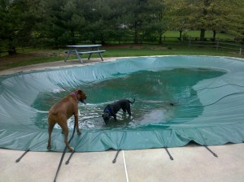
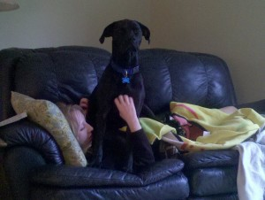

It’s unlikely that anyone is still following this, but for posterity's sake, I’ll note here that I did finally make it to Pennsylvania. I’ve been shuttling back and forth between Bethlehem and the Bay Area. Here are some broad-strokes highlights.

1. It was great to see George in Chicago (this was just after the Gas Station at the End of the Universe). Maddy and I went for an epic rollerblade where she nearly died of heat stroke (she literally couldn’t walk), and then she got some water and hammed it up at the dog park:

George convinced me to put Maddy in doggie daycare for the night (unbelievably, we managed to pull this off at 8pm in a new city). The view from George’s downtown apartment is incredible:

Chicago, overall, impressed me a lot. It reminded me of Manhattan. I’d have to say that I had no idea how big Chicago was until I got there. Here is a picture of me and George in front of a silver ball.

And, here is one without the giant ball.

I drove on through Cleveland, Ohio and western Pennsylvania, before finally reaching Bethlehem.

I think the East Coast is incredibly beautiful. But, to be honest, I was too tired of driving to really care anymore, and I wanted to get home. Now, Maddy has a big backyard to have adventures in, and tons of small animals to murder.

Plus, she can hang around with the other boxers, and sit on my sister Emily like she owns her.

Well, there’s been a lot that’s happened in my life since. Mostly, traveling a lot for job interviews and, finally, getting a job offer that I’m super excited about.

Now, I’m busy planning my final big adventure before settling into a 9-5. More on that in the next post!
