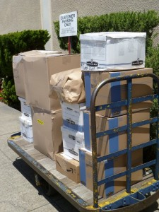

I accepted a job in New Hampshire and finally have a concrete plan, so I’m now off to India. I left on Tuesday 6/1, and I’ll be back on 7/1.

First off, I had to ship all of my stuff to Pennsylvania. Neither the post office, nor the people standing behind me in line, were thrilled about this choice. But hey, it was about 80% cheaper than using a moving company.

My plan is to head up North to Dharamsala (where the Dalai Llama and the Tibetan Government in Exile reside), then perhaps further Northwest to Leh (which is accessible only in the summer). Jaclyn will then meet in in Delhi around 6/17 and we’ll head down South to Agra, Goa, and Kerala (all beautiful cities).

Here is my provisional To-Do list:

THINGS TO DO

- Get professional golf lessons
- Play golf with a caddie
- Do a 3-day meditation retreat near Dharamsala
- Get a tattoo done the old way (w/out the little tattoo gun)
- Sleep overnight in a second-class sleeper train
- Get a custom-tailored suit

PACKING LIST

My backpack weighs 6 kg. It’s light enough to carry around all day without really noticing it.

Luggage

- Outdoor Products Skyline 8.0 Daypack ($30)
- Laptop lock from Fry’s to afix bag to hostel beds, etc.

Clothes

- 1 Pair convertible polyester pants/shorts
- 1 pair synthetic shorts
- 2 pair lightweight synthetic underwear (ExOfficio brand)
- Synthetic sleeveless shirt
- Synthetic T-shirt
- Synthetic long-sleeved button-up shirt w/ vented armpits, etc.
- Strap-on sandles (including strap behind heels) – no socks or sneakers.

Electronics

- Laptop (Asus UL-20A, a 12.1” laptop, 3.3 pounds, very reasonably priced. I love this laptop.)
- Laptop charger.
- Sansa Clip 4GB MP3 player
- Headphones
- Panasonic LUMIX DMC-FH20 (nice small camera, but with 8x zoom. It turns on (completely off –> taking a picture) in under 1 second, which I love) + charger

Bathroom

- Clear 1-quart bag containing:
- Shampoo
- Bodywash/soap
- Contacts case + 1 spare pair contact lenses
- 4 oz contact solution
- glasses
- tooth brush + small toothpaste
- small package of ~10 Face wipes
- Disposable razor
- Small deodorant stick

Meds, etc.

- Athletic Tape

Books

- The rough guide to India
- Lila (sequel to zen & the art of motorcycle maintenance)

Misc

- Eyemask and earplugs (for sleeping on planes & trains)

Identity, etc.

- Wallet (kept on my person) with:
  - Credit Card
  - Debit/ATM Card
  - Passport
  - List of contact info, insurance numbers, etc.
- Backup pouch in backpack with:
  - CA Driver’s license
  - Spare Debit/ATM Card
  - Paper copies of passport, contact info, insurance #s
  - Spare cash (Indian and American currencies)
- Additionally, I email myself images of all of the above.
