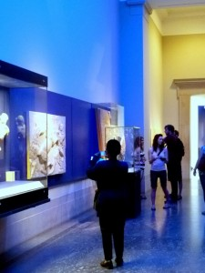
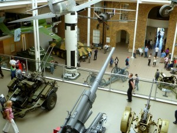
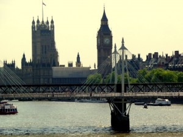
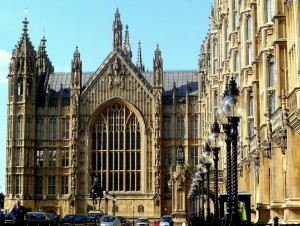
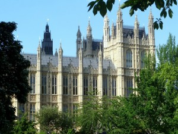

I was lucky enough to find  a cheap ticket on Virgin Atlnatic. In between consecutive 10-hr planeflights, I had a 11-hr stopover in London.

I rushed out through their very agreeable customs and boarded the _Piccadilly_ line towards _Cockfosters_ (“Cawk-Fahstehs”). I wisely _alighted_ the train downtown, being sure to _mind the gap_ (a phrase which I thought was annoying until I saw the size of the gap on the London underground—who built this thing?)

I visited the British National Museum. On the plus side, it was free. On the minus side, it was incredibly boring, filled mostly with Grecian Urns (seriously, it had room after room filled with urns. Who cares? Does anybody actually want to see more than one of these?)

_Way_ cooler was the National War Museum near Waterloo. They had real equipment (including huge artillery), tons of WWI and WWII memorabilia, and even a section that tried to recreate the WWI “Trench Experience”. It was _much_ better than Grecian urns.

I spent probably 7 hours of my 11 hour layover just walking, so that I could sleep on the next leg. London is very easy to walk through. Everywhere you go there are signs telling you where traffic is coming from (thank god). Plus, the subways are super clean and super safe. I noticed small things like, for instance, I could actually _hear_ the announcements on the train, and the route maps were _right_ where you expected them to be posted, and the trains were cleaned regularly. I got to wondering how we ever stopped expecting this in the US. In NY or even San Francisco, I can almost never hear the train operator through the crackly intercom. Why do we tolerate these types of problems?

My favorite buildings were the houses of parliament. I don’t know what style the architecture was, but it was arresting.

Then, it was back on the plane to Delhi (where I’m writing this right now). I am _rreeallllyyy_ done with being on a plane, and can’t wait to sit down and destroy my insides with some fattening and extremely spicy Lamb Korma.
