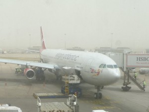
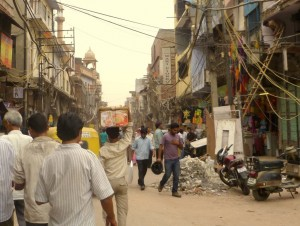
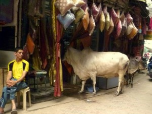
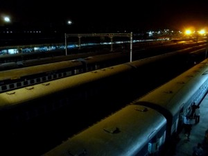
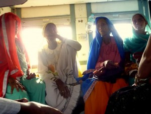
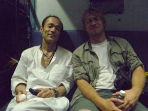
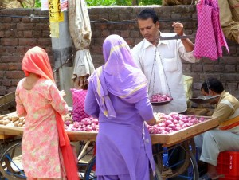
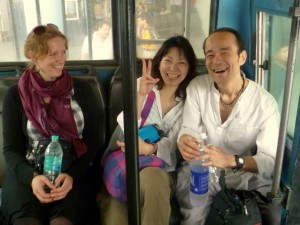
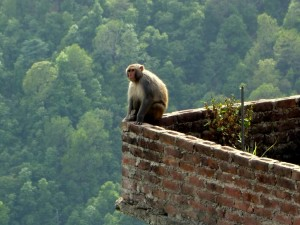

The last 20 minutes of the plane flight into Delhi, we were encapsulated in a thick yellow-gray smog. Delhi is in the middle of an epic heat wave, is enduring a 3-year drought, and is in the midst of an unusual sandstorm. The air smells alternately like death and curry.  

  
I nearly got scammed by a taxi driver at the airport (even the police were in on it), but soon met a fellow traveler (Karen) and we made it to the train station to buy tickets to Pathankot. Then, we walked round the nearby bazaar.  
It was incredibly squalid and everybody was trying to hustle and scam us. Just the type of place where you can’t trust anybody. The power lines are strung haphazardly from storefronts (apparently monkeys are regularly electrocuted on them) and the streets are filled with rubble. And, this is a _tourist_ area!  

  
The only ones treated with respect were the cows, which have free reign of the city.  

The bazaar was a crazy introduction to a crazy country, but at over 40 degrees (about 110 fahrenheit) and with air humid enough to cut with a knife, we were ready to get out. We got to the train station through Delhi’s marvelous subway. The station was a madhouse and had a bit of a WWII-blitzkrieg feel to it.  

  
The train itself was an 11-hour sleeper train (which arrived 2 hours late). For the first few hours everybody hangs out, talks, and eats (tons of vendors walk the cars). Then, the seat backs fold up and turn into bunks so everyone can sleep.  
  

  
  
Karen and I met a cool Japanese monk who was also on his way to Dharamsala, and his wife. He was very helpful.  
  

  
  
At one point the Nigerian guy in our compartment refused to turn off the overhead light, and nearly got in a fight with some nearby Indians. The police were very nearly called, and the whole situation was terribly embarrassing for the rest of us in the compartment.  
  
We then took a 3-hour bus ride towards from Pathankot to Dharamasala. The street was lined with vendors for nearly the whole drive.  
  

  
  
About 3 minutes from our final destination (Technically, Mcleod Ganj), the bus broke down. This was frustrating, but the shear timing (about 99.9 percent of our journey was done) was pretty entertaining.  
  

  
  
Mcleod Ganj is absolutely awesome, and is a very different speed than Delhi. Everybody seems totally trusting. I’ll cover this awesome area better in my next post, but for now, here’s a picture of a pensive monkey that was kicking it outside of the restaurant where we ate lunch.  

