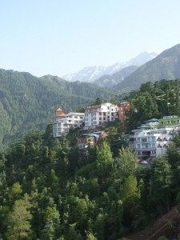
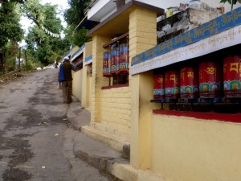
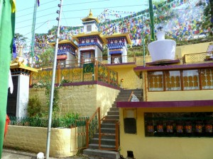
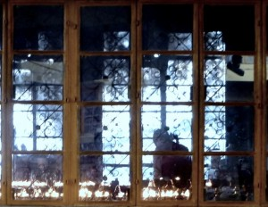
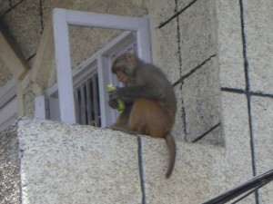

Dharamsala is a beautiful, relaxed, peaceful mountain town in the foothills of the himalayas.  
  
Being the home of the 14th Dalai Lama, it has a huge monastic presence. Most streets have prayer wheels which inhabitants turns as they walk by. Inside each canister are thousands of prayers, and turning a wheel is allegedly equivalent, in a karmic sense, to saying each prayer individually.  
  
Tibetan Buddhism is famous for its prayer flags (see below, rear) and the unique architecture of its monuments and temples.  I think the style is both magnificent and unpretentious.  
The nuns and monks are incredibly down-to-earth, kind, and unassuming, although their life is steeped in timeless and repetitive ritual.  
  
The energy of Dharmasala is so mellow and spiritual that you get a feeling when you arrive almost as if you suddenly found yourself talking very loudly in a quiet room. You kindof step back and question how you could be so high-strung in the first place.  
That energy also makes Dharmasala incredibly _easy_ to live in. All the merchants are honest, there is no real risk of crime or theft, prices are reasonable, and the town is easy to navigate. The downside of this is that you’re left wondering what to do with all your time.  
Perhaps the hardest part of this type of travel, for me, is just allowing myself to relax. I have a natural urge to make sure that I “do” everything there is to “do”, but such frenetic planning is so at odds with the vibe of this town that I just have to step back and relax. In a way, I think that over-planning and constant busyness are a way to ignore the tinge of loneliness and anxiety that comes with traveling alone in such a foreign place. Fighting the urge helps me to come to terms with those worries.  
Today, I fought the urge to jump on a bus and immediately travel somewhere else. Instead, I just calmly walked around. Within a couple of hours, I had accidentally managed to see the Dalai Lama (a rare treat!!), I’d met two very cool people who live right near my new job in New Hampshire, I’d signed up for a great class the next day, I’d stumbled upon an incredible path through the woods at just the right time of day, and I’d run into the Japanese monk from the train.  
I’m slowly learning that I need to have faith that I can ease up a bit and just let the day come to me, and everything will still be okay. It sounds like an easy lesson, but at least for me it’s difficult.  
Dharmasala is a great place to calm down and find some peace. But, I do want to move on soon.  
I’m considering an extremely long bus ride over the 2nd highest road in the world, to a Himalayan village called Leh. On the other hand, I may go into Kashmir which, though less remote, is far less touristy and which I expect will actually be a bit more tricky to accomplish. A third option might take me through Gaya to Calcutta, and up to Darjeeling, which is appealing because it can be done mostly with trains.  
While I consider the options, I will leave you all with another picture of a pensive monkey. Crazy monkeys.  

