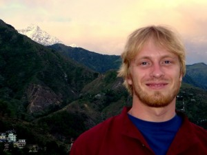

I’ve been in Dharamsala for a few days now, and may actually stay for at least 5 days more. I feel more serene than I think I ever have before and, with the last 2 weeks of the trip bound to be pretty crazy, I think that settling into Dharamsala for a bit might do me good.

At this point, I’ve gotten pretty used to the place. Everywhere I go I see people I know—walking to an internet cafe and back, I might get stuck talking to two or three people. I lived in Mountain View for over a year, and never felt as part of it as I do D’sala.  
Each afternoon I go to an English class where western tourists can converse with the locals (who love to practice their English). It’s amazing how many people here actually escaped from Tibet, invariably on foot, on 30+ day trips through 15,000-foot passes in the Himalayas.  
I even have dog friends who I like to hang out with at the cafes.

At this point, I don’t even find it too surprising to see a cow reading a neon-green flyer:

  
Or, after he’s had a good look at it, eating it off the wall:

The monsoon has just started in the past day or two, so the air cleared up incredibly. All of a sudden, we can see how high we are above the subcontinent:

  
and how close we are to the big Himalayan mountains:

  
(how fake does that picture look ?!)  
I’ve been taking a meditation class each morning at a Buddhist center called Tushita, which is an absolutely first-rate institution.  
Each class starts with a type of meditation called ‘calm abiding’ in which you focus intently on some object, for instance, the feeling of your own breath. The point is to hone your ability to concentrate—every time your attention wanders, you bring it gently back to your breath. The more you practice, the longer and more intently you can concentrate.  
The second half of the class tries to use your focused concentration to explore a problem analytically (or to do various thought experiments). For instance, it is easy to say that happiness from worldly things (such as eating food) is impermanent and fleeting and that true happiness comes from within. However, our minds tend to shrink a bit from the thought—although it’s hard to disagree, the conclusion doesn’t hit home with the force that it ought to. The idea of the analytical meditation, then, is to hold your mind on the issue, to explore it methodically and completely, and to not let your mind shrink from the conclusion. It is incredible how much harder the ideas hit you when the calm abiding meditation has made your mind settled and undistracted.  
The calm abiding meditation and the analytical meditation are both completely secular techniques, and I recommend them strongly. More contentious are ideas of karma and rebirth that are quite central to Tibetan Buddhism. But, even though the monks are pretty gung ho about those subjects, they aren’t at all pushy. There is a consensus that nothing should be taken on faith, and that students are free to take or leave each aspect of the religion as they see fit.  
Anyways, to lighten the mood a bit, here is a picture of a monkey stealing some poor girl’s sandwich right outside the monastery. Crazy greedy monkeys…

