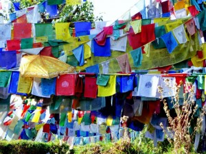
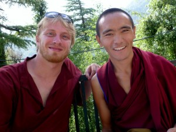
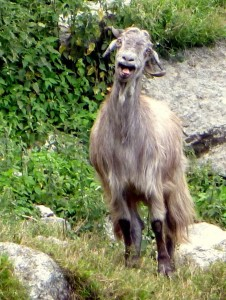
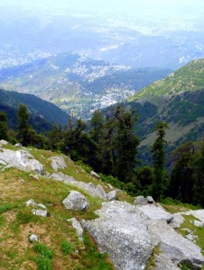
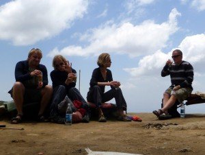
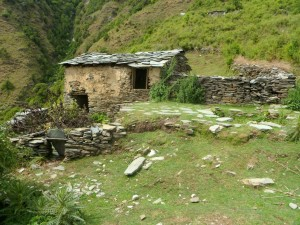
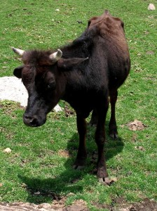

The other day, I was taking a stroll around the Dalai Lama's residence (clockwise, as the Tibetans do). I was feeling a bit ansy to leave, but also knew that staying would do me good. I was so out of it that I totally forgot about my 4pm conversation class. I was really upset, as the class was one of my favorite parts of the day.

At the exact moment I realized this, a monk tapped me on the shoulder and started to talk in broken English. Soon other people joined in. One older nun couldn't speak english at all, but she was _fascinated_ by the amount of hair on my arms and legs. She was pulling it and twisting it in disbelief, and I helped her to learn the names for "arm hair", "leg hair", and "toe-knuckle hair".

For days after, the monk and I continued to meet over tea. He had walked from Tibet to India (a 28-day trek over some of the highest passes in the world, and which must be done solely at night so that the Chinese guards cannot find them). But, he was extremely lonely, talked constantly of his family back in Tibet, and of the hardships of being a monk in a foreign country. It was weird to hear how he jogs every morning (in his monk robes) and how he loves to play soccer but that his teachers at the monastery wouldn't let him. I guess that you tend to hear about the monastic life from monks who love it, and you can forget that many monks aren't terribly happy there.

In other news, a few days ago I went on a great hike with a few friends up to a mountain pass near the snow line called Triund. We saw a flock of goats:

and saw some beautiful views of the valley below:

One great thing about India is that you can climb to the most desolate mountaintop and still find four different Cafes and guesthouses. Below, we're eating at one... from right to left, are me, Karen (whom I've been traveling with since Delhi), Anastasia (a British health journalist who's spending six months in Mcleod so she can concentrate on writing a book), and Eamon (an Irish-born Australian who was awesome fun to hang out with).

On my way back down I got a bit lost, and ran into this awesome abandoned house:

Inside the levels were like 4 feet high. It was weird to think that, probably just a few years ago, someone was living in this house that was built exactly as it might have been built 1000 years ago.

Over the weekend, I did a great 2-day meditation retreat. My mind has never been so focused, and I have never felt so incredibly patient and peaceful.

That's good, because I've now moved on to a Sikh city called Amristar that I'll write about shortly. It's crazy, hot, and requires a good bit of patience and peacefulness to deal with.

I was also nearly attacked by a troupe of monkeys in Mcleod Ganj, which was a harrowing experience. I no longer find them cute, so I'll end with a picture of a very coy cow:

