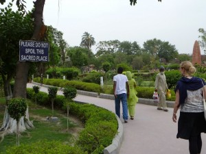
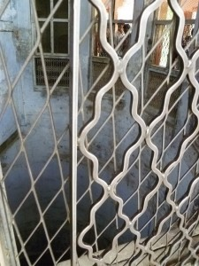
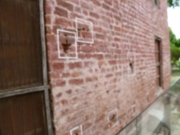
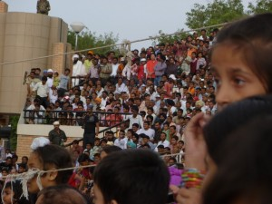
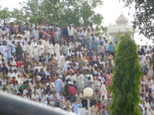
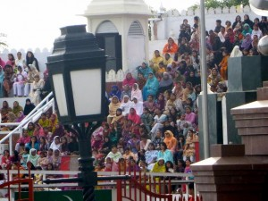
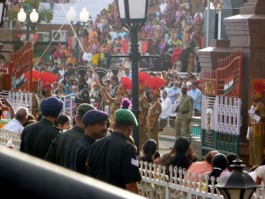

Although Amritsar is known inside India for its Golden Temple (and the associated rebellions and subsequent massacres that took place there), it might be better known outside of India for Jallianwalla Bagh.

It was at this park that on April 13, 1919 Mahatma Gandhi called for a peaceful mass demonstration, in defiance of a British ban on meetings. A British General commenced firing on the crowd without warning, and within 10-15 minutes, up to two thousand Indians were dead. The massacre is a key scene in the movie _Gandhi,_ and was massively important in catalyzing the Indian independence movement.

Hundreds of Indians fell to their death by jumping into this well, to escape the British machine guns:

Bullet holes are still visible on the walls around the park:

I think the strangest part was, on the one hand, seeing evidence of this one small face of the massive carnage caused in India by Westerners; but, on the other hand, witnessing virtually no hostility from Indians even though it took place within the last century.

Our final activity in Amristar was to visit the India-Pakistan border to see a strange festival which accompanies the flag-lowering at sunset every night.

On our side of the border were thousands of Indians amassed in bleachers:

On the Pakistani side were an equal number of decidedly poorer-looking Pakistanis, segregated into men:

and women (note the white traditional head-covering on the woman in the upper-right):

Indian soldiers dressed in outlandish hats and absurd moustaches would shout battle-cries into the microphones and march flamboyantly up and down the street, as would the Pakistani guards on the other side of the border. The crowds cheered and joyously chanted religious slurs.

DVDs were available afterwards for a nominal fee.

The whole tradition is what seems like an Indian’s dream: Pile your 17-person extended family into an extremely small rick-shaw, set off down an overcrowded highway through knuckle-whitening multi-species traffic at tremendous speeds while honking madly, submit to a highly invasive but ineffective security screening, pack into unbelievably over-crowded bleachers in seering 110 degree heat, work yourself into an insane frenzy over a thousand-year-old religious rivalry, and then repeat the terrifying bumper-car journey home in penetrating darkness while dodging unlit horse-pulled carts and (again) honking madly. It’s a strange, strange country, but I’m increasingly beginning to like it.
