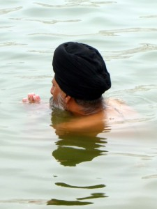
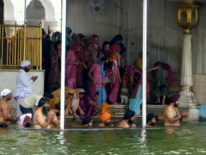

I’m glad that I stayed in McLeod-Ganj as long as I did—you can see a monument in a day, but you can’t really take in a city’s culture and attitude without staying for a while.

But, with that done, it was a 9-hour bus journey (a good deal of which I was standing) to Amristar, a Sikh holy city. The centerpiece of the city is the Golden Temple, a beautiful shrine in the center of a holy lake, plated in 25 kg of gold and dating from the 1500s.

The Sikhs (male Sikhs are easily identified by their turbans) come to the lake to cleanse themselves in its waters, either alone

or in crowded groups.

Wherever we went in the Golden Temple, every single person stared at us with unbridled curiosity. Each passing child would run up to introduce himself and shake our hands (with the encouragement of their parents). The funniest thing, though, was how many families came up and asked “Picture?”

So, at their insistence, we would take a picture of them. They would look at it on the camera, giggle happily, and leave. It just didn’t make sense—it’s not like they hadn’t seen digital cameras before. Why did they want us to have a picture of them on _our_ cameras?

Anyways, I could not have been more impressed with the Sikhs. They were gentle, kind-hearted, genuine, and pious people. Apparently the religion is a bit of a mix of Islam and Hinduism, but it discards much of the ritual and doctrine of each in favor of simple meditation on the idea of a (single) God. It is inclusive, egalitarian, and (considering its origins) rather gender-neutral.

Perhaps the coolest thing about the Golden Temple is that it provided free food and shelter for _anyone_ (of any faith, gender, or economic group). Every inch of the temple complex was filled with pilgrims, homeless people, or simply travelers who needed a place to rest. Similarly, the huge “free kitchen” served free dhal and chipoti dinners to tens of thousands of diners each night, in a massively efficient operation.

There was even a free Chai area outside:

The eatery is run entirely by volunteers, who are incredibly friendly and dedicated. They went out of their way to make us feel included, even though we weren’t Sikh (they give generously regardless of faith). Because of this system, there are no homeless or hungry in Amristar, or throughout much of India for that matter. The sikhs are happy to feed them all… what a wonderful system.
