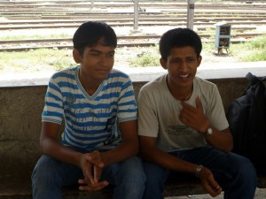
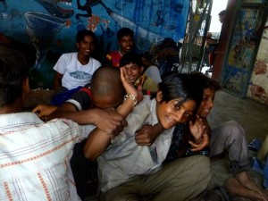

Jaclyn finally made it to Delhi (albeit a day late) after some frustrating visa problems and a missed flight. In the meantime, I had taken an awesome tour of Delhi street life called “Street Walk”. It was run by the Salaam Baalak trust, which aims to provide education and shelter for the thousands of homeless “street kids” in Delhi. Our two guides were both former street kids themselves:

One guide had run away because of bad domestic problems between his parents, and the other was simply _lost_ while his parents were vacationing in Delhi (!) The tour wasn’t at all voyeuristic—we didn’t even really see many homeless kids—it was mainly just a discussion. I learned a ton, for example:

- The street life is different for boys and girls. Boys actually kindof like the independence of it, and often don’t _want_ to leave the life. Girls, however, are forced almost immediately into prostitution. So, while the boys’ situation is not particularly dangerous, charities make every attempt to save the girls before the pimps get to them.
- They said that food is no problem, and even shelter is not too hard. Sikh shrines provide unlimited food for anyone in need. I had thought that starvation would be a real danger…
- They pointed out that street kids can’t save money. They can’t open a bank account, and any money on their person can be stolen in (quite common) muggings. This is one reason they can’t leave the street lifestyle.
- They said that the biggest vice among the children is sniffing whiteout. The worst antagonists are, in many ways, the police.
- The street kids learn to trust no-one. Each kid started their homelessness by begging for food from shopkeepers. The shopkeepers tell them they need to work for food, but then they never come through. Alternatively, the kids go to work at factories and are beaten, mistreated, and never paid.
- Even though charities provide plenty of education and free shelter, the kids don’t know who to trust, and so they are afraid to avail themselves of the charities services. One of the toughest tasks, then, is simply getting the kids to accept the free food and shelter.

It was a tremendously eye-opening experience. After the discussion, we visited the “contact point” where the charity tries to convince kids to take advantage of their free services.

It was crazy hanging out with the kids. They seemed totally normal, playful, and nice, but I knew that at night they were sleeping under bridges and fending off rival gangs. I guess it’s a testament to the human spirit that so many of them pull through and go on to be happy and successful adults.

Jaclyn and I ended up having dinner with the kids to celebrate one of their birthdays, which is another interesting story, but I’ll let Jaclyn write that one up.
