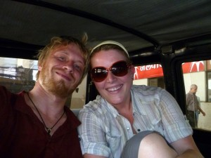
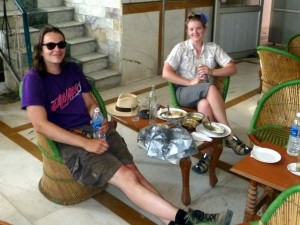
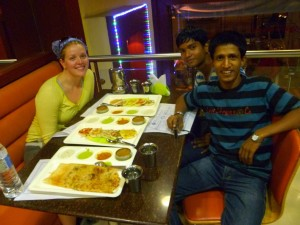
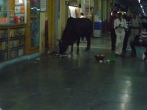

This post is an excerpt from Jaclyn’s travel diary:

\--------------

Delhi was like nothing I had ever imagined. Imagine being in  120 degree heat, surrounded by rude Indian men, and basically being accosted for sales at every turn. By the way, where we stayed at Delhi was under construction, so it literally looked like a war-torn country that had just had a 12.0 earthquake.

When we arrived at the hotel, I met Rob’s friend from Holland. Nice guy. Picture John Cusack from 1982 ;) Black t-shirt, Bermuda hat, long hair, and sunglasses.

He described Delhi as “organized chaos”. Delhi has no stoplights and thousands of cars that drive as if they could only see the space 4 feet ahead of them. It is the scariest thing you have ever seen. On the drive to the hotel I thought I was going to die several times from a car accident or a heart attack.  The analogy that Rob’s friend gave me was that one could not imagine a stoplight in this place, because it would cause chaos, but for some reason in a city of 12 million people, thousands of cars and buses, manage without a single stoplight. organized chaos. It is the most incredible thing you’ve ever seen.

Rob took a tour yesterday that was designed to show the life of a street kid in New Delhi; picture “slumdog millionaire” in real life. (see his post below) We met the kids for dinner my first night in Delhi. The tour guide’s name was “Mr. B”, and it was his friend’s birthday. His friend thought he was “about 18”, but was not exactly sure of his actual birthday or age because he didn’t know his parents or ever remembered celebrating a birthday. He wanted to know what Americans did for birthdays, so Rob invited him to dinner to show him.

I have to say, it was one of the most memorable, interesting, and insightful nights of my life. Mr. B was so open and interesting in answering all of my ignorant American questions about relationships, arranged marriages and Indian culture. All I could keep saying is that this culture is so “different”, and “different” seems like such an understatement for this experience.

The most fascinating thing about the dinner was walking home. Rob, trying to be nice, offered to share a cab; they declined. At first, I thought it was due to money, but we soon found out that it wasn’t. They said they preferred to walk, so we walked back with them. We were having a good time, when a motor-bike pulls up and starts yelling at Mr. B. We see them exchange words and once they stopped talking, Rob asked who it was. Mr. B informs us that it was the police, asking what he was doing with two foreigners. The police thought he was trying to scam us because we are white, I am female, and we were walking and talking in the dark in Delhi. About 10 minutes later a rickshaw pulls up and the people start arguing with Mr. B. After they leave, Mr. B. informs us that the man threatened to stab him for being with us because he was walking with tourists in “their territory”.  I guess only certain Indians can scam white tourists in certain areas.  Rob blatantly asked Mr. B. if we were causing him problems, and he said “yes”, but insisted on walking us home. It is beyond me that someone could get threatened for walking with us because one of us is white and one of us is Indian.

So, now we are on our way to Agra to see the Taj Mahal. And, on a more positive note, (see picture below) there are cows _everywhere_ in this city. And it was hysterical for me to see a cow even in a train station. _So Different._

\- Jaclyn

\------------

Rob says: On the one hand, the dinner was amazing… I get so much more from talking with people like those kids than from seeing monuments and museums. However, the walk back left me feeling incredibly cold and vulnerable. I couldn’t believe that I was so ignorant to what was going on around us—that when we were on certain streets we were literally a gang’s “property”, and only _they_ could safely hassle us. Plus, I felt scared that just by talking to the locals, I might endanger them. I still don’t know what to do with those feelings. But, we’re moving on to less hostile towns, where I think that the situation will be much less tense.
