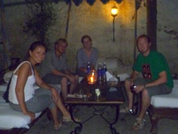

As Rob posted the Taj Mahal was amazing if you can get past the heat and the hustlers.  The moment we exited the train we were accosted by people at every turn trying to sell us something or scam us into paying twelve times the amount that it costs a native.

The only saving grace was that Rob spent 200 rupees, (the equivalent to 4 US dollars) on a tour guide.  He really made the Taj Mahal the best it could be in 120 degree heat. Every time there was a line to look at something he would literally morph into a bodyguard and break the sea of people like we were the president and push us to the front of the line.  Thus, our tour of the Taj Mahal could have taken hours in 120 degree heat, but in actuality took about an hour (which was all I could take, I was literally  “melting”).

The best part of Agra, (besides the Taj) was leaving Agra.  As we were waiting for the train, wondering what platform to be on, we followed a cow to platform number two where we asked an American looking couple if they knew when our train to Udaipur was coming.  Serendipitously, they were in the same sleeper car as us.

Maria and Allister were traveling to three different continents over a three month period.  We had a LOT in common, (besides the fact that they were married….ahem Rob).  Allister had just completed his master’s degree in computer sciences and was originally form South Africa.  Maria was originally from Mexico City and just finished her Master’s degree in childhood development.  They were a mirror of our relationship, ie engineer and therapist traveling around India together before beginning our “real jobs”.

We all talked on the train until late at night about our careers and experiences of India thus far… They hated Agra too by the way.  They were such an interesting couple to hang out with and we had great conversations together. We ended up staying in hotels that faced each other on the street in Udaiper.   We went and saw the city palace together, although they were much better with the heat than us, (we had to breaks to get massages and such).

Udaiper was such a beautiful city!  Every other building was a palace of some sort and the people were so nice….a nice change from Agra. To give you some perspective, the palaces are built on the hills of Udaiper, so all of the streets are small and built on hills; these streets all look similar.  So one morning I went out for coffee while Rob was sleeping and made a wrong turn somewhere and ended up walking these streets for about three hours.  I was horribly lost, could not remember the name of the hotel and every street I walked down looked the same.

I found a rickshaw driver and somehow managed to communicate in broken English that my hotel was by a Hindu temple and he actually helped me find my hotel.  We drove around for quite a bit, looking for something familiar, (apparently, you can walk pretty far when lost for three hours).  That has been my experience of most Indian men, they will go over and above to help a woman in any situation, they just don’t want your opinion about anything.

Sadly, we had to leave to Rishikish, but it could not have been any better to be in the most romantic city with another couple, experiencing it all together.  
\---
P.S. (from Rob): This poor Allister guy from South Africa had a crazy story. He said that about 15 years ago he voted “yes” on a ballot measure to begin dismantling the apartheid system in South Africa. That same day, on the bus-ride home, he was stabbed  in the chest by a black guy (who presumably also supported the measure) and nearly died. So, he immigrates to England to escape the violence. 10 years later he visits South Africa again and is amazed at the racial progress. He’s overjoyed, in fact, and is buying tons of drinks for everyone at bars, celebrating his country’s progress. As he steps out of the bar, another black guy comes up and stabs him in the skull with a machete, and robs him. Allister wakes up in a hospital, where they promptly send him home. After his brain continues to swell, he goes back to the hospital and they reluctantly treat him. To this day, he’s still struggling to regain feeling in his right hand. This confirms my feeling that South Africa is really, really dangerous place.
