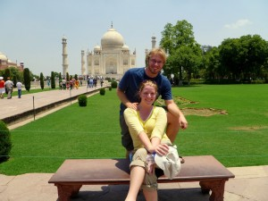
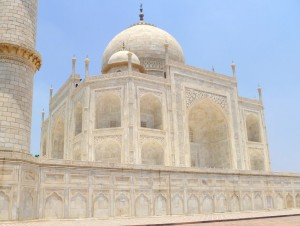

India has a great train system. The train are super-fast, and you can go most of the way across the country on a single overnight train.

Unfortunately, they are booked months in advance and, even with a “foreign tourist quota” and the several schemes designed to accommodate last-minute travel, many tourists vacations are determined simply by what train tickets are available.

Hence, Jaclyn and I had to give up on some of our more ambitious plans: Varanassi, Darjeeling, Kerala, etc.. However, we still managed to get tickets to Agra, home of the Taj Mahal.

The Taj is beautiful. Pictures really can’t do it justice. The entire palace is incredibly, uncompromisingly, symmetrical. Every detail is repeated with painstaking conformity in 2, 4, 8, 16, or even more places. In fact, the entire complex was meant to be repeated across the river (in black), but the king’s sons felt the project to be so wasteful that they had him dethroned on charges of insanity.

Plus, the marble itself is gorgeous—soft to the touch, remarkably uniform, and even a bit translucent.

As great as the Taj is, that’s how bad the city around it, Agra, has become. It’s filthy, corrupt, congested, and hostile to tourists (in a vicious sort of self-prostituting way). Several years ago, a ring of Agra “doctors” was busted for giving poison to keep ill tourists bed-ridden, while charging huge amounts to those tourists’ insurance companies for the ongoing “medical treatment”.

The admission fee for the taj is an outrageous 750 rupees each for foreign guests (about $20 US; the fee for domestic tourists is about 50 rupees. It’s hard to describe just how out-of-line this fee is compared to normal costs in India). That would be fine if the money went to repairing the Taj, but the consensus is that the money is funneled to corrupt politicians. For instance, there wasn’t even _water_ in the fountains around the palace; they only fill them up when “VIPs” come around.

Adding to the general shittiness of Agra was the weather. The day we visited the Taj, it was 49 degrees Celsius. That’s about 120 degrees Fahrenheit, people. There is no air conditioning anywhere in the complex, and the sun reflects off the marble like a mirror, doubling the intensity of the sun’s heat.

The Taj was gorgeous, but the combination of the weather with the incessant hassling of street touts and the never-ending scamming of taxi drivers was just awful. We were thrilled to get out of Agra.
