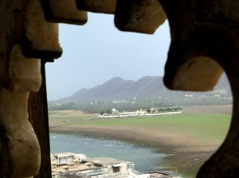
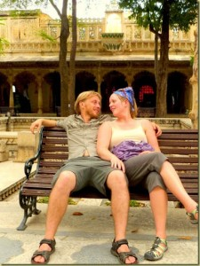
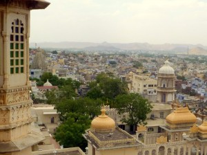
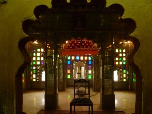
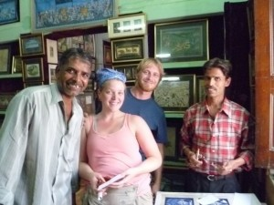
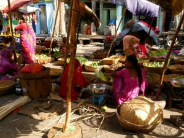

Udaipur is normally called India’s most romantic city. Normally, though, the picture above would be of a beautiful white palace seeming to float on a serene desert lake. As you can tell, the palace was more “heavily sitting” than floating, and the “lake” was more of a “giant swampy mud-plain”.

Still, we loved Udaipur. It was hassle-free, clean, and full of history. During our stay, we even braved the 105 degree heat to visit the City Palace.

The palace was built over many centuries and, thanks to the surrounding mountains, was never invaded or plundered. It looked down on the beautiful and Old City district of Udaipur. Like many of the cities in Rajasthan, Udaipur is known for its colorful buildings, in seeming defiance of the monotonous desert that surrounds it.

Even the interior decorations of the palace were strangely modern and colorful. Ornamental gold was interspersed with stained glass and antique mirrors. In fact, once or twice I even found myself considering this thousand-year-old palace to be a bit… gaudy. But, in a good way!

We hired a guide for our last afternoon in Udaipur (Uman, below left). He took us to his family’s art school/shop, where his relatives create shockingly detailed miniature paintings.

We also visited a very cool little science museum, a fabric factory, a beautiful garden, a history museum, and a great little vegetable market.

It was in Udaipur, though, that we decided that no matter how beautiful the historical cities of India were, we simply needed to escape the heat. So, we set off through Delhi to catch a train to Rishi-kesh. More on that next post.
