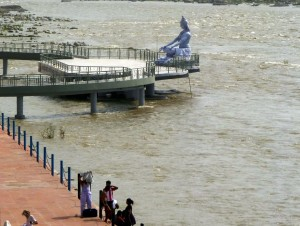
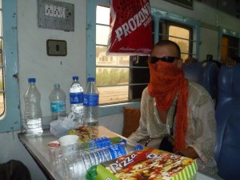
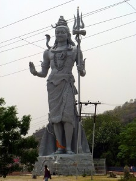
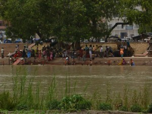
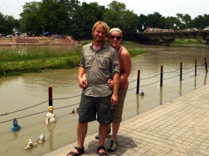
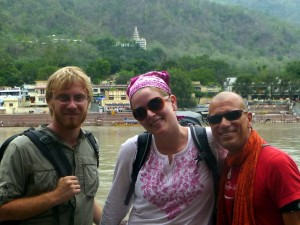
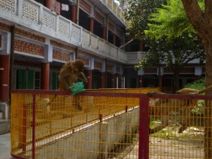

<< by Jaclyn >>

Rishikesh is by far my favorite place in India.  It is a combination of five different towns on the Ganges river. Ironically, the trip to Rishikesh tested every ounce of serenity I possess, but once I got there, restored it all.

The trip to Rishikesh from Delhi is four hours on train.  Most tickets were sold out, but they had two available in second class which is a non air conditioned train (“second class” is a scary word in India); it wouldn’t have been that big of a deal, but we are talking about 100 + degree weather daily in India. Rob and I thought, “We can hang for four hours, the wind from the train ride ventilates pretty well, so we’ll just deal with it”.  Bad decision.  Never try to “deal” with anything in India, because India shows you how much worse it can get.

Our four hour train ride ended up taking nine hours.  Yes, that was not a misprint.  Nine hours, in a non-air-conditioned packed train in 100+ degree heat.  And let me mention, that many Indian do not wear deodorant for cultural/religious reasons.  The train would be stopped on the middle of the tracks for about an hour, move a kilometer and stop again.  I’m still not clear on what the problem was, because no one felt the need to communicate this to second class (the working theory was that the conductor was watching world cup matches).

The one saving grace of this train ride was that this was the train that our new friend Noel was on.  My first experience of Noel was him walking through the train with this huge suitcase bumping into people saying “I’m sorry, so sorry”, repeatedly, up the aisle.  At first I thought, (and probably everyone on the train) that he was a gay Hari Krishna, because he was wearing these orange pants and scarf, just like the Hari Krishnas do.

As the train gods do (as we learned with Allister and Maria) the train conductor moved him to the seat across from us and we got to talking.  Noel was also headed to Rishikesh.  Noel is a 48 year old yoga instructor from Miami beach who also works as a concierge at the Ritz.  He looks not a day over 30, which is a great argument for vegetarianism and yoga, which he has done for 10+ years.  He was my little piece of San Francisco in the middle of India.

After our nine train hour ride from hell, (which I did not hear Noel complain about once by the way) We spent the night in Haridwar (unfortunately) and split a cab to Rishikish.  The ENTIRE cab ride, Noel would have the driver stop so he could take a picture of some Hindu shrine or holy site (See pictures below).  It was AWESOME because I would never think to tour Haridwar.

So we all get to Rishikish and stay on the same floor of the green motel, which actually has nothing green about it. (See picture below)

We had such a blast! We went rafting in the Ganges (which I would be shocked if I don’t have some disease from), went to yoga, ate and shopped. (rafting in India is more scary because you really can die, and your guide does not speak english) Noel was sooo nice to everyone.  We would walk by anyone and he would bow and say “Namaste” to literally everyone we walked by, from the beggars, sadhus to locals.  I have to say that by this point I am on the defense in India, because I had only really experienced Delhi and Agra and had to _learn_ how to avoid natives trying to take advantage of you for being a tourist.  Noel brought me back to the point of visiting this country, by really helping me to absorb the culture and the experience of India.  We ended up hanging out with Noel for a few days and then moved on to Gangotri, to find the source of the Ganges.  After everything I had experienced in Delhi and Agra, Rishikish was by far my favorite city and I really did learn how to _breathe_ and slow down and _relax._

_P.S._ I do have to say one of my favorite things about rishikesh is that this city has a monkey problem like we have seagull problems in the bay.  There are monkeys _everywhere_.  I thought they were adorable, Rob hates them because they tried to attack him.

