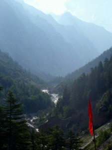
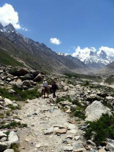
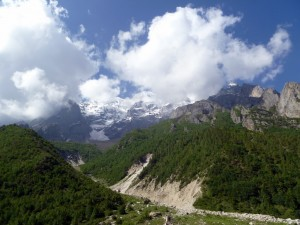
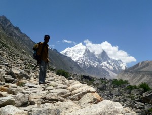
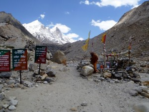
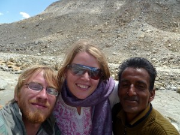

(Ed note: Sorry for the delay; of course, I’m in the US now. )

At Gomukh (elevation 11500 feet), a great and ancient Himalayan glacier melts (at a ferocious rate) at a glacial “snout” which is, traditionally, considered the spiritual source of the Ganges River. Because the Ganges it so holy (besides providing water to most of Northern India, it is also famous for carrying away dead bodies to paradise), Gomukh is a popular and ancient destination for religious pilgrimages.

I planned our trip there mostly to escape the 120 degree Indian heat. The heat was absolutely tormenting, and I felt that we could benefit from a few days of coolness and comfort.

Unfortunately, I didn’t realize how harrowing the 250km jeep trip was. By the time we go to Gangotri (the staging point for treks to Gomukh), we were so tired, disillusioned, and physically sick that we were incapable of doing the 18km trek (36km round-trip) to the glacier.

So, in a stroke of brilliance, we decided to ride donkeys to the top. This was by far the most expensive and touristy thing we did in India, but it was definitely a clutch choice.

The scenery was absolutely beautiful. We started in lush valleys at the feet of the higher peaks:

As we went higher, we started to pass the tree-line and the terrain became a lot rougher (below is one of our two guides): 

Because the glacier itself is at 11,500 feet, we were both feeling pretty woozy near the end. For the last 4km, we had to walk ourselves (no donkeys allowed!) and Jaclyn eventually sat down on a rock and declared that, no matter _what_, she absolutely _could not_ make it _any_ further. Luckily, what she didn’t realize was that we were only about 100 meters away from the end. So, after watching us celebrating 100 meters away, she finally manned up and finished the trek.

All in all, we spent about 12 hours on donkeys that day. It got to be incredibly painful and, if not for the elevation, I think I would have rather walked most of the trek.

We rode back down to Gangotri, passed the night in a shady little guesthouse, and then did the entire trek back to RishiKesh the next day. By the end we were glad we’d done it, overjoyed that it was over, and totally committed to never doing anything like that again.

Afterwards, we took the train to Delhi and spent our last full day shopping for gifts for everyone back home. We stayed at the Courtyard Marriot (Jaclyn’s mom had gotten us a free room there-it was AWESOME and hobbling into their air conditioned lobby was one of the best feelings of my life). After that, it was back to America and, for me, it was on to New Hampshire to start my job. More on that next post!

(btw, I got back to the states on July 1, so this post is a bit out-of-date ;)
