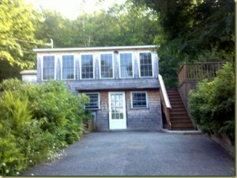
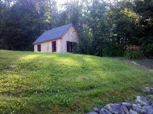
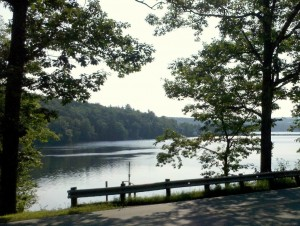
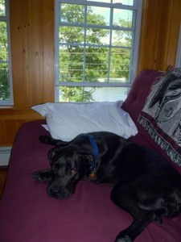
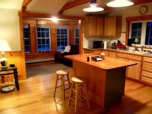
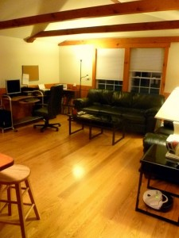
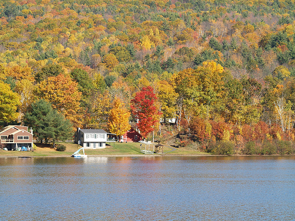
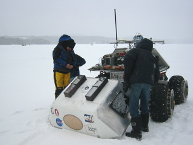

Well, it's official--I've started my new job, rented a new apartment, furnished it as best I could in the 2 to 3 weeks I've been in it, and generally embraced the idea of waking up in the same place more than two nights in a row.

My job is with Creare, Inc., a small R&D services company in Hanover, NH (the home of Dartmouth College). Tons of thanks to Tom Zangle for introducing me to the company. At the risk of oversimplification, I'd say that Creare is a business which competes for grants (usually government grants) to enable them to do cool research and engineering, just like a professor at a university might. But, whereas a University is non-profit, Creare most certainly is not. Like everyone else there, I work on several (5+) projects at a time (currently involving programming, algorithm development, fluids experiments, and part prototyping). Eventually, I'll be expected to start writing my own proposals and bringing in my own grant money. So, it's an interesting job.

But, enough about that! What I want to do right now is invite anyone who's been following this blog--and, pretty much anyone who's reading this right now--to come visit me at my new house in New Hampshire, of which I am quite enamored. The house is on the southern edge of Mascoma Lake, about 20 minutes from Hanover and 15 minutes from my work:

<iframe src="http://maps.google.com/maps?f=q&amp;source=s_q&amp;hl=en&amp;geocode=&amp;q=154+NH+4A+lebanon,+nh+03766&amp;sll=43.639057,-72.15168&amp;sspn=0.029878,0.076904&amp;ie=UTF8&amp;hq=&amp;hnear=154+New+Hampshire+4A,+Lebanon,+Grafton,+New+Hampshire+03766&amp;ll=43.634797,-72.165113&amp;spn=0.02988,0.076904&amp;t=h&amp;z=14&amp;output=embed" width="425" height="350" frameborder="0" marginwidth="0" marginheight="0" scrolling="no"></iframe>

 [View Larger Map](http://maps.google.com/maps?f=q&source=embed&hl=en&geocode=&q=154+NH+4A+lebanon,+nh+03766&sll=43.639057,-72.15168&sspn=0.029878,0.076904&ie=UTF8&hq=&hnear=154+New+Hampshire+4A,+Lebanon,+Grafton,+New+Hampshire+03766&ll=43.634797,-72.165113&spn=0.02988,0.076904&t=h&z=14)

It's a rather small 1-story, 2-bedroom house with a walkout basement, but it has a nice side deck and a great yard.

It also has a structure in the side-yard which will hopefully be turned into a nice lofted guesthouse (no plumbing, unfortunately):

The main attraction of the place, though, is its gorgeous view of Lake Mascoma. The house is on the mountain side of the road, but it includes lake frontage on the other side (including a dock, a fireplace, and a two-story deck).

The front of the house has tons of windows, and has a clear view of the water:

The kitchen and living room have vaulted ceilings, and all the floors and most of the cabinetry is hard-wood.

I'm working on getting together some appropriate furniture, and with the help of Rent-A-Center things are starting to fall into place.

**The Case for Coming to Visit Me** Allow me to list the reasons:

- Private Space: You'll have your own guest room with a queen sized bed. If there are more people, I have an array of futons, air mattresses, and soon a separate little guest house.
- _In summer:_ The Lake. The water is incredibly warm (high 70s) and the lake is picturesque.
- _In Autumn_: In roughly the first week of October, the leaves change in the Upper Valley. I've never seen it, but apparently it's an incredible sight (I found this picture of my lake on the internet):

- _In Winter_: Great Skiing. I'm 1 hour from Killington (the most famous ski resort on the East Coast), and I'm as close as 20 minutes to some great smaller resorts. Plus, Mascoma freezes over in the winter for cross country skiing, ice skating, hockey, and also (apparently) for testing of NASA's Arctic Rovers (I kid you not, they test arctic rovers in front of my house in the winter):

- _Year Round:_ Great hiking in the mountains of NH and VT, awesome cultural activites (opera, concerts, etc) at Dartmouth and the surrounding towns. And, more than anything else, just a really chill and tranquil place to relax.

I'm about 1 hour from Manchester, 2 hours from Boston, and about 5 and a half hours from the Lehigh Valley.

_Directions_:

- Approach on I-89 West (from Manchester, Boston, and NY City) or on I-89 East (from Burlington, Montreal, the Northwest Territories, or Santa Claus's secret snow castle at the North Pole).
- Take exit 17 for Route 4 East. Proceed about 2 miles.
- Turn right onto New Hampshire Route 4A, and continue for 2 miles.
- I'm house #154 on the right (there's a little green sign but no mailbox)--it's the second driveway past Evenchance Rd. If you pass the bridge, you've gone a bit too far. Turn into the driveway and park in the turnoff on the right.

Good airports are Boston (cheap flights) or Manchester (a little bit closer and easier to navigate). There are great bus connections from Boston and from both airports to right near my house. Also, Burlington has an airport that might come in handy (2 hours away).

I seriously hope that you guys will come to visit me--especially those of you on the East Coast who I haven't been able to see very much the past few years. And please don't be afraid to use my place as kind of free housing for ski trips or whatever--I got a bit more room than I need so that I can house people when the come to stay, and it'll be a pleasure to put it to use.
