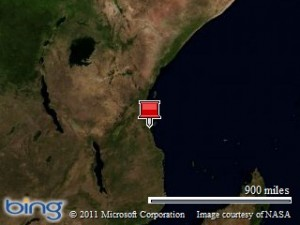
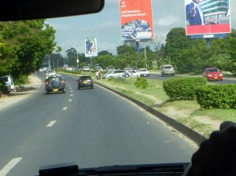

Well, it seems that it’s time to break my eight month blogosphere silence. It’s been a blissful and memorable time in the “Shire”, but not really one that would make for good reading. But, I’m finally on a another trip and figured I’d memorialize it here.

At this point, I’m about a week into my two week trip to Tanzania which is, I recently learned, a country in Eastern Africa.

The name Tanzania is, you’ll be interested to learn, a sort of _portmanteau_ of two even more obscure names of now-defunct countries that you’ll be even less likely to have heard of. Interesting. Tanzania is poor, even by African standards. It is, however, relatively peaceful and is even known for being tolerant and pluralistic.

Tanzania is best known as a gateway to Kilimanjaro and the Serengeti. Tourism to those two sites makes up a sizeable portion of their economy, with the balance rounded out by a hodge-podge of small-scale farming and a ton of international aid agencies.

As for me, I’m in Tanzania on business. My company, Creare, is working with Dartmouth-Hitchcock Medical Center to run a study on hearing loss in HIV-positive patients. Rather than risk any confidentiality issues (and probably boring you all at the same time), I’ll just sum it all up by saying that it’s a difficult task to run such a complicated and technologically-intensive study from across the ocean and across cultural barriers.

Anyways, back to my travels.

My biggest surprise so far is to see how wealthy and well-managed Dar Es Salaam (the city where I’m staying) seems to be. Granted, any comparison I make are to India, which is difficult to beat when it comes to disfunctionality and suffering. But, check out this rather typical view from inside our car:

What’s that… pruned bushes? Roads without gaping potholes? No cows in the road? Most cars manufactured within the past decade, and comprising four or more wheels and a working muffler? This is certainly not a level of wealth and sophistication that I expected from one of the poorer countries in Africa. Of course, this is one of the richest parts of Tanzania. But, still, it makes me realize how unbelievably poor some of the areas of India were that I visited.

Well, that’s it for now. I should be back soon with more footage from Dar, as well as my trip to Zanzibar (a rather bewitching island nearby).
