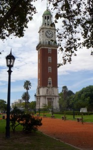
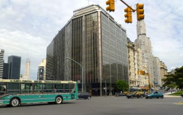
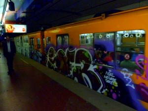
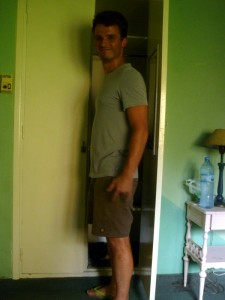

<table align="center" cellpadding="0" cellspacing="0" style="margin-left: auto; margin-right: auto; text-align: center;"><tbody><tr><td style="text-align: center;"> </td></tr><tr><td style="text-align: center;"></td></tr></tbody></table>

So, my previous few attempts at blogging about my travels have been pretty unsuccessful. So, I'll try to keep this one current by keeping the entries short...

Today was the first day of my two-week trip to Argentina with my close friend from college, George Malikov. George is taking a multi-month trip through South America before he starts grad school, and I'm joining him for his Argentina stretch. We have almost no plan, but we've packed light and we're hoping some fun things will happen.

It took quite a bit of organizing to line everything up at home for me to take the trip... but luckily Julie and Ryan are helping out a ton with the dogs and the house (thanks!) and everybody at work is super understanding about vacation time.

The plane ride was great. The JFK->Buenos Aires leg was about 10 hours, of which I slept like a baby for 8, leaving 2 hours for dinner and breakfast, as well as a bit of reading and TV. God, I love red-eyes, especially when they're long enough to get a full night's sleep. Airport customs and immigration sucked, it took 2-3 hours of pointless waiting in line to get through. But, after all that, actually clearing the checkpoints was extremely easy.

Buenos Aires seems very cool so far. It is enormous, and the outskirts looked very run down in some places. But, the downtown is quite beautiful, with a charming mix of shiny skyscrapers and old european-style architecture.

<table align="center" cellpadding="0" cellspacing="0"><tbody><tr><td style="text-align: center;"></td></tr><tr><td style="text-align: center;">Buenos Aires near the Retiro Bus Station.</td></tr></tbody></table>

I only really had a chance to see a bit of it as I walked from the bus to the subway (Subte). The subway is really nice and functional, although the cars have a comical amount of graffiti on them.

<table align="center" cellpadding="0" cellspacing="0" style="margin-left: auto; margin-right: auto; text-align: center;"><tbody><tr><td style="text-align: center;"></td></tr><tr><td style="text-align: center;">El Subte</td></tr></tbody></table>

George and I met up at the hostel. We both ran into pretty substantial delays (me with customs, and George with someone on his bus being arrested and then someone else subsequently throwing a rock through his window), but they added up to us both arriving at the hostel within 30 seconds of each other. Sweet.

<table align="center" cellpadding="0" cellspacing="0" style="margin-left: auto; margin-right: auto; text-align: center;"><tbody><tr><td style="text-align: center;"></td></tr><tr><td style="text-align: center;">George</td></tr></tbody></table>

We're definitely in B.A. for at least one more day... we'll see what happens next.
