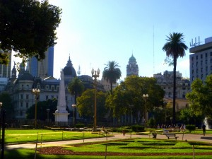
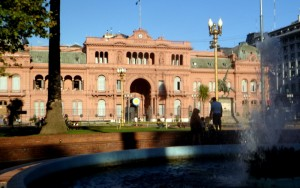
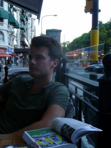
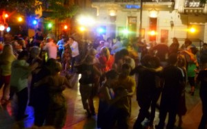

After meeting on Saturday morning and spending most of the day getting our bearings, George and I spent Sunday exploring Buenos Aires. We are still constantly surprised by safe, efficient, and "European" the city is. Even late at night, young women don’t seem to worry about being out alone. There are families and even community activities all over the city long past when I go to bed.

We spent some time exploring the central downtown plaza where the government buildings are clustered—El Plaza de Mayo.

<table align="center" cellpadding="0" cellspacing="0" style="margin-left: auto; margin-right: auto; text-align: center;"><tbody><tr><td style="text-align: center;"></td></tr><tr><td style="text-align: center;">El Plaza de Mayo</td></tr></tbody></table>

At the end of the plaza is the famous Casa Rosada (Pink House), which roughly corresponds to the U.S. White House. The place feels loaded with history, and the free Bicentennial Museum was a nice touch. It had a sequence of exhibits on each stage of Argentina’s development, along with a healthy dose of propaganda concerning recent economic successes.

<table align="center" cellpadding="0" cellspacing="0" style="margin-left: auto; margin-right: auto; text-align: center;"><tbody><tr><td style="text-align: center;"></td></tr><tr><td style="text-align: center;">Casa Rosada</td></tr></tbody></table>

I haven’t spent much time in Europe, but George says that the city (especially the central districts) truly do seem European. The streets are clean, narrow, historic, and (during business hours) bustling.

We find ourselves spending a lot of time in cafes and restaurants, which seems to be a national pastime.

<table align="center" cellpadding="0" cellspacing="0" style="margin-left: auto; margin-right: auto; text-align: center;"><tbody><tr><td style="text-align: center;"></td></tr><tr><td style="text-align: center;">George at a café on Av 9 de Julio</td></tr></tbody></table>

Sunday Night, we made our way to San Telmo, a district known for (among other things) specializing in Tango. Until now, I basically considered la samba, la bamba, el tango, and pretty much every foreign-sounding dance to be variations on the same thing. But, it turns out that the Tango is actually an extremely serious, sensual dance. It seems very awkward that these couples, who appear to be virtual strangers, can dance something like the Tango so convincingly, and then continue on as if nothing happened. I suppose that’s part of the show… We’re hoping to go to a legitimate Tango show at some point.

<table align="center" cellpadding="0" cellspacing="0" style="margin-left: auto; margin-right: auto; text-align: center;"><tbody><tr><td style="text-align: center;"></td></tr><tr><td style="text-align: center;">Tango at Plaza Dorrego</td></tr></tbody></table>

Anyways, George and I are both excited to learn more Spanish. He has been picking up bits and pieces (along with a lot of Portuguese in Brazil), while I have been taking classes for several months in the US. So, we’ve decided to stay in Buenos Aires at least through Saturday to take an intensive Spanish course. We rented what we expect to be a reasonably plush apartment in Palermo (a swank district known for restaurants and night life) using the AirBnB website (for roughly the same price as a crappy hostel room!), and we signed up for 5-day Spanish courses at the El Pasaje language school. We took the first class today, and are both exhausted but already improving our language markedly. It should be nice to settle down a bit in the city, get to know some other travelers, and take our Spanish to a new level at the same time. And in the meantime, we can gather ideas for what to do next week…
