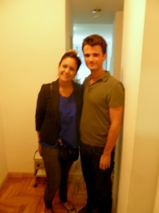
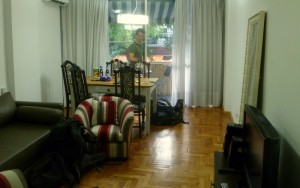
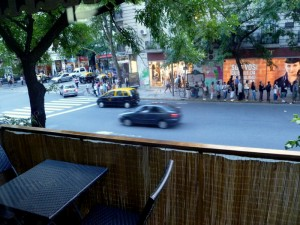
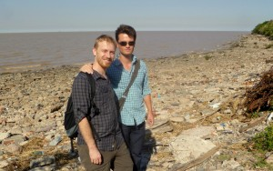
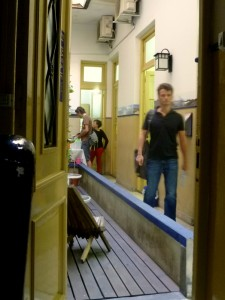
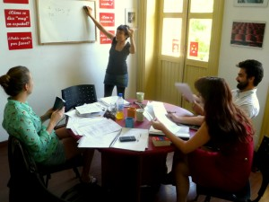

So, moving from the hostel to the apartment: Best Idea Ever. It's a bit more expensive than the hostel, but way less than a decent hotel room, and it's much nicer than either of them. We're located in the heart of Palermo, just steps from a Subte station, and (for better or worse) directly across from a McDonalds, Starbucks, Burger King, and TGIFriday's. It's a full-fledged 1bd apartment with a kitchen, fridge, two cable TVs, stereo, great WiFi, etc.. I will definitely be checking out AirBnB again!

<table align="center" cellpadding="0" cellspacing="0" style="margin-left: auto; margin-right: auto; text-align: center;"><tbody><tr><td style="text-align: center;"></td></tr><tr><td style="text-align: center;">George with Pilar, who owns the apartment.</td></tr></tbody></table>

<table align="center" cellpadding="0" cellspacing="0" style="margin-left: auto; margin-right: auto; text-align: center;"><tbody><tr><td style="text-align: center;"></td></tr><tr><td style="text-align: center;">Living/dining room</td></tr></tbody></table>

<table align="center" cellpadding="0" cellspacing="0" style="margin-left: auto; margin-right: auto; text-align: center;"><tbody><tr><td style="text-align: center;"></td></tr><tr><td style="text-align: center;">View of Palermo from the balcony</td></tr></tbody></table>

The past few days, we've been going on long, beautiful runs through the enormous parks near our apartment. The weather is beautiful  lately (mid-70s and not too humid), and the runs are an incredible way to explore the city, build up an appetite, and stay feeling healthy. Two days ago, we ran out to what I figured would be the ocean. However, it turned out that the beach is effectively an industrial zone inaccessible to pedestrians. Today we managed to see the "ocean", and it is clear why: it's actually a huge, muddy river outlet with no sand to speak of. Apparently the nearest decent beaches are a couple of hours away.

<table align="center" cellpadding="0" cellspacing="0" style="margin-left: auto; margin-right: auto; text-align: center;"><tbody><tr><td style="text-align: center;"></td></tr><tr><td style="text-align: center;">The 'beach'</td></tr></tbody></table>

We're also neck-deep in our Spanish classes. The pace is remarkable! I had learned a lot of grammar and vocab at my Rassias classes back in New Hampshire, but this immersion with native Spanish speakers is doing absolute wonders for my listening comprehension. It's still very, very challenging, but I'm improving a lot. We are planning to start attending some [activities](https://www.spanglishexchange.com/argentina) where people practice speaking English and Spanish together. It's great having something fun and constructive to do in the mornings... we are both really glad that we decided to stick around in B.A. for the week. I will be sad to leave it!

<table align="center" cellpadding="0" cellspacing="0" style="margin-left: auto; margin-right: auto; text-align: center;"><tbody><tr><td style="text-align: center;"></td></tr><tr><td style="text-align: center;">Entrance to El Pasaje spanish language school</td></tr></tbody></table>

<table align="center" cellpadding="0" cellspacing="0" style="margin-left: auto; margin-right: auto; text-align: center;"><tbody><tr><td style="text-align: center;"></td></tr><tr><td style="text-align: center;">My Spanish class with (L-&gt;R) Mindy, Diana (the teacher), Charlie, and David. Diana habla muy rapido!</td></tr></tbody></table>
