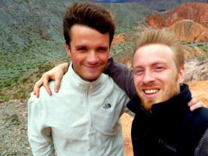

Spanish class is over, and it was incredibly helpful. I don’t think we actually covered any material that I hadn’t seen before in my Rassias classes. But, my ability to string together a sentence, and especially my listening comprehension, have improved far more than I’d ever hoped. This is my first time experiencing what it’s like to understand someone speaking in another language, let alone be able to do it myself. It’s just as cool as I’d hoped (although more tiring than I’d thought). I’m surprised at how intuitive it is. When I’m comprehending well, I don’t even think about the words, I just understand them immediately. If I do actually think about them, then I tend to lose track of the conversation. I’m convinced that the only way to make progress is to listen to and speak a lot of Spanish—the textbooks are only a small part of it.

Anyways, I switched my return flight from Buenos Aires to Santiago, Chile. It lets us avoid making an annoying loop back to Buenos Aires, and it lets me meet up with my Rassias drill instructor (Emily), and lets George meet up with a friend he met in Brazil. Plus, I've always wanted to visit Chile, since it seems to be one of the more stable and entrepreneurial South/Central American countries.

We hooked up with our friend David from El Pasaje (Spanish class), who is a very well-traveled South African oncologist. We took a 20-hour overnight bus ride from B.A. to Salta, a beautiful city near the desert in the Argentinian Northwest.

<table align="center" cellpadding="0" cellspacing="0" style="margin-left: auto; margin-right: auto; text-align: center;"><tbody><tr><td style="text-align: center;"></td></tr><tr><td style="text-align: center;">George in the fully-reclining, bed-like 'Cama Suite' chair.&nbsp;</td></tr></tbody></table>

<table align="center" cellpadding="0" cellspacing="0" style="margin-left: auto; margin-right: auto; text-align: center;"><tbody><tr><td style="text-align: center;"></td></tr><tr><td style="text-align: center;">One of the double-decker luxury sleeper buses we took.</td></tr></tbody></table>

The buses are truly great. If you can manage to sleep in the chairs (which if you get the right seat, will actually recline to a full 180-degree sleeping position), then you save a night of lodging and cross the entire country for around $110US, with food (crappy) and free drinks included.

We stayed at an awesome hostel in Salta and met a few other travellers. George and I did the longest stairs-run of our lives up to a beautiful mountain lookout. We ate at Viejo Jack (old Jack), where we had what we unilaterally declared the best steaks of our lives for about $15/person.

<table align="center" cellpadding="0" cellspacing="0" style="margin-left: auto; margin-right: auto; text-align: center;"><tbody><tr><td style="text-align: center;"></td></tr><tr><td style="text-align: center;">Best steaks ever. Guy in the white shirt is David; plaid shirt is Nick.</td></tr></tbody></table>

The three of us, plus a student from Brown University (Nick), combined to rent a car so that we could explore the Salta area own our own terms. We set out over the mountain and towards the desert, near the foothills (I'd call them mountains) of the Andes

<table align="center" cellpadding="0" cellspacing="0" style="margin-left: auto; margin-right: auto; text-align: center;"><tbody><tr><td style="text-align: center;"> </td></tr><tr><td style="text-align: center;">Absurdly narrow mountain road overrun with farm animals.</td></tr></tbody></table>

<table align="center" cellpadding="0" cellspacing="0" style="margin-left: auto; margin-right: auto; text-align: center;"><tbody><tr><td style="text-align: center;"></td></tr><tr><td style="text-align: center;">David confirming that we were lost. His Spanish is great.</td></tr></tbody></table>

<table align="center" cellpadding="0" cellspacing="0" style="margin-left: auto; margin-right: auto; text-align: center;"><tbody><tr><td style="text-align: center;"></td></tr><tr><td style="text-align: center;">Great empanadas in this region. Nick is a vegetarian and thus basically starved.</td></tr></tbody></table>

We stopped at the "seven-colored mountains", right near the surprisingly stark transition between forest and desert. In this small region, each mountain seems to be of a completely different makeup, and various sea, lake, and river sentiments yield startlingly different shapes and colors. The overcast skies really prevent the color from coming out in the photos, but it was a breathtaking sight.

<table align="center" cellpadding="0" cellspacing="0" style="margin-left: auto; margin-right: auto; text-align: center;"><tbody><tr><td style="text-align: center;"></td></tr><tr><td style="text-align: center;">A few of the many colored peaks. If you look closely, you can see David walking the ridge.</td></tr></tbody></table>

<table align="center" cellpadding="0" cellspacing="0" style="margin-left: auto; margin-right: auto; text-align: center;"><tbody><tr><td style="text-align: center;"></td></tr><tr><td style="text-align: center;">Me and some guy :)</td></tr></tbody></table>

The next day, after staying in a small charming hostel run by a very motherly woman, we drove back towards Salta and stopped at Salinas, an enormous salt plain.

<table align="center" cellpadding="0" cellspacing="0" style="margin-left: auto; margin-right: auto; text-align: center;"><tbody><tr><td style="text-align: center;"></td></tr><tr><td style="text-align: center;">Driving towards the salt plain.</td></tr></tbody></table>

<table align="center" cellpadding="0" cellspacing="0" style="margin-left: auto; margin-right: auto; text-align: center;"><tbody><tr><td style="text-align: center;"></td></tr><tr><td style="text-align: center;">Driving on the salt plain.</td></tr></tbody></table>

It was awesome to have a car. It was my first time driving in a foreign country, and not nearly as terrifying as I thought it would be. The only big difference is that most intersections don't have stop signs... you just kindof push your way through, yielding to any traffic that could destroy your vehicle without being damaged itself (buses, dump trucks, etc), which is basically the same strategy that the pedestrians take with respect to you.

We are now in Mendoza (after another overnight bus ride), making some final arrangements for our final leg into Santiago. Mendoza seems beautiful, clean, and livable. We look forward to seeing a bit of it before we head out.
