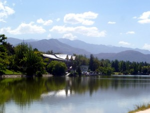
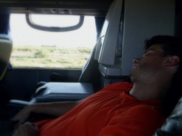
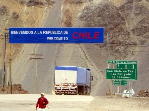
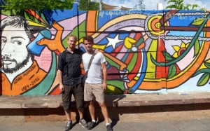
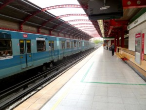
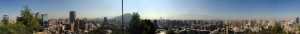

After our ~17 hour overnight bus ride from Salta to Mendoza, we spent a lot of time walking around town and jogging in the park. It had a bit of the cultured wine-country feel of Napa, as well as a bit of a bigger-city night life feel.

<table align="center" cellpadding="0" cellspacing="0" style="margin-left: auto; margin-right: auto; text-align: center;"><tbody><tr><td style="text-align: center;"></td></tr><tr><td style="text-align: center;">View from a running path in a park in Mendoza, AR</td></tr></tbody></table>

The next morning, we took what was supposed to be a 7-hour bus ride over the Andes Mountains to Santiago, Chile. Everything was quite smooth, except that the Chileans are incredibly strict about bringing any type of food into the country. No fresh fruit, trail mix, meat of any kind, dairy products, cheese, chocolate... and if you try, the fines run into the hundreds of dollars.

<table align="center" cellpadding="0" cellspacing="0" style="margin-left: auto; margin-right: auto; text-align: center;"><tbody><tr><td style="text-align: center;"></td></tr><tr><td style="text-align: center;">George recovering from an all-nighter</td></tr></tbody></table>

<table align="center" cellpadding="0" cellspacing="0" style="margin-left: auto; margin-right: auto; text-align: center;"><tbody><tr><td style="text-align: center;"></td></tr><tr><td style="text-align: center;">Border-crossing</td></tr></tbody></table>

Santiago is a beautiful city, and is an interesting contrast to Buenos Aires. On the one hand, it feels a bit less cultured, less European, and less mature. On the other hand, it seems much more modern, well-run, and efficient. The people are friendly, jolly, and seemingly less superficial than in Buenos Aires. The steak is worse, but the stews are better. The prices are rather similar to Argentina (especially if you ignore the special $US <-> Peso black market exchange rate), and the subway system is absolutely gleaming and modern. My Spanish Teacher from New Hampshire (Emily), who is currently living in Santiago, gave George and I a great one-day tour of the city. George and I are both totally impressed with Santiago, just as we were with Buenos Aires. I hope to have the chance to spend a lot more time here, someday. But, as of a couple hours from now, I am off to the airport to return to The Shire!

<table align="center" cellpadding="0" cellspacing="0" style="margin-left: auto; margin-right: auto; text-align: center;"><tbody><tr><td style="text-align: center;"></td></tr><tr><td style="text-align: center;">George and I in Santiago</td></tr></tbody></table>

<table align="center" cellpadding="0" cellspacing="0" style="margin-left: auto; margin-right: auto; text-align: center;"><tbody><tr><td style="text-align: center;"></td></tr><tr><td style="text-align: center;">A typically modern Santiago subway station.</td></tr></tbody></table>

<table align="center" cellpadding="0" cellspacing="0" style="margin-left: auto; margin-right: auto; text-align: center;"><tbody><tr><td style="text-align: center;"></td></tr><tr><td style="text-align: center;">A panorama I made of Santiago, viewed from Cerro Santa Lucia.</td></tr></tbody></table>
