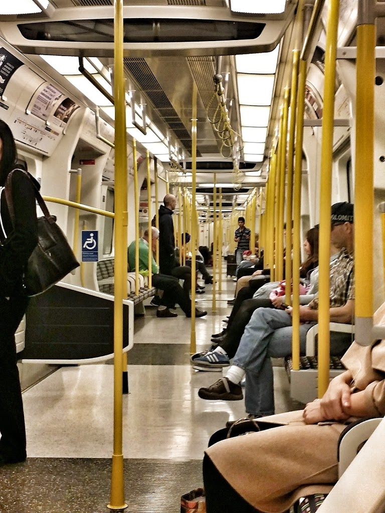
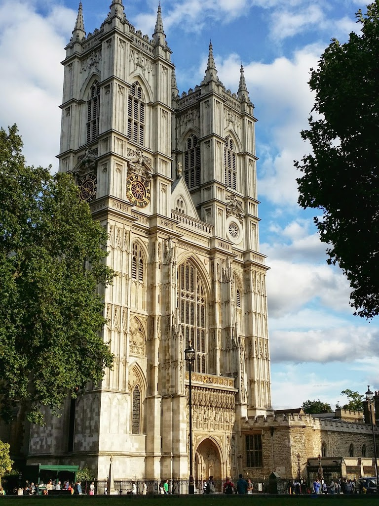
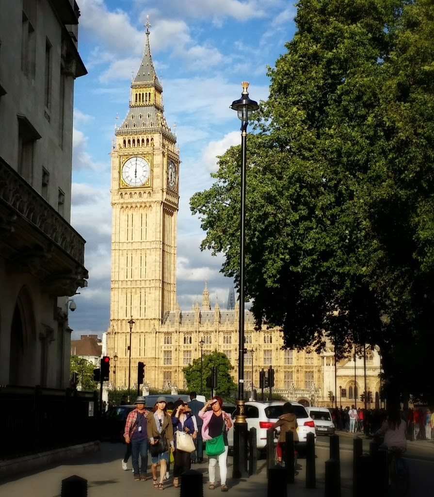

After Dee and I finally gave up trying to get Indian Tourist Visas (only India could [screw up](http://www.tripadvisor.com/ShowTopic-g304554-i4228-k7517072-US_Citizen_Tourist_Visa_for_India_CKGS_frustration-Mumbai_Bombay_Maharashtra.html) the application process [that badly](http://blogs.wsj.com/indiarealtime/2014/06/27/long-lines-and-lost-passports-for-indian-visa-applicants-in-the-u-s/)), we decided to simply visit the UK for the next two weeks. We have our first few nights booked at a wonderful hostel in Earl's Court, and after that we are just going to wing it. Scotland may be in the cards, or perhaps Wales, or maybe even Ireland?

The trip got off to an exciting start as Dee decided to schedule (1) her move back to Boston from her Portland internship, (2) returning the rental car across the city, and (3) exchanging her broken cell phone with Verizon, in the two hours between my bus arriving in Boston and us needing to be at the airport. Nevertheless, we made it in the nick of time and took a relatively pleasant red-eye to London.

My only other visit to London was a 12-hour stopover on the way to India. But, I am once again amazed at how clean, organized and *well-signed* the city is. What an easy and pleasant place to visit. One of my giddier moments was realizing that on the District Line on the 'Tube', there are no barriers between the subway cars -- you can look down its entire length and literally see the interior snake back and forth as the train navigates the curves of the track!

<table align="center" cellpadding="0" cellspacing="0" style="margin-left: auto; margin-right: auto; text-align: center;"><tbody><tr><td style="text-align: center;"></td></tr><tr><td style="text-align: center;">London Underground</td></tr></tbody></table>

This is the first international trip where I've brought my own cell phone along. Interestingly, Verizon does not lock down their 4G phones -- you just pop in a new prepaid overseas SIM card, spend a few minutes sleuthing the internet to find out how to configure the new service's APN, and you're good to go! It is so pleasant to not be screwed by Verizon for once. I actually have a UK phone number, 2 GB of data, and more free voice/data than I could ever use for about $18 for the month. It's surprisingly nice to be able to access my personal email, google maps, Uber, Yelp, Trip Advisor, and all my other favorite apps without even needing to reinstall them, and it's making the trip that much smoother. In fact, this is one of my first trips where I'm not bringing a Lonely Planet or Rough Guide guidebook -- that alone will save me more than I paid for the SIM card.

We booked a four-hour bike tour through Hyde Park and Central London, which was great for helping to keep us awake in the face of substantial jet lag. Westminster Abbey looked especially stunning:

<table align="center" cellpadding="0" cellspacing="0" style="margin-left: auto; margin-right: auto; text-align: center;"><tbody><tr><td style="text-align: center;"></td></tr><tr><td style="text-align: center;">Westminster Abbey</td></tr></tbody></table>

And, this photo marks the *[second time](http://www.rdchambers.net/uncategorized/2010/06/03/london/)* that Big Ben (ahem.. _The Elizabeth Tower_) graces the pages of this blog, albeit from a different angle.

We look forward to watching a professional football/soccer match, visiting the Churchill War Rooms, and many other adventures over the next two weeks.
