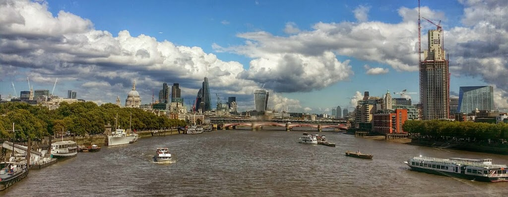
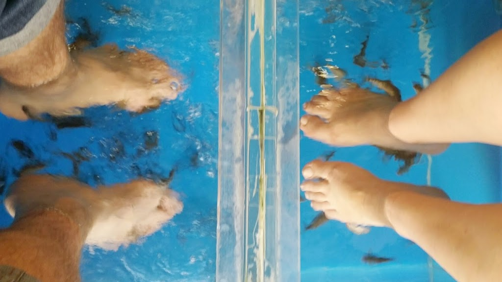
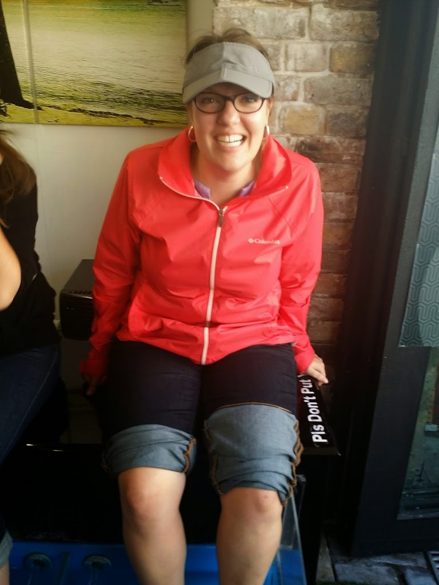
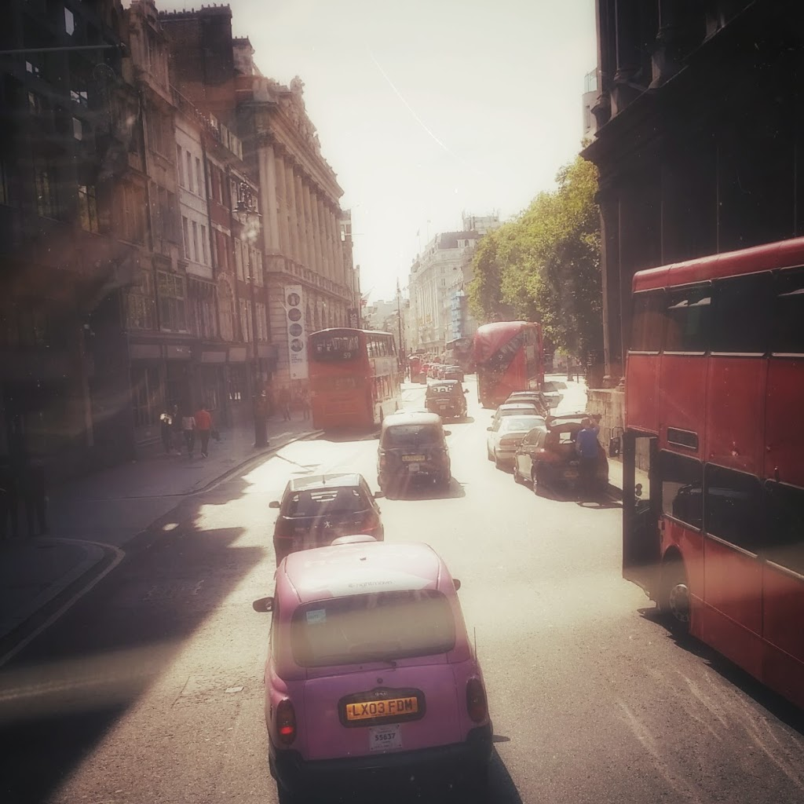

  

<table align="center" cellpadding="0" cellspacing="0" style="margin-left: auto; margin-right: auto; text-align: center;"><tbody><tr><td style="text-align: center;"></td></tr><tr><td style="text-align: center;">The Thames&nbsp;</td></tr></tbody></table>

Our London trip continued with us doing the most touristy and shockingly expensive activities that we could find.  For instance, we visited the Churchill War Rooms – the underground bunker from which Churchill directed Britain’s part in WWII. Admission was around US$30 a piece, and the museum was more of a shrine to Churchill than a museum of WWII history.  It made me curious about Churchill as a person, but the museum was so partial and non-critical that I left feeling like I’d like to watch a History Channel documentary to get the real story.

  

We proceeded to shell out another ~$35/piece to go on the London Eye – effectively a giant Ferris Wheel next to the Thames. After the “4D” introductory movie, which basically involved the filmmakers thinking up outlandish scenarios that would justify having the electronic sneezing equipment spew water on you (that was the fourth ‘D’) and which conveyed no actual information about the London Eye or its construction. Although the Eye was the most expensive Ferris Wheel I’ve ever been on by a factor of about 35, the view was spectacular.

  

"Eye" took a selfie on the London Eye

  

After the London Eye and Churchill War Room fiascos (henceforth referred to as the London Fee Party) and the ensuing buyers’ remorse—we decided that from now on, whenever feasible, we would go to free attractions. After all, the UK has plenty of them.

  

In that vein, we spent an afternoon vising Camden Locks, an old market with hundreds of food, clothing, and random-crap stalls. Now, I’m sure that the random-crap stalls had pretty amazing deals, and ten years ago I would have been falling all over myself to buy funny t-shirts, bobbleheads, cellphone accessories, and Chinese knockoffs of American sneaker brands. But now, in 2014, I have unfettered access to the world’s largest random-crap stall – Amazon.com – with free delivery to my door, the ability to effortlessly compare prices, and a wealth of customer reviews to properly place the crapgadget with respect to my Crappiness-vs-Cheapness utility function.  The brick-and-mortar (or corrugated-sheetmetal-and-blue-tarp) random crap stall just doesn’t hold the same allure it once did.

  

However, one thing that the Camden Locks market did have was a store where you could pay 5 pounds to have fish nibble to calluses and dirt off of your feet, causing uncontrollable ticklishness and general hilarity.

  

  

<table align="center" cellpadding="0" cellspacing="0" style="margin-left: auto; margin-right: auto; text-align: center;"><tbody><tr><td style="text-align: center;"></td></tr><tr><td style="text-align: center;">Dee laughed so hard when the fishes tickled her feet that a crowd literally gathered to watch.</td></tr></tbody></table>

My favorite thing about London has been its public transit system. One example of its awesomeness is the Oyster Card, which gets you on city busses as well as the Tube. For one thing, when your trip is done you can return the card for a refund of your 5-pound deposit _as well as any unused funds_. For another, you don’t have to perform some complex calculus to determine which pass to buy—you just start using the card, and it automatically caps your expenditures each day at the cost of a one-day pass. The system is fair, simple, and gives you the distinct impression that you are not being taken advantage of.

  

<table align="center" cellpadding="0" cellspacing="0" style="margin-left: auto; margin-right: auto; text-align: center;"><tbody><tr><td style="text-align: center;"></td></tr><tr><td style="text-align: center;">View from a double-decker bus. Of other double-decker busses.</td></tr></tbody></table>

We also visited the London Comedy Store on Improve Night. It was really first-rate comedy. Boy, do the Brits love their accents. Incidentally, I am happy to report that 2 days into our trip Dee has picked up an involuntary British Accent, and that I am doing my best to make fun of her for it.

  

Also, I used Uber (a mobile-phone-based private taxi service that is infuriating the London Taxi establishment) for the first time. We summoned the Uber car just as we were finishing our dessert at an outdoor table at an Italian restaurant. When it arrived we simply stood up, took one and a half steps forward towards the street, and stepped into the car. It was very James Bond.
