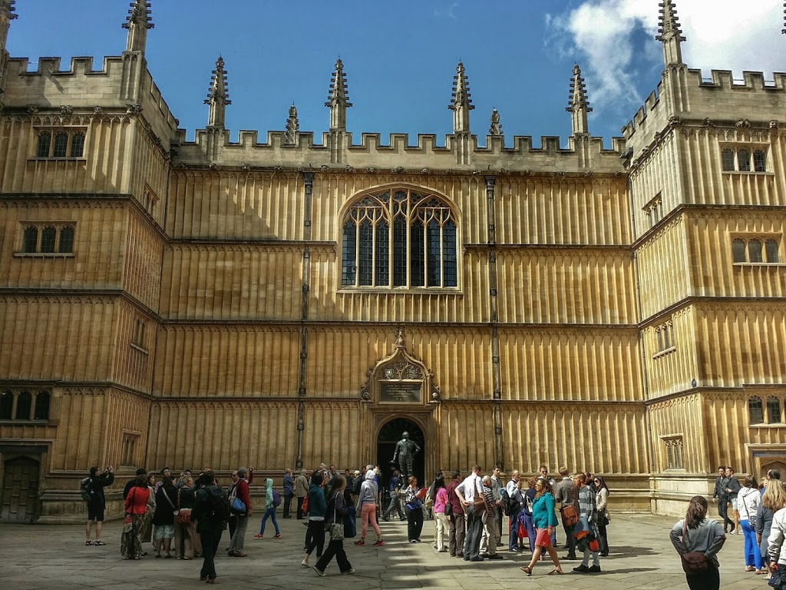
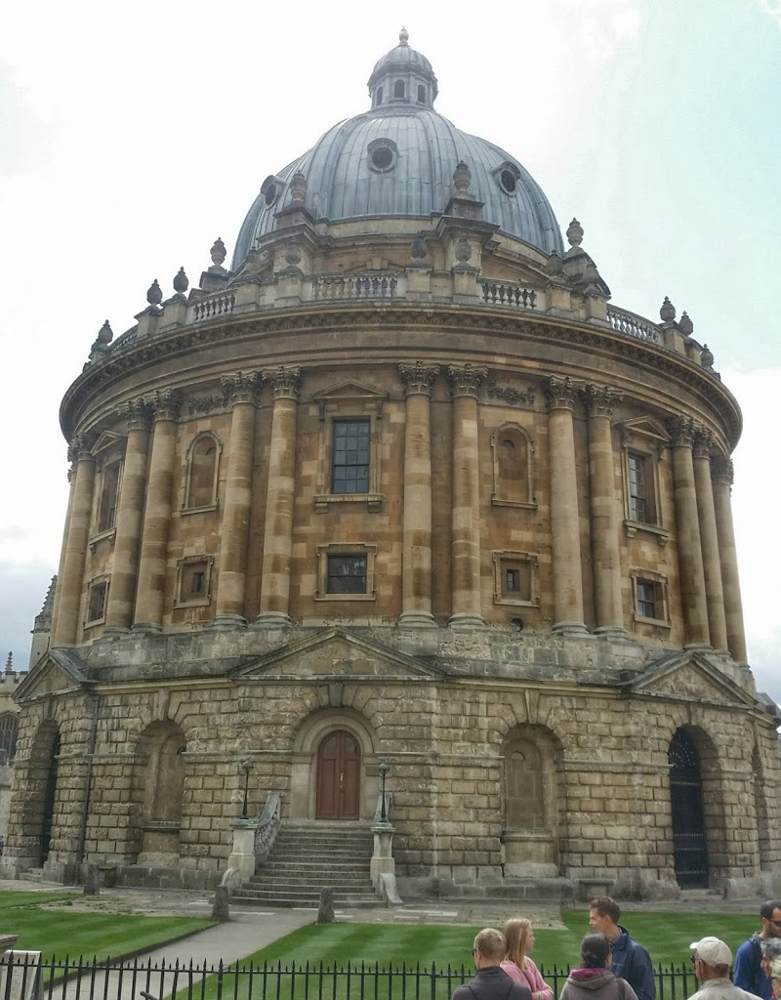
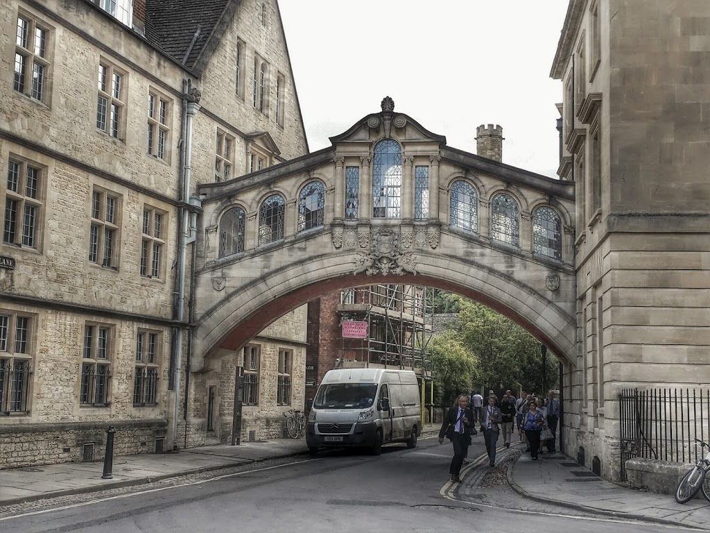
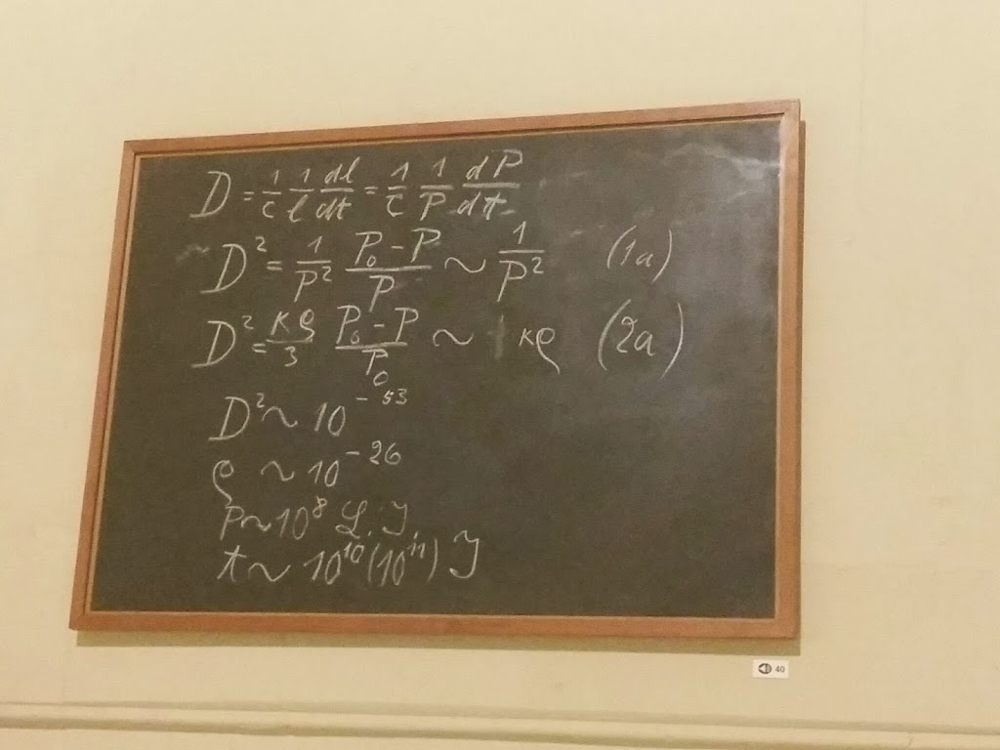
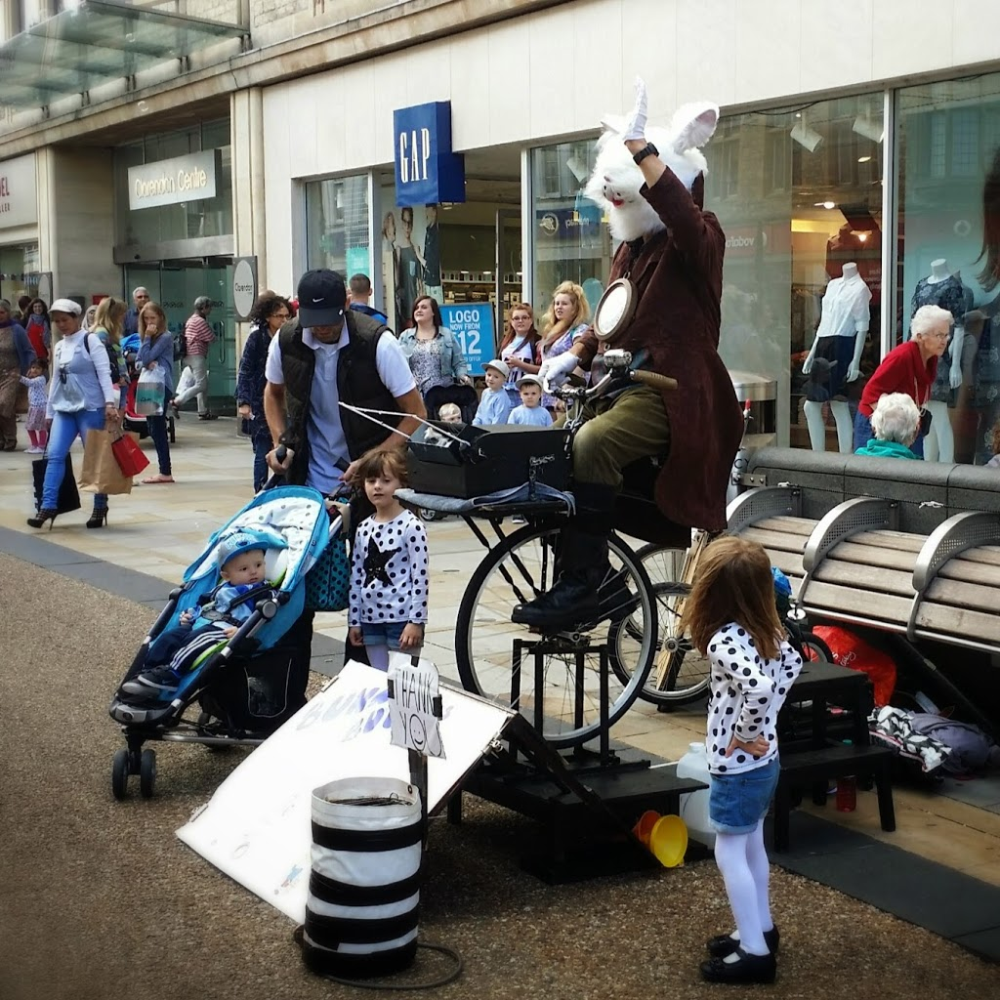

  

  

  

Just before visiting Oxford, I re-read Bill Bryson’s chapter on Oxford in “Notes from a Small Island”. Wherein, he complains bitterly about how Oxford has been blighted by ugly architecture and too many parking spaces. It was a nice reality-check for me because upon visiting Oxford I found it to be incredibly well-preserved and beautiful, confirming once and for all that Bill Bryson is a whiner.

  

  

However, I did get the impression that Oxford focuses almost exclusively on what I would call the “bullshit” aspects of higher education: how old are the buildings, how many of them are devoted exclusively to unnecessary ceremonies, how many of them are featured in Harry Potter, and how many volumes of books do they have (regardless of their quality or relevance). The tour guide spoke in hushed tones of the eminent scientists—“the most clever people in the world, really”—who sat isolated in its medieval buildings, absentmindedly stroking their stubble and solving the Mysteries Of The Universe.

  

I think that it’s a very outdated idea of how scientific progress is made. I think they should be scanning in the books instead of devoting the most precious real estate on campus to them (keep the ones that are actually used, that’s fine, but if you truly need to access one of the other 20 million volumes, perhaps you could be troubled to catch a bus to the storage site). Then, replace that library space with actual classrooms, auditoriums, meeting spaces, student groups, and professors’ offices. _That’s_ where the real progress happens, so why are these spaces relegated to ugly buildings on the fringe of campus?

  

In other news, I’ll bet this maintenance guy thought it was pretty funny to park his van under what is apparently the most photographed place in Oxford (the "Bridge of Sighs"). _free_ walking tour, and then going to the _free_ Science Museum, which was actually wonderful. I wish we had more time there. One of the cooler artifacts was this segment of a chalkboard from an original Einstein lecture.

  

  

  

However, I’m happy to report that Dee and I avoided supporting the British fee-conomy in Oxford by taking the _free_ walking tour, and then going to the _free_ Science Museum, which was actually wonderful. I wish we had more time there. One of the cooler artifacts was this segment of a chalkboard from an original Einstein lecture.

  

<table align="center" cellpadding="0" cellspacing="0" style="margin-left: auto; margin-right: auto; text-align: center;"><tbody><tr><td style="text-align: center;"></td></tr><tr><td style="text-align: center;">Section of an original chalkboard from an Einstein lecture (never erased!)&nbsp;</td></tr></tbody></table>

I will leave you with a photograph of this street performer who rode a stationary bicycle that blew bubbles, while waving to the crowd in a bunny suit.

  

<table align="center" cellpadding="0" cellspacing="0" style="margin-left: auto; margin-right: auto; text-align: center;"><tbody><tr><td style="text-align: center;"></td></tr><tr><td style="text-align: center;">Best Street Performer Ever.</td></tr></tbody></table>
