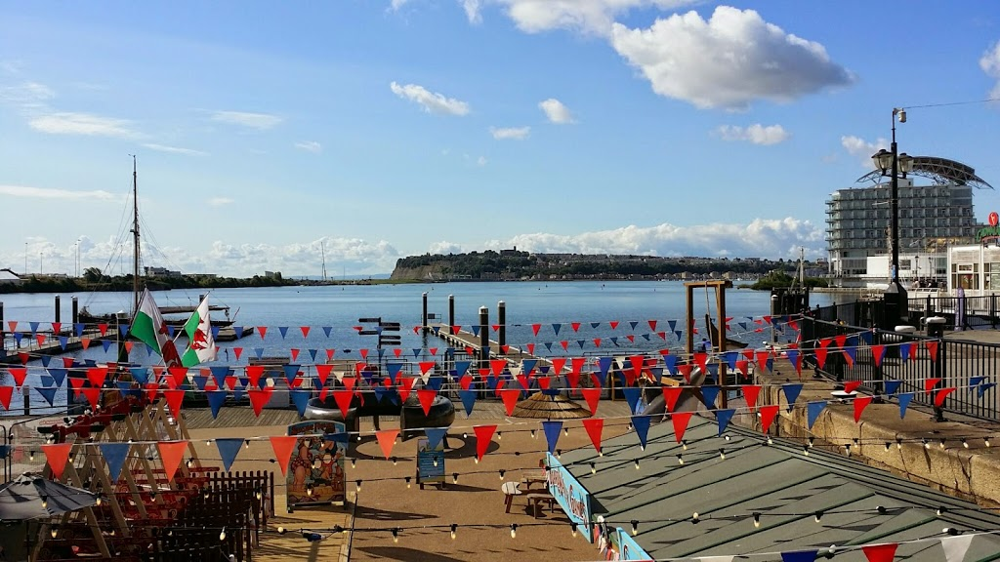

<table align="center" cellpadding="0" cellspacing="0" style="margin-left: auto; margin-right: auto; text-align: center;"><tbody><tr><td style="text-align: center;"></td></tr><tr><td style="text-align: center;">Cardiff, Wales</td></tr></tbody></table>

After Oxford we continued onwards to Cardiff, the capital of Wales. I settled in for a nice long trip, but when I was awoken from my nap about an hour later, we were already there. In fact, we were so unprepared that by the time we got our belongings together we had been locked on the train and had to summon the conductor. I guess these high-speed train make quick work of such a small country.

Cardiff was our first time couchsurfing in England.  Our host was named Bob, and he had hosted over 500 couchsurfers in his apartment overlooking a canal in Southeast Cardiff. I must admit that by the time we arrived in Cardiff I was very tempted to just drop some extra money for a hotel instead of lugging our bags around the city for five hours waiting for Bob to get out of work. But, I am very glad that we stuck with it, since it was great to meet Bob and learn about Wales from him, and we probably saved a cool $200-$300 in the process.

<table align="center" cellpadding="0" cellspacing="0" style="margin-left: auto; margin-right: auto; text-align: center;"><tbody><tr><td style="text-align: center;"></td></tr><tr><td style="text-align: center;">Bob's house, across the canal</td></tr></tbody></table>

Dee and I grudgingly broke our admission fee “poor-atorium” to go to the Dr. Who Experience. Dr. Who is Dee’s favorite show, and apparently it is filmed primarily in Cardiff. The ‘Experience’ was kindof like a theme park show, and ended with a Dr. Who museum. It was well done. Although I don’t watch the show much, I do think it is a great concept and allows them to tell some really good stories. Of course, the most otherworldy item in the ‘Dr. Who Experience’ were these Lamb and Mint flavored potato chips:

<table align="center" cellpadding="0" cellspacing="0" style="margin-left: auto; margin-right: auto; text-align: center;"><tbody><tr><td style="text-align: center;"></td></tr><tr><td style="text-align: center;">Lamb and Mint Potato Chips</td></tr></tbody></table>

We also visited St. Fagans National Museum (a free alternative to the extortionately-priced Cardiff Castle). It consisted of a famous ‘manner house’ and a few dozen historic buildings which had been moved on-site in order to preserve them. The most interesting spectacle, however, were the enormous Welsh families in attendance. The children were running around like uncoordinated little hell-raisers, and the parents frankly weren’t too stressed about it. It was a nice attitude.

Today, we continue onwards to Dublin, Ireland via a ferry from Holyhead. The plan is to then head North, cross the Irish sea to Scotland, and then loop back down to London.
