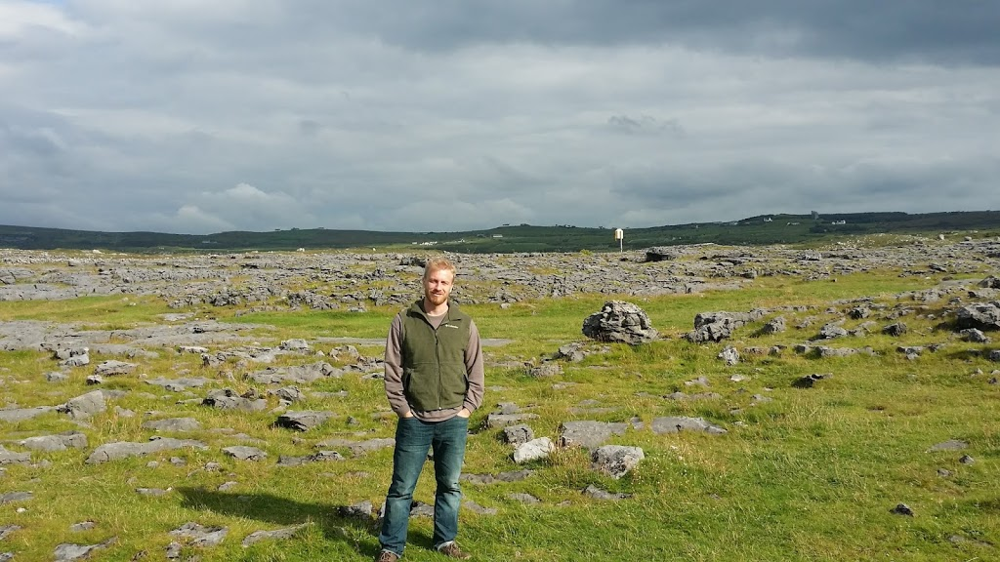
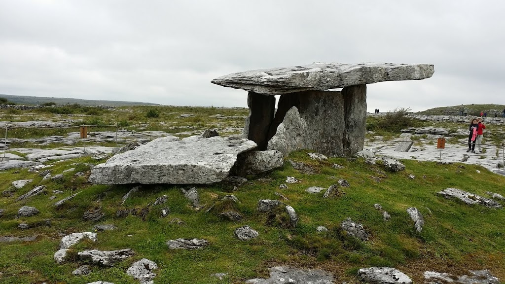
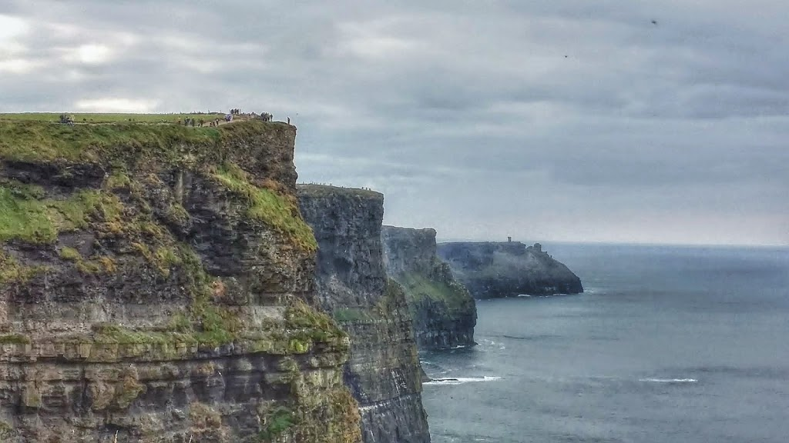
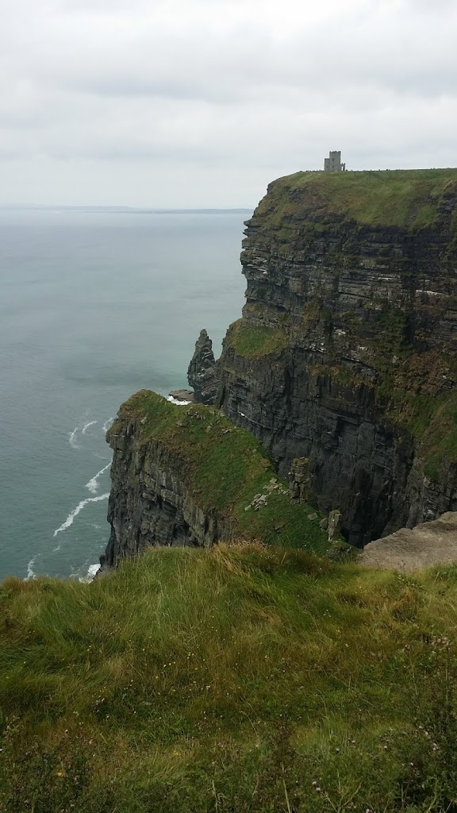
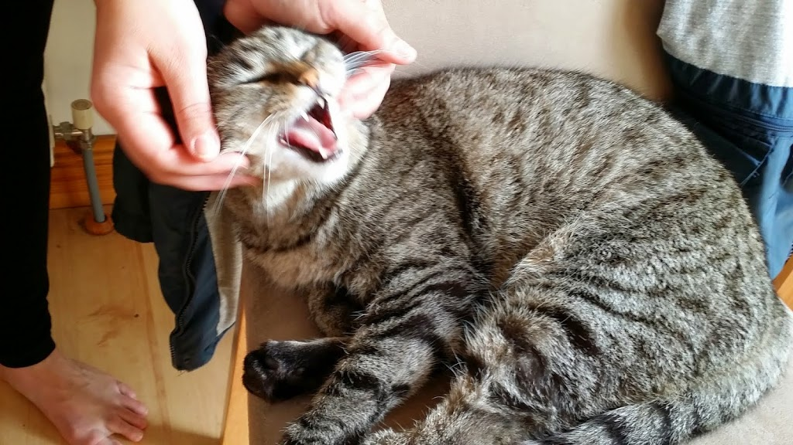
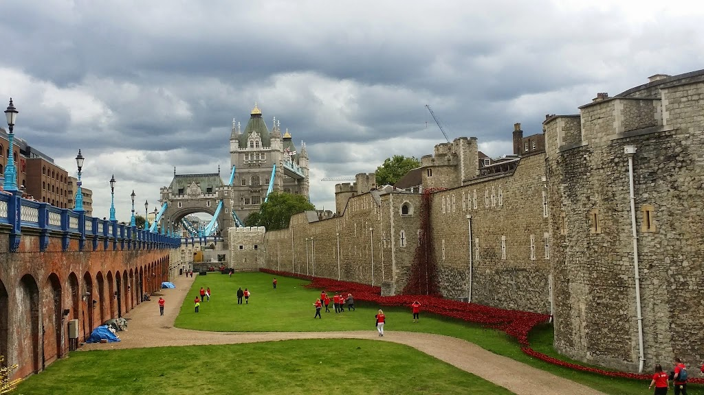
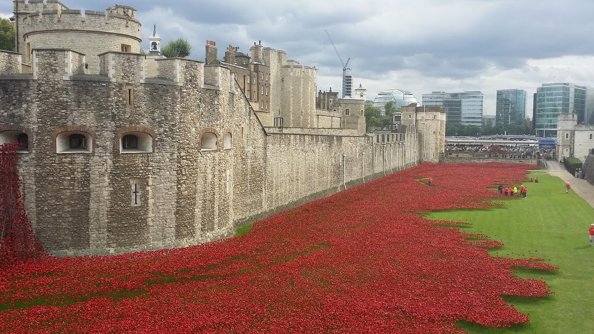

We’re back in beautiful New Hampshire again, and as always I’ve fallen behind in my blog while tending to last-minute logistics. However, the last few days weren’t any less fun than the first ones.

We decided to take a break from the constant planning and navigating by going on an official bus tour from Galway. Of course, we also had to compete with the ten thousand other tourists whose bus tours were following the exact same itinerary as ours. Still, our tour guide was great, and we were able to see 10x more than we ever could have if we were planning it ourselves. In particular, we got to see a lot of the beautiful Irish countryside.

<table align="center" cellpadding="0" cellspacing="0" style="margin-left: auto; margin-right: auto; text-align: center;"><tbody><tr><td style="text-align: center;"></td></tr><tr><td style="text-align: center;">Out of the four consecutive pictures Dee took of me here, this was the one where I was squinting the least.</td></tr></tbody></table>

<table align="center" cellpadding="0" cellspacing="0" style="margin-left: auto; margin-right: auto; text-align: center;"><tbody><tr><td style="text-align: center;"></td></tr><tr><td style="text-align: center;">A prehistoric tomb, among the most photographed places in Ireland.</td></tr></tbody></table>

The cliffs of Moher are 700-foot cliffs overlooking a phenomenally rough part of the Atlantic Ocean.  Even on a beautiful, (partly) sunny day, they were foreboding. I simply can’t imagine what they would be like during a storm.

<table align="center" cellpadding="0" cellspacing="0" style="margin-left: auto; margin-right: auto; text-align: center;"><tbody><tr><td style="text-align: center;"></td></tr><tr><td style="text-align: center;">The Cliffs of Moher</td></tr></tbody></table>

Nonetheless, we were forced to take our leave of Galway after just a couple of days. Even more sadly, we were forced to leave our AirBnB host, and her attention-loving cat.

<table align="center" cellpadding="0" cellspacing="0" style="margin-left: auto; margin-right: auto; text-align: center;"><tbody><tr><td style="text-align: center;"></td></tr><tr><td style="text-align: center;">catgasm</td></tr></tbody></table>

We were delayed by a day in getting back to London because Irish Ferries (in true Irish fashion) cancelled our ride back to England in the most grumpy, inflexible, and technologically inept way it possibly could.  However, we ultimately made it back and were able to spend one more day in London, while getting ready to catch our early-morning flight from Heathrow.

One of my favorite sites was the Tower of London, where a group of volunteers was installing beautiful red ceramic flowers – one for each person who died in World War I—as part of the 100th anniversary of the Great War.

My impression of England is that it is unbelievably clean, historic, and well-run, with a truly remarkable government. It helped me to realize how flaws our public transit systems are, and indeed how differently we in the US relate to our own government and the services it provides.  Just as we are less trusting of and less dependent on our government, it is also far less trustworthy and less capable of providing basic services.

My impression of Ireland is that it is a country in transition. It seemed that the Irish still have fresh memories of being an impoverished and rather backwards country. As much as their economy and technology has been improving, it doesn’t seem to be happening evenly across the country or across the population.  But, the most astounding thing about Ireland was how eager and willing people were to talk with us. They seem to truly enjoy meeting new people and talking with one another. I hope that they are able to fix their economy without losing their friendliness.

Overall, the trip to the UK was a wonderful way to get to know our “ancestral homelands”. It was difficult to keep the cost of the trip down in such a phenomenally expensive country, but Couchsurfing, AirBnB, and our smartphone access helped a lot. The trip wasn’t as challenging as a place like India, China, or perhaps even New Jersey would be, but that was part of the charm of it.
