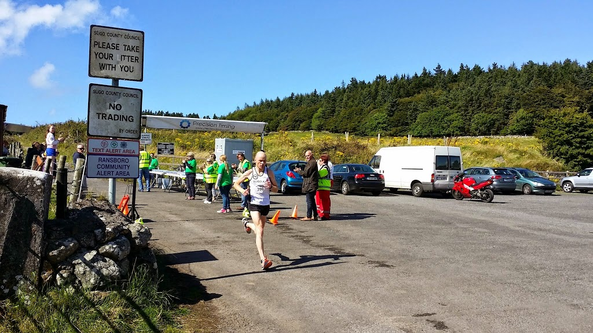
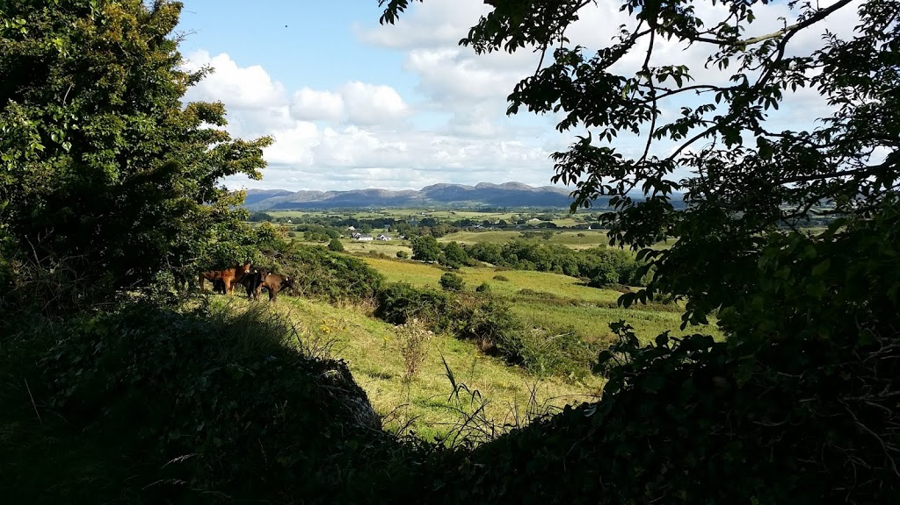

  

SLIGO, IRELAND

  
(Note that I'm posting this a month or two after I wrote it...)  
  

The ferry from Holyhead, Wales to Dublin, Ireland seemed more like a repurposed cruise ship than what I picture as a ferry. It had 11 separate levels, one of which was filled mostly by private cabins with beds. It had a cinema, several cafeterias, a small casino, and of course numerous bars. Most of its levels were used to store cars, busses, and even (it seemes) trucks carrying containerized cargo. It was an awesome way to travel.

  

<table align="center" cellpadding="0" cellspacing="0" style="margin-left: auto; margin-right: auto; text-align: center;"><tbody><tr><td style="text-align: center;"></td></tr><tr><td style="text-align: center;">Dee and I as the ferry pulled away from Holyhead, Wales</td></tr></tbody></table>

  

Our first welcome to Ireland was basically being stranded, along with several dozen other tourists, as the Irish Ferries port. There was terrible bus service to the city, and no ATM to get euros or to switch our pounds to euros. Luckily, some enterprising taxi drivers were able to solve our problems.

  

We stayed at a nice room using Air BnB. It was a pleasant change from couchsurfing, in that the room was immaculately cleaned and we didn’t feel like beggars. We’re eager to do more couchsurfing in the future, but it’s probably best suited to less touristy cities, or trips where we travel by car, so that we aren’t competing for the few available downtown rooms.

  

Dublin seemed interesting and full of rich history. It was definitely rougher around the edges than London, Oxford, Cardiff, or Holyhead, and the public transit is less organized. Also, it seemed surprisingly expensive—just as expensive as London, in fact.

  

The most noticeable difference, though, is the friendliness of the people. People almost seem excited to give you directions, which is lucky because it’s impossible to get around without them. Even the shortest of trips seem to merit many minutes of gesticulation and vivid explanation, which is then repeated (with variations) several times over, and followed by a rapid-fire interrogation session as to where you’re from, where you’re going, how do you like Ireland, how unfortunate is the weather, aye?, and have you tried the blood pudding.

  

Regardless, we decided not to linger in Dublin, and set out immediately for two nights in Sligo on the West Coast, which seemed to present a nice combination of scenery, history, activity, and public transit links. We took the bus (which is much cheaper than the train and just as fast), and Dee began to absolutely knit herself silly with the new Irish yarn she picked up in Dublin. It was a huge hit with the old Irish ladies on the bus.

  

<table align="center" cellpadding="0" cellspacing="0" style="margin-left: auto; margin-right: auto; text-align: center;"><tbody><tr><td style="text-align: center;"></td></tr><tr><td style="text-align: center;">A beautiful abbey that we stumbled on in Sligo</td></tr></tbody></table>

We stayed with a lovely Irish couple named Peter and Mary, again via Air BnB. We rented bicycles and took a beautiful ride through the country.

  

  

  

We meant to climb to the top of ‘Knocknarea’, a picturesque hill overlooking the sea with some sort of prehistoric monument on top. However, we happened to arrive in the middle of the ‘warrior race’, a series recreational foot races, and we weren’t able to make it to the top.

  
However, while we waited for the racers to pass by, we took a stunning walk through the Irish countryside.

  

  

  

  

Now, to make sure we don’t get stranded and miss our flight out of Heathrow Sunday morning, we’ve mostly planned the remaining week: Westport (a coastal town with great cycling), Galway (an Irish city that is apparently great to visit), then another 2 days in London to close out the trip.
