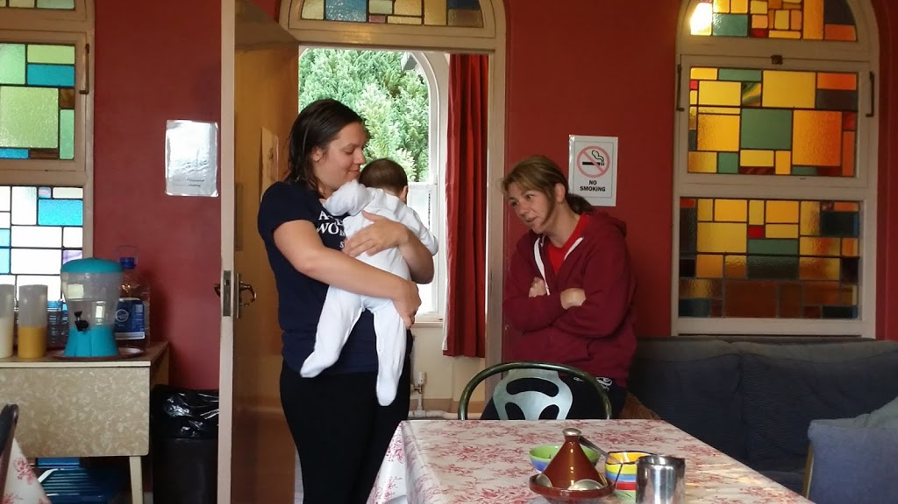
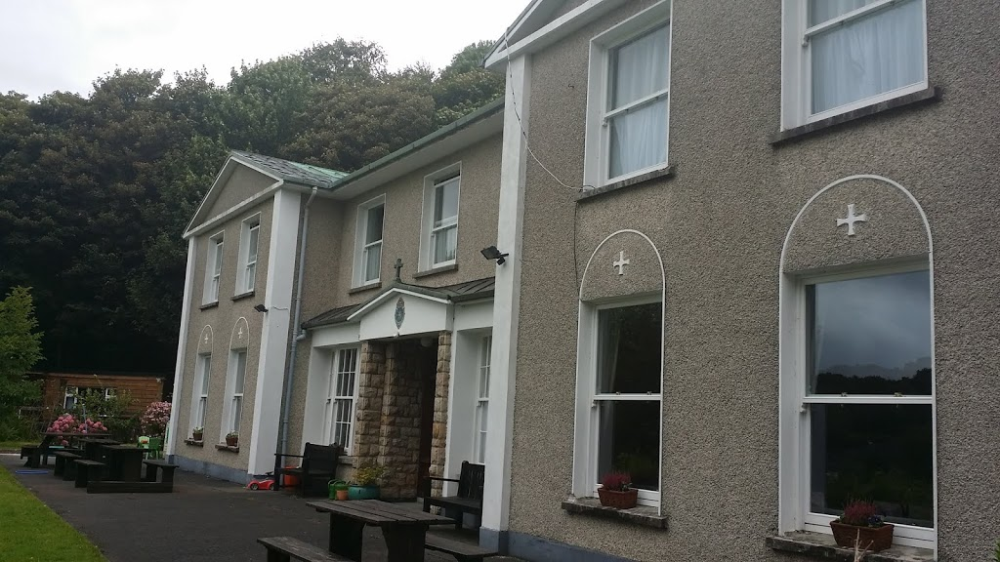
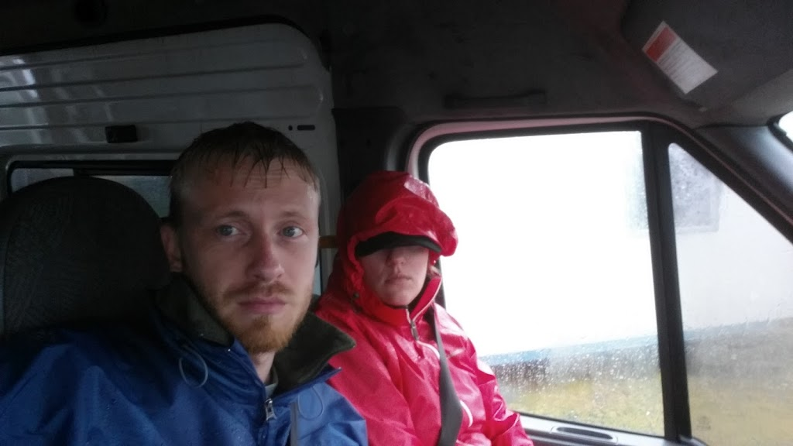
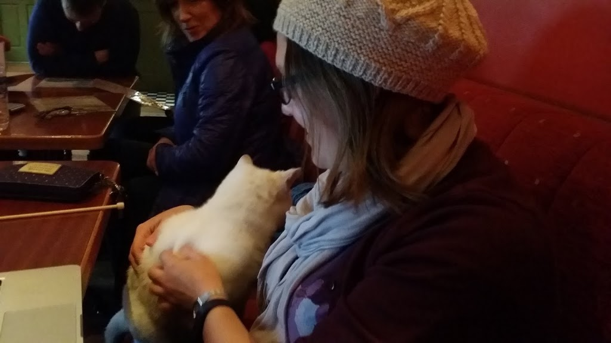

  

PART I

  

As in any extended trip, we have had some moments of travail during our travel. The first of these was our attempt to bike the 42 kilometer Greenway from Achill to Westport, Ireland. Reviews of this trip described rolling green hills, a car-free path from town to town, and views of the Irish coastline. We even found that electric bikes were available to make the considerable length (~30 miles) do-able.

  

The night before the ride we were staying in a historic abbey-turned-hostel (where we had enjoyed the company of the very friendly proprietors and their very cuddly baby, as well as a lovely sitting room from which we endured the agony of our annual fantasy football live drafts – twice). We awoke early to dark gray skies and drizzle outside our lacy curtains. Nonetheless, we got up, showered, packed our bags to be stowed, and dressed for a long day of cycling.  

  

  

  

The steady but only just annoying drizzle continued as we walked to the cycling outfit.  We, along with about 10 other people, arranged to rent bicycles and get shuttled out to Achill to take our long ride. Our shuttle driver was a friendly, funny fellow who had been a carpenter in Boston for some years.

  

However, when we arrived in Achill the rain was driving and wind blew so hard we could hear it whistling through the van as we sat and waited to get set up. We were given helmets and orange vests and our bikes. Rob and I pulled our rain jackets tight and bravely made out across the parking lot and up the first hill. Within 2 minutes we were soaked to the bone and freezing. An easterly wind drove the stinging rain straight into our eyes so we could not even see the road. We pulled over and quickly decided to call the whole thing off and beg a ride back to Westport with the shuttle driver, who kindly obliged us. Our greatest surprise was that we were the only people who decided to go back. I hope they all made it okay.

  

<table align="center" cellpadding="0" cellspacing="0" style="margin-left: auto; margin-right: auto; text-align: center;"><tbody><tr><td style="text-align: center;"></td></tr><tr><td style="text-align: center;">The mood in the van was gloomy after admitting defeat</td></tr></tbody></table>

So we returned to Westport – soaked, freezing, and having wasted an entire morning. Luckily, the bike company did agree to refund our entire rental and shuttle costs, which they certainly weren’t required to do. Admittedly, we did (in a sense), get a free tour of the scenic drive to Achill! We slogged back to the abbey, peeled our clothes off and changed, and napped on the couches in the sitting room until our bus to Galway arrived.

  

PART II

  

Two days later we began an ill-fated journey to the Aran Islands, or more specifically, Inish Mor. Back in Abbeywood we had dutifully called ahead and arranged to take a horse ride along the beaches of Inish Morr. I had been excited for days.

  

We woke up at 7:30, showered, cooked and ate breakfast in our host’s kitchen (enjoying the company of her sweet, old dog and jealous, shrieking feline). We were out by 8:45 and off to catch an hour-long bus ride to an hour-long ferry ride to Inish Mor. We had meant to be out by 8:30, and consequently did not stop at an ATM on the way to the bus as I had planned to do.

  

After stomach-wrenching bus and ferry rides, we arrived on the gray and rainy shores of Inish Morr. Hawkers of bus tours, bicycle rentals, and horse-and-carriage rides propositioned us non-stop as we dutifully climbed up through Kilronen, searching for an ATM on our way to the riding center. After a quick stop at the Aran Sweater shop to buy a woolen hat (as I was once again, wet and cold,) we walked up and did find an ATM. It was out of order. After asking at a bank, a post office, and a bar, we were certain that this was the only ATM on the island, and there was absolutely no way for us to get cash anywhere else with American credit cards.

  

Running 15 minutes late now, we walked (me – with dread, and Rob – with righteous resoluteness) towards the riding center. It turned out to be just a house, and there was no way they were going to be able to take a credit card. I was in tears with embarrassment in the driveway. After being thoroughly comforted by my dear Rob, we ventured up the driveway.

  

We were met by the proprietor, who informed us that (even though we had a reservation and were a mere 15 minutes late), he had given our horses and spot to a random couple who had walked in and simply asked. He offered to take us later if we liked, and we explained our cash situation. He seemed quite pleased that he had accepted the other couple and not lost any money.

  

I, on the other hand, was thoroughly disappointed and a bit angry – at myself, and also at just how wrong this situation had gone. I went and had a good cry sitting in the gateway of a scenic Irish pasture. I was interrupted by a few German tourists staring at me as they went by, followed by some staring folks peering down from a horse-drawn carriage.

  

We made our way back down the hill in the drizzle, arranged to leave on an earlier ferry, and wandered about wondering what on earth to do with ourselves. We got directions to a pub that served lunch and began trudging up the dirt lane to Ti Joe Watty’s. We did take a nice detour through a little wooded area, where we found a large patch of blackberries. In a rather surreal moment, we picked berries and ate them in the rain, on a secret lane in the woods in Ireland, when we had absolutely nowhere else to be.

  

Upon arriving at the pub, I promptly ordered myself a creamy, whisky-filled Irish coffee.

  

I write now from Ti Joe Watty’s, where we have sat for hours. We enjoyed fish and chips and steamed mussels. We also enjoyed the company of what is apparently the bar cat.

  

  

  

My conclusion at the end of Disastrous Days I & II is this: use the two legs the good Lord gave you.
