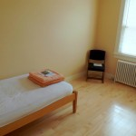
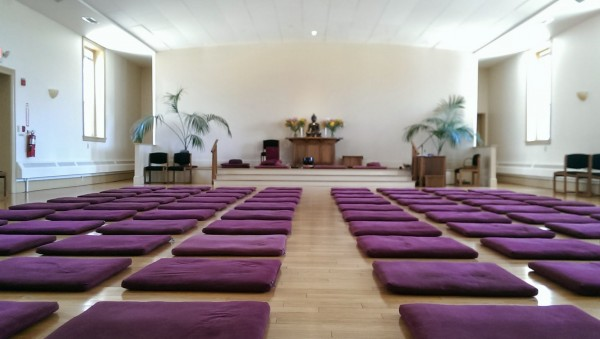

This April 3-12 I did a silent meditation retreat at the Insight Meditation Center in Barre, Massachusetts. I had done a sort of [non-residential retreat in Dharamsala, India](http://www.rdchambers.net/uncategorized/2010/06/11/settling-in/),  as well as three weekend retreats run by our awesome local meditation group ([Valley Insight](http://valleyinsight.org/)) and a few daylongs. At each one, I gained a lot of calmness, learned about myself, and came back to daily life with a renewed perspective. Still, everyone said that the longer retreats were different, and more fulfilling. This 10-day retreat was my chance to find out. (Spoiler alert: it was awesome.)

I decided to do the retreat at the Insight Meditation Center (IMS) in Barre, MA on the advice of some friends at Valley Insight, and because it's world-famous, well-regarded, and just seems to be my style.

\[caption id="attachment\_391" align="alignnone" width="600"\] Front of the Insight Meditation Society Retreat Center\[/caption\]

 

I had to sign up for the retreat about 6 months ahead of time (they're very popular), and I had to take a total of six days off of work.

Upon arriving, I was funneled into what was clearly a finely-tuned orientation system. Like everything at IMS, it had been honed over 25+ years of retreats to be pleasant, efficient, and predictable (all conditions which are helpful for meditating). Judging by the license plates, I was one of the few retreatants from 'Up North'; most people were from Massachusetts (mostly Boston), and a good number were from NYC or New Jersey.

Like everyone else, I was assigned a 'yogi job' (in my case washing dishes after lunch) in order to keep costs down and to practice 'mindful work'. My room was single-occupancy (all rooms at IMS are singles). It had an in-room sink, and it was very basic, clean, and appropriate. I appreciated the privacy (I have always been in shared rooms at other retreats).

 

The meditation hall was sparse but extremely beautiful. I loved the subdued decorations. There was plenty of seating both on meditation cushions and on chairs. The climate control and sound system was top-notch.

\[caption id="attachment\_390" align="alignnone" width="600"\] The main meditation hall at IMS\[/caption\]

 

Being a dedicated retreat facility, IMS also had several purpose-built rooms for walking meditation.

\[caption id="attachment\_389" align="alignnone" width="600"\] Upper room for walking meditation\[/caption\]

 

 

The retreat itself had an interesting theme, which I hadn't expected going into it: while most meditation styles in this tradition focus on an object (like sounds, body sensations, the sensation of breathing in the belly or the nostris, etc), this style focuses on awareness itself. So, although you might let your attention drift naturally from one object to another, you try to always remain aware of what you're paying attention to. This accomplishes some of the same goals as other practices -- concentration (of a sort), steadying the mind,  staying in the present moment, and preventing disruptive thoughts and feelings. But, it is (according to the teachers) much easier to integrate into daily life.

Another neat aspect of the retreat was that most of the day was self-paced. Although we met as a large group before breakfast and between dinnertime and bedtime, we were able to schedule our own practice between breakfast and dinnertime. The idea was (a) to be training for the 'real world', and (b) to conserve energy for continuous awareness. The teachers even provided a great book (available freely [here](http://sayadawutejaniya.org/wp-content/uploads/2011/07/Dhamma-Everywhere-Ashin-Tejaniya.pdf)) to study during free time if we wished to.

Below are some notes taken from my diary:

- Day 0 (Friday): I felt a lot of anticipation to get the retreat started, as well as some nervousness about whether it would be difficult. I was glad to hear that the schedule was relatively flexible.
- Day 1 (Saturday): The first full day went well. I noticed with amusement the absurd pressure I put on myself to be productive and competent in my dishwashing job. Totally inappropriate to the task at hand! Some notes from Steve's talk:
    - He emphasized that there's _nothing_ in our body or mind that's not okay to examine and become aware of.
    - He explained that in vipassana we pay attention to body sensation because they're noticeable, persistent, and localized. We are very interested in thoughts, but they are slippery, subtle, and difficult to observe (and emotions even more so), so especially at first we focus on body sensations.
- Day 2 ( Sunday): I established some simple goals: (1) Stay open, flexible, and aware. (2) Don't try so hard! Relax and have fun. (3) Don't squelch thoughts and emotions; just watch them, and (4) Just keep asking: "what does the mind know _now_?"
- Day 3 (Monday): Unfortunately, I started to develop a nasty cold, complete with headache and runny nose, which is no fun for meditation. On the plus side, as my mind started to stabilize, and I started to get a better handle on how to quickly assess the quality and stability of my awareness. I also worked on finding a happy medium between focusing in too hard (which leads to headaches and a cramped mind) vs. relaxing and 'zooming out' too much (which also causes some tension if it is forced). Steve's dharma talk was on the [defilements](http://en.wikipedia.org/wiki/Kleshas_%28Buddhism%29) (greed, hatred, delusion, conceit, restlessness, etc.). The instruction was to notice them, allow them to pass without engaging, and to notice the 'fingerprint' that they leave on the mind, to help get used to identifying them. It was really cool to play with this; when your mind is quiet and stable, they really do each leave a unique feeling as they pass.
- Day 4 (Tuesday):  I decided to re-focus on being receptive, having a 'light touch', being in the moment, not using too much energy, and not striving after specific feelings or experiences. I began to experience a profound appreciation for the difference between being in the present moment, versus being lost in thought, and specifically for how rich, fresh, and interesting the present moment is when you are really tuned in. By this point the retreat was getting a lot easier for me, both physically and mentally. My mind had shifted from dull, constricted, and achey to much more open, spacious, interested, and bright. At times, awareness began to seem almost effortless, and any lack of awareness became much more noticeable. Alexis gave an interesting dharma talk. He struggles profoundly with stage fright, but he went up on stage and gave an extemporaneous talk for as long as he could handle it. It was inspiring and courageous to do something like that without preparing notes.
- Day 5 (Wednesday): My goal became to just watch "this one moment"; to simply be present, and not try to _make anything_ out of it. No judgement, no expectation, no speculation. Just trust in the practice. At this point, I started to increase the amount of time I was practicing on my own each day, since it became quite pleasant and less energy-sapping. At some points, my mind became so still that it almost seemed 'silent' inside. I came to recognize two primary aversive thoughts that were preventing me from further settling into the practice:
    - _Pain,_ especially in my back, neck and right shoulder, from the extended sits. Instead of fighting the pain, I just acknowledged that if I wanted to do a retreat like this, pain is inevitable and expected, and wasn't even that bad.
    - _Restlessness_ due to the thought that I should be somewhere else or be doing something else. I simply acknowledged that these sits were productive and important, and moreover that I had decided to do them and I wasn't going to change my mind.
    - Finally, I acknowledged that moving my body (to stop the pain) or ending the sit (to stop the restlessness) wasn't going to bring lasting satisfaction. Somehow, this slight reframing of my understanding of my pain and restlessness profoundly changed my approach to the meditation, and I began to sink far more deeply into the present moment.
- Day 6 (Thursday): I continued to work with my aversion to pain and restlessness every time I sat, before trying to settle in. Once I dealt with those two issues, I could settle down almost effortlessly. My mind became exceedingly tranquil and spacious. When craving or aversive thoughts came up I could watch my mind seize up and tighten; but if I caught those thoughts early, I could release them and fall right back into the tranquility.
- Day 7 (Friday): Sits continue to become even more peaceful and effortless. I reduced my practice to just a few easy-to-remember instructions: 'no expectations', 'keep checking the awareness', 'relax', and 'stay in the present moment'. At one point, after a 45 minute sit, I just kept sitting for another 20 minutes. Very unusual for me. At one of the sits Carol, Steve, and Alexis shared some personal stories. Steve talked about his possible retirement, and it was impactful to see how this kind of practice can change and develop over a lifetime.
- Day 8 (Saturday - last full day): In the morning sit, I had an intense urge to sneeze. But, I decided not to act on the urge, and I just watched the tickle go up my nostril and into my head or whatever, and it just sat there and kindof glowed and vibrated. It was so intense! But somehow I was able to totally dissociate the tickle from the need to sneeze. The teachers organized a 'mindful speaking session' where we were able to talk amongst ourselves mindfully while trying not to be too drawn into the stories. I thought it was a great practice, since the end of a silent retreat can be really jarring.
- Day 9 (Sunday): I stuck around for a long time after the retreat ended, touring the IMS forest refuge (photo below) talking with the other retreatants. It was a beautiful day out, and driving home afterwards was an incredible pleasure, just feeling the wind on my face and watching the forest streak by.

I'm writing this entry a couple of weeks after the retreat, and I still feel a deep change in my mindset. I am far more patient, more aware of my own thoughts and feelings, and far more able to dwell in the present moment. The retreat was an amazing experience, and an almost completely positive one. I look forward to trying to do these sorts of retreats more often, and I hope that I don't let the cost and inconvenience deter me.

\[caption id="attachment\_388" align="alignnone" width="600"\] The IMS Forest Refuge, for longer individual retreats (several weeks to several years), is next door to the IMS retreat center.\[/caption\]
