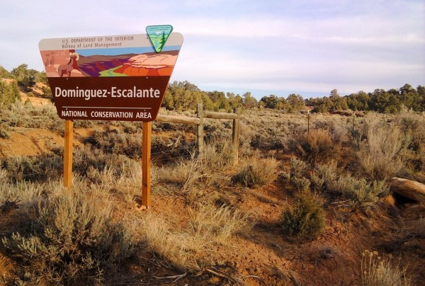
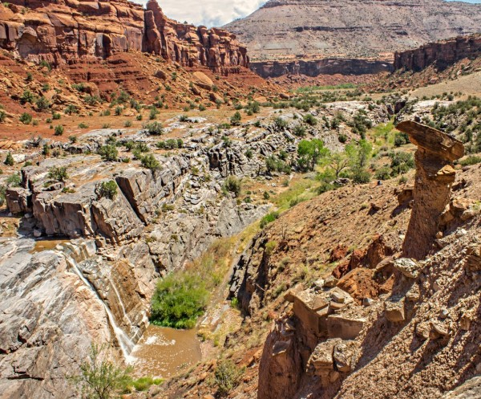
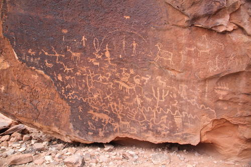
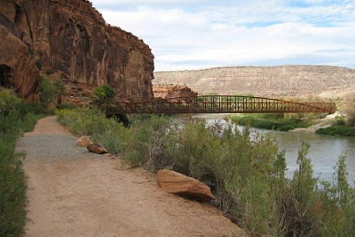

I kicked off my gappaticaltirement with a wilderness meditation retreat through *[Impermanent Sangha](http://www.impermanentsangha.com/)* in Boulder, CO. Insight meditation retreats in the US are almost always indoors, so I felt like this was a unique and appropriate way to set the tone for my upcoming European bike trip. The idea was to do five days of backpacking and hiking in the mountains near Leadville, Colorado, combind with a lot of meditation and just dwelling in nature, and to conduct the retreat in relative silence. However, after landing at the Denver Airport, I got a voicemail that the retreat had been moved to Dominguez Canyon near Grand Junction, CO due to rain and frigid temperatures in the mountains. Of course, I had packed completely wrong for the desert, but whatever, an insulated winter coat could theoretically provide sun protection, right?

_Note: None of these photos are mine, because I didn't want to deal with any electronics during the retreat, but they're **just like** the photos I would have taken :)_

\[caption id="attachment_482" align="alignnone" width="600"\] Domingez-Escalante National Conservation Area\[/caption\]

I drove in with another retreatant named Don, who had offered to give me a ride over email. Once we arrived, all 15 of us hiked in--around 5 miles. Nobody in the group had been to Dominguez before, but the leader (Johann) found a perfect campsite next to a waterfall. I was worried that I wouldn’t find a place to set up my backpacking hammock (great for the mountains -- horrible for the desert), but I found some scrubby trees straddling a game trail, and managed to string the hammock a few inches off the ground.

\[caption id="attachment_481" align="alignnone" width="600"\] We camped next to the top of this beautiful mud waterfall.\[/caption\]

Unfortunately, although it rarely rains in the desert, ‘rarely’ is not ‘never’. It rained a _ton_ on us. It made it difficult to cook, and the food and equipment were constantly soaked. Of course, it felt kind of badass to be meditating outside in the rain, but the fun ended when the ‘game trail’ under my hammock turned out to be a ‘raging river of mud and silt’, foiling my naive waterproofing job and soaking my gear and my laptop computer (why in the world did I ever bring the computer?).

But, the desert dries out quickly, and the dampness was gone much faster than it would have been on the East Coast. The last three days were dry and I was able to sink into my practice.

Compared with a conventional indoor retreat, meditating in the wilderness was a more ‘external’ experience… the sounds and smells of the desert, the feel of the wind, and the sights of the canyon as the shadows moved through the day. There was a lot to take in compared to a meditation hall.

\[caption id="attachment_480" align="alignnone" width="500"\] There were tons of petroglyphs along the hiking paths.\[/caption\]

There were also numerous unavoidable disruptions. We had to follow instructions, help prepare meals, and deal with the challenges imposed by that particular desert environment: brutal sun alternating with unpredictable thunderstorms, large day to night temperature swings, maintaining equipment and hygeine in the presence of a lot of dirt and mud, and the occassional (but not relentless) insects and critters. But, that was the point. Johann spoke about the difference between meditating in stillness (in a meditation hall), meditating in movement (repetitive tasks like walking meditation), and meditating in action (like hiking). Life tends to have a lot of action, so I appreciated the opportunity to practice mindful action.

Over the course of the five days, I became amazingly keyed in to the sensory experience of being in nature. I also stopped minding the heat, sun, and bugs so much, and I started to appreciate the vastness, ancientness, and independence of nature. Instead of using the desert as a backdrop to my internal running monologue of plans and memories, I was able to (more than ever) appreciate the feeling of the wind or sun, or the sound of weather or animals, or even just the changing feelings of my own body during long hikes, and I could do it for hours at a time.

\[caption id="attachment_479" align="alignnone" width="600"\] This puzzlingly well-constructed pedestrian bridge marked the beginning and end of the retreat.\[/caption\]

Re-entry was much smoother than indoor retreats, and somehow it was even smoother than my typical backpacking trips. For once, I wasn’t shocked or repelled by re-entry into civilization, and I wasn’t even interested in gorging on fast food. I barely made it onto my flight in Denver due to an ill-advised stop at the Glenwood Hot Springs, but I was saved by TSA Pre yet again (best $100 I ever spent). From there, it was on to visit Jared, Kristen, and their new daughter Stella in Phoenix, and then on to drive down with my mom to visit my sister and her daughter Hadley in Wilmington, NC.

Overall, the wilderness retreat was an amazing experience that could not have been timed better for me. It was also quite affordable (especially if you ignore the plane tickets). I highly recommend it, and I wish that this sort of retreat was more widely available. I may get involved in assisting with running the retreats next year… we’ll see where that goes.
