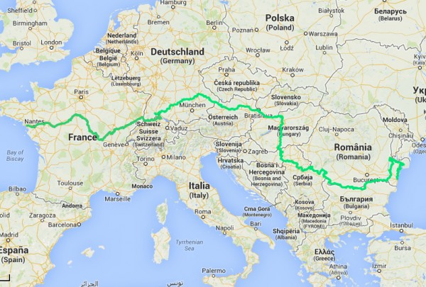
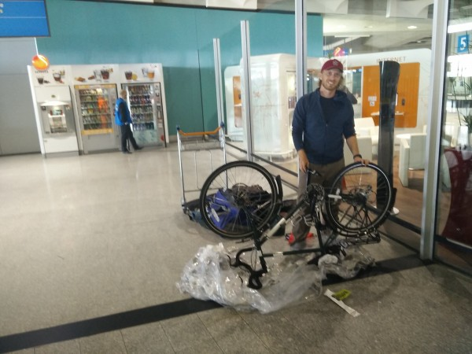
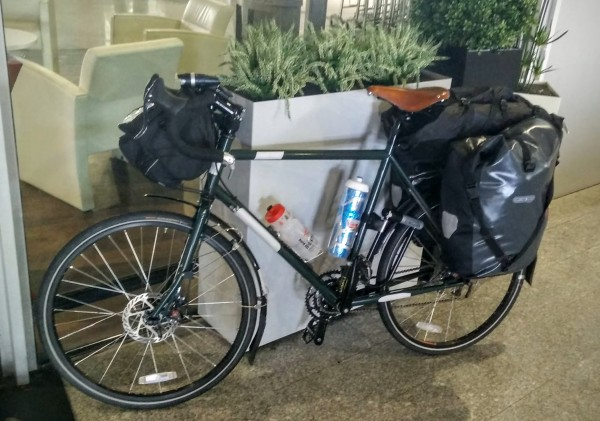
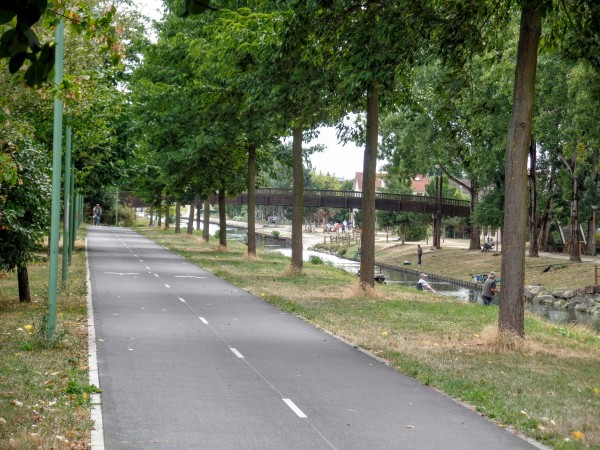

I've just started what I expect will be the longest trip I've ever taken. The plan is to take 3 months to bike across Europe on a route called Euro Velo 6, or 'The Rivers Route'. (See the [official site](http://www.eurovelo.com/en/eurovelos/eurovelo-6), or the [interactive map](http://www.bikemap.net/en/official/2938-eurovelo-6/)). The 2,270 mile route is the most well-developed of the [Euro Velo Routes](http://www.eurovelo.com/en/eurovelos). It follows the Loire river through France and into Germany, and then it follows the Danube out to the Black Sea. Along the way, it crosses through France, Switzerland, Germany, Austria, Slovakia, Hungary, Croatia, Serbia, Romania, and Bulgaria. Most of the route, at least on Western Europe, is on dedicated bike paths and bike lanes.

\[caption id="attachment\_497" align="alignnone" width="600"\] Map of Euro Velo 6, the Rivers Route\[/caption\]

Why 3 months? Because that's how long you can stay in continental Europe (actually, the Schenzhen area) on a US passport. Of course, I could end early, or I could travel onwards to a place ouside of the Shenzhen area like Turkey, the UK, or... err... Ukraine.  But, 3 months would mean 25 miles/day. I expect to do more like 50 per day, which would give mean that I'd bike half of the days, and have the remaining half to explore Europe, like I'm doing now in Paris. In particular, I'd love to settle down for a couple of weeks in a place like Austria. So, 3 months seems like just about the right length of time.

During the trip, I'm planning to mix hostels, campsites, and 'stealth' camping, and probably some hotels as I get into the cheaper Eastern European countries. I'm excited to see so many places up close, to do it in a healthy and sustainable way, and to have the freedom and flexibility that bike riding affords.

Luckily, I won't have to begin the adventure all alone. Dee has offered to come join me after her bar trip and before she begins work. We will be biking together for 2-3 weeks, which should take us a good part of the way through France. By all accounts, this is a great stretch of the route, and it is especially known for its numerous castles.

Dee decided to rent a bike in Paris. I, of course, chose the far more expensive and logistically difficult option of buying one myself (a Surly Long Haul Trucker).

Over the past month, I've fit it with the panniers, fenders, and other equipment I'll need. Overall, the bike (plus some attached gear) weighs 36 pounds, while all my other gear weighs about 47 lbs. I know that I packed far too many clothes, so hopefully I can get that weight down by sending things home once I identify what I don't need. However, I've found in the past that I really value being able to switch between a few different outfits when I stay in one place. It just makes me feel civilized :)

Perhaps the biggest logistical issue so far was getting my bike and all my gear to Saint-Nazaire, France. Inside of France, we can use trains although they were tricky to reserve (thanks for the help, Julie!). As for the plane trip across the Atlantic, there is a standard $100-$200 oversized luggage fee. Also, you have to somehow pack your bike for travel. Searching the interwebs, I found 3 main ways to do this that are acceptable to most airlines:

- Bike box: You (or a bike shop) substantially disassemble the bike back into either a hard-sided bike box, or in the kind of box that bikes are delivered to bike shops in (pre-assembly). This makes the bike small, but it's a lot of work on both ends and your shifting, etc. can get out of whack. Also, even though it's boxed, baggage handlers are still known to damage the bikes. Finally, if you used a hard-sided box, what do you do with it once you get to your destination?
- Soft bag: You can also buy some type of padded bag that covers your bike. But, you still have to figure out what to do with the bag once you arrive.
- The [CTC bike bag](http://www.wiggle.com/ctc-plastic-bike-bag/), manufactured by a UK non-profit, has earned rave reviews on the internet. It's a large, thick, clear plastic bag. At around $20, it's semi-disposable. Although it affords very little protection, it does make it clear that your bike is, in fact a bike, hopefully evoking the sympathy and professionalism of airline baggage handlers. Also, it retains the unwieldy, lumpy, and sharp-pokey nature of your bike, discouraging the baggage handlers from stacking things on top of it. Finally, since the bag is so large, you don't need to disassemble the bike.

I chose the CTC bike bag, and I recommend it wholeheartedly. Per airline rules, I turned the handlebars, removed the pedals, and lowered the seat. I also detached the rear derailleur and halfheartedly padded some sensitive bits of the drive train. There are plenty of guides online on how to do  this. Then, I put the bike in the bag, generously duct-taped everything together, and presented it to the airport checkin staff, who didn't bat an eye.

The bike arrived in Paris in great shape. I had to throw out the bike bag, mostly because my exuberant duct-taping job had prevented it from ever being bag-shaped again. In the airport arrivals hall, I re-assembled the drive train, righted the handlebars, and attached the pedals. It drew some curious attention from onlookers, and even some help. The only damaged parts were the taillight (which I should have removed) and the front fender (which was partially broken anyways).

 

\[caption id="attachment\_493" align="alignnone" width="600"\] Re-assembling my bike in the arrivals hall of Charles de Gaulle Airport\[/caption\]

 

 

 

\[caption id="attachment\_491" align="alignnone" width="600"\] The reassembled and fully operational bike, still in the airport.\[/caption\]

 

In a fit of irrationality, I then decided to bike straight from the airport into Paris, instead of simply putting my bike on the train. Luckily, someone had put together an [incredibly detailed set of instructions on doing this](http://www.mayq.com/Cycling_out_of_paris/Airports/Charles_de_Gaulle.htm), which I failed to accurately follow. However, once I'd gotten away from the area around the airport, the ride was incredibly pleasant. Most of it followed a beautiful bike path along a canal. Even in the city, the bike paths were well-defined and safe. I had bought a European SIM card at the airport, so I even had turn-by-turn bike navigation the whole way to the hostel.

\[caption id="attachment\_496" align="alignnone" width="600"\] Bike path along a canal going from CDG airport to Paris\[/caption\]

Now, I'm hanging out at a hostel in Paris for 4 days, waiting for Dee arrive so we can start the cycling part of the journey.

<iframe src="https://www.strava.com/activities/356651052/embed/574b12949cac783f4dcc5bbe35c405dc2a732cb3" width="590" height="405" frameborder="0" scrolling="no"></iframe>
