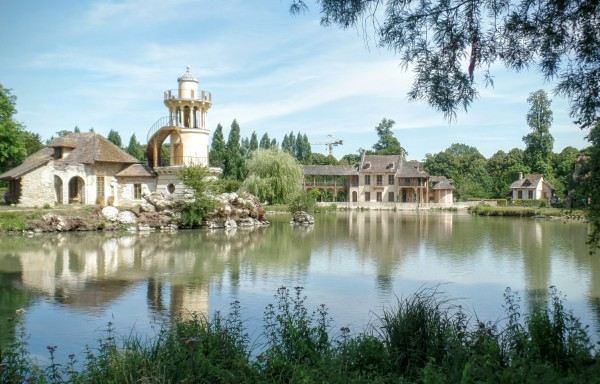

## Paris

My four days in Paris have been wonderful-I've been impressed by the city and by the French in just about every way. The good parts were just as good as expected: the food, the tourist sights, and well-dressed Parisians. And, the bad parts didn't really materialize.

I'd heard that waiters and shopkeepers were rude, and that people refused to speak English. But, I found the shopkeepers and waiters to be entirely pleasant. They certainly didn't always *fawn* over their customers, but most were friendly and all were extremely professional and serious about their jobs. I find the level of service to be far better in the US, *especially* from government-owned services. And, perhaps I'm too dense to notice, but I never felt mistreated for speaking English--in fact, the French seem to me to be more tolerant of foreign languages than people in the US.

Paris was exceedingly easy to navigate. Within minute of arriving, I had a working Europe-wide SIM card and I was getting turn-by-turn directions. Besides, streets are well-labeled and the train system is fantastic and affordable. Food was reasonably priced and really good (granted, I was dining cheaply).

One of the first things I did was to create my own guided tour of the free attractions in Paris. It turns out, there's a lot of them -- I barely skimmed the surface. Of course, the most famous is Notre Dame, the most visited tourist attraction in the world.

\[gallery type="rectangular" link="file" ids="534,533,532,523,530,531"\]

Over the course of that visit, and my next visit, and seeing the cathedral over and over again while travelling the city, the cathedral really grew on me. It is amazing that it can be so incredibly old (I believe it dates from the 1200's, although it has been added onto often), that it has remained standing and structurally sound, that its style has proved so timeless, but also that people with such primitive tools could plan and construct that kind of structure.

Of course, I continued on to see other sites. The place de la concorde featured a large obelisk. I usually ridicule obelisks as the most uninspired, formulaic, and uninteresting of all monuments. However, this obelisk was an historic one that was transported, at great expense and difficulty, from Egypt. It is covered in Egyptian hieroglyphs, and it's actually pretty cool. The Arc de Triomphe was quite amazing on its own, but even better was the swarm of comically small French cars swirling around it.

\[gallery type="rectangular" link="file" ids="519,520,521,526,528,527,525,524"\]

After touring downtown Paris, I set up a walking tour of the Musee d'Orsay. It had been recommended to me so strongly by my dad and by TripAdvisor (of course it was your opinion that counted, Dad!) that I chose to make it the one Parisian museum I would visit.

The museum did not disappoint, and neither did our tour guide. I usually find unguided museum visits to be pretty boring, bit I find well-guided museum visits to be phenomenal. Our guide gave us the a rousing recitation of the usual story of the Impressionists, which I always enjoy. However, he was especially heavy on ridiculing the old, formulaic, pre-impressionist style of painting (which I enjoy even more), and he had a vast knowledge of all of the vices and sexual escapades of the various painters. Near the end of the tour, I was reminded just how much I like Van Gogh paintings--they seem to have a style all their own.

\[gallery type="rectangular" ids="539,536,538,537"\]

I was glad to get out and enjoy the sights of Paris, since I stayed at the worst hostel in the world. It was actually clean and well-decorated, but it was *unbelievably* loud, and a lot of the travelers there basically just wanted to party but couldn't afford a hotel to do it in. Still, I was lucky to make a like-minded German friend named Henrik, who showed me around some beautiful parks.

\[caption id="attachment_541" align="alignnone" width="600"\] Hanging out with Henrik at a nearby park\[/caption\]

## Versailles

Of course, I also had to visit Versailles. I had heard so much about it, and it seemed to typify everything French: old, unbelievably expensive and beautiful, but also crowded with insufferable tourists.

I spent most of the time doing a bike tour of the gardens. We visited a local market to stock up on cheese and baguette, biked all the way around the 'grand canal', and had a French-style picnic overlooking the grounds of the palace.

\[gallery type="rectangular" link="file" ids="546,554,553,552"\]

I thought the most entertaining part of the tour was visiting Marie Antoinette's 'Austrian Village'. The story is that Antoinette, who was originally Austrian and a bit of a diva, was homesick for her native country. So, she ordered that a model Austrian village be built on the grounds of Versailles. It has a surreal, Disneyland-ish feel to it: the thatched-roof cottages are tasteful and sumptuously maintained, and the village just screams 'Austria'.

\[caption id="attachment_551" align="alignnone" width="600"\] Hameau de la Reine: Marie Antoinette's fake Austrian village at Versailles\[/caption\]

However, the water wheel doesn't work, and the villagers and all of the food and 'fresh-milled flour' had to be brought in each morning from an actual village. The entire thing is a sham--a facade. And, the most delicious part of it is how much it must have pissed off the French nobles (who hated Antoinette to begin with)--that she would squander so much of France's wealth to create a fake Austrian village just to escape them.

Of course, the palace itself was... simply palatial. It was beyond comprehension, and I doubt I'll ever visit a building that lavish again. Virtually every square centimeter was covered in tapestries, gold leaf, oil paintings, sculptures, and mirrors (which were of course very expensive in at the time). It is interesting to me that the French didn't find the whole a bit... gaudy? Garish? I mean, it just seems a bit overdone, and I think of them as a tasteful people (their choice in language notwithstanding). Maybe the style at the time was different.

\[gallery type="rectangular" link="file" ids="547,549,548,550"\]
