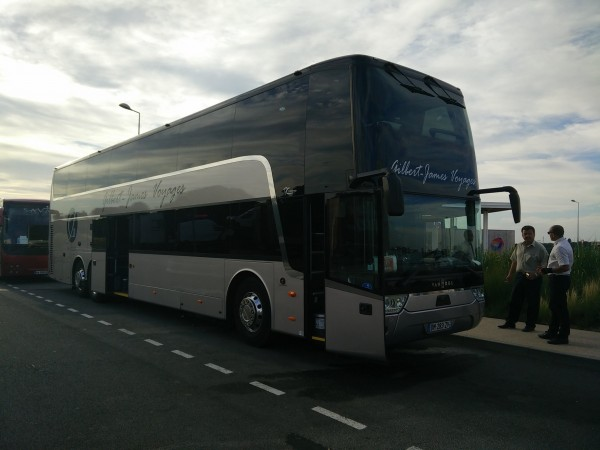
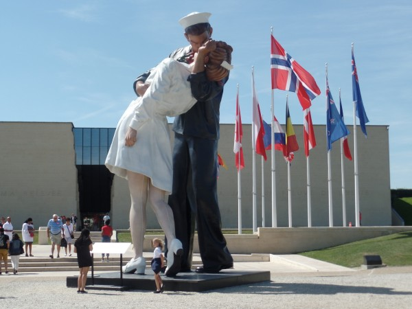
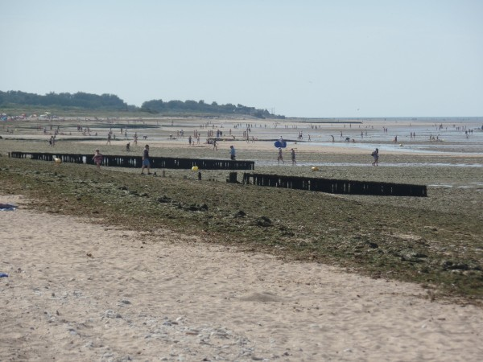

Since high school, I've had a chronic World War Two obsession. I've loved historical fiction movies like 'Band of Brothers' and 'The Pacific,' as well as documentaries like Ken Burns' 'The War', and I've read tons of books like 'With the Old Breed at Pelelieu' and 'Iron Coffins'. I just can't believe the sheer size and horror of the war, or the speed with which the world changed during that period. Of course, the iconic event for the US in WWII was the landing at the beaches of Normandy: particularly, Omaha Beach. Yesterday, I lived out a lifelong dream by visiting Omaha Beach and the famous US war cemetery there.

I booked a bus tour that I knew would be touristy, American, and probably cheesy. I then proceeded to completely miss the bus tour by sleeping in. Thankfully, they rebooked me (it was super expensive!), and the next day we traveled there and back (3.5 hours each way) through lush Normandy farmland on a comfy double-decker coach. What an easy way to travel!

\[caption id="attachment_559" align="alignnone" width="600"\] Comfy double-decker coach (with great views)\[/caption\]

Even though the guides were hard to understand, the tour was my favorite part of the trip so far. I've never really dreamed of visiting Paris, but I've dreamed *many* times about visiting Omaha Beach. (Does that mean I'm weird? :) )

Our first stop was at a WWII museum. It was neat, but not that remarkable. My favorite part was a 20-minute movie that went through the D-Day preparations and the battle chronologically, showing American footage on the left half the screen, and German footage on the right half. It was a neat format. I also loved the huge statue out front: it was very French.

\[caption id="attachment_572" align="alignnone" width="600"\] Humongous statue outside of the WWII museum\[/caption\]

Next was Pointe du Hoc, where the soldiers of the 2nd Ranger Battalion heroically scaled a cliff, at great human cost, to take out several large German artillery guns. Unfortunately, the guns had already been moved far away from the battle. The event is commemorated by an enormous statue, which speaks for itself.

\[gallery type="rectangular" ids="566,573,568,567"\]

Also at Pointe du Hoc, I got to spend some time exploring bomb craters and the ruins of German bunkers. I’m pretty sure I recognized the inside of several bunkers from WWII video games.

\[gallery type="rectangular" ids="571,569,570"\]

It was eerie and memorable. On the one hand, the bunkers and craters were such hard, physical evidence of the carnage that happened there. But at the same time, the wildflowers, the perfect weather, and the ocean breeze were so tranquil. It was nice to see that even that kind of destruction eventually fades away and can be replaced by something pleasant.

\[caption id="attachment_560" align="alignnone" width="600"\] The beaches of Normandy are back to being popular tourist spots.\[/caption\]

Afterward, we visisted the Normandy American Cemetery and Memorial, which is often shown in WWII documentaries. There are around 10,000 soldiers buried there. No expense had been spared. The landscaping was absolutely immaculate--beyond anything I saw in Paris. It was such a powerful metaphor to have American imagery (bald eagles, flags, etc), architecture, and landscaping in the middle of the French countryside. I had never been to a military cemetery before, and the effect of the thousands of white crosses (and occasional star-of-David's) lining up along different angles was chilling and awe-inspiring.

\[gallery type="rectangular" ids="563,562,561,564"\]
