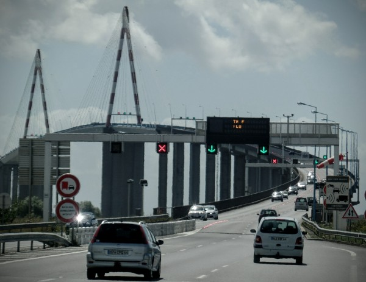
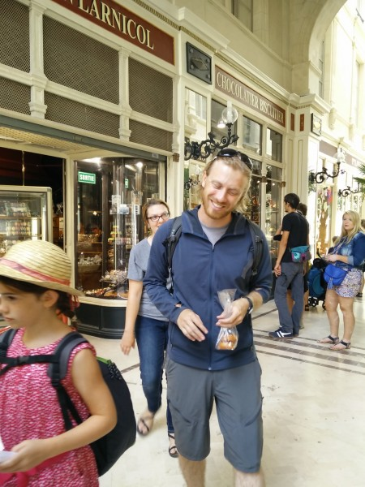
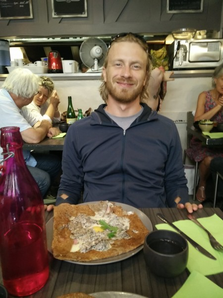
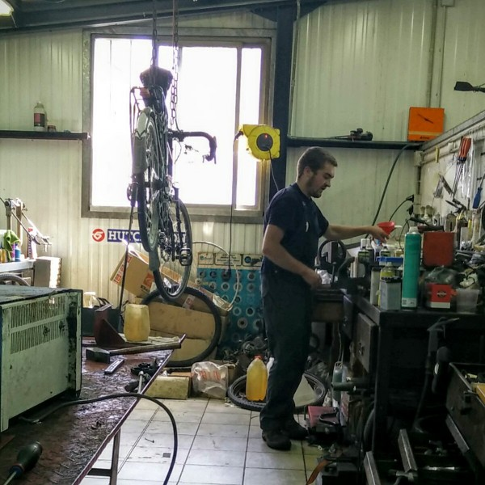
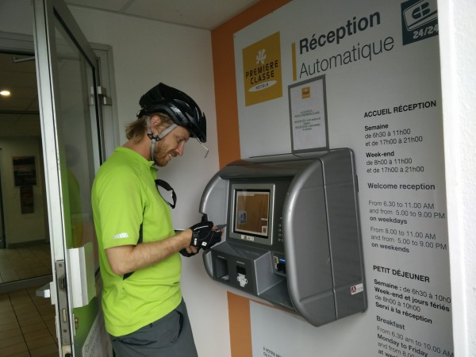

The bike trip is going strong. The scenery is beautiful, the path is well-signed and safe, and we are gorging ourselves on French cuisine. We are now 7 days in, which is nearing the halfway point of Dee's visit with me. We are starting to pick up speed as we get used to the bikes and as we get better at managing our camping gear, and within a few days we should be in the heart of castle country.

# Day 0: Getting to the starting point.

Dee arrived in Paris via plane, and things went more or less according to plan. She rented the bike that she had pre-arranged with a bike shop--it wasn't perfect, but it will do--and we packed it up with her stuff. Miraculously, everything seemed to work. We then rode directly through the busiest parts of Paris to the train station. Considering that Dee was on an unfamiliar bike with a ton of weight, and was also jetlagged and in a new city, she did a great job keeping up.

We had a reservation for ourselves and our bike on the train (thanks again, Julie, for helping!), and the ride couldn't have gone more smoothly. Surprisingly, our destination (Saint-Nazaire) was a bit of a ghost town.  We stayed in a strange and extremely empty hotel run by a Chinese family, but we were just happy to have a clean place to stay, and I was happy to be out of that 'party hostel'.

# Day 1: St Nazaire to Le Mignon Campground

 

St Nazaire is an oceanfront port that also has some nice oceanfront beaches. Currently, it's semi-famous for being home to the two battleships that France is currently refusing to sell to Russia, as part of some well-publicized EU sanctions.

The city is just across the Loire river from the starting point of the trail. Unfortunately, the bridge that we had to cross, which looked quite approachable on Google Maps, was a bit terrifying in person:

 

\[caption id="attachment\_591" align="alignnone" width="600"\] The St. Nazaire bridge was not especially bike-friendly.\[/caption\]

The bridge is very large, somewhat steep, and it has a very narrow shoulder/bike lane. Apparently, some riders wait a few hours to take a city bus across the bridge. The problem isn't necessarily the width of the bike lane--it's the extremely high winds that affect both the bikes and the cars. If we had been more used to riding our loaded bikes, we might have tried it. As it was, we decided to just walk across on the narrow sidewalk. It took a long time and it was super annoying.

 

\[gallery type="rectangular" link="file" ids="598,602,601"\]

However, we eventually made it. The first day of riding was pleasant and uneventful. We stopped at a campsite for the night, and we were impressed by the price (around 8 euros), the facilities, and the fact that there was a kitchenette in the womens restroom (with men who would come in and use the microwave!)

\[gallery type="rectangular" link="file" ids="590,599,589,588,597"\]

So far, camping has been easy to manage and really pleasant (thanks in no small part to the amazing weather). It has been one of our favorite parts of the trip.

 

<iframe src="https://www.strava.com/activities/361126740/embed/f2c5f44cef7cdf4c5bee38706a45e026bd1ff0bc" width="590" height="405" frameborder="0" scrolling="no"></iframe>

 

# Day 2: Le Mignon to Nantes

We did a short second day so that we could spend a long evening in Nantes, which turned out to be a beautiful city. First, we checked in at a hostel and did all of the naive touristy things we'd normally to do.

\[gallery type="rectangular" ids="593,592,596,614,594"\]

However, we then realized that our good friend Julie used to live in Nantes! She gave us a whole new set of must-do activities, so we decided to spend the next morning and afternoon in the city and spend a 'day in the life of Julie Lamarche'. First, we ate breakfast at a cafe that was in a beautiful, historic shop covered in oil paintings, sculptures, and intricate tile work. The menu included a detailed description of the cafe's unique history, but it was in French, so I have no idea what it is.

\[gallery type="rectangular" link="file" ids="587,586"\]

We also checked out Le grand éléphant at Les Machines de l'île. This huge, mechanical elephant is based in Nantes, but tours around Europe, spraying children with water with its mechanical trunk.

(note: you do not have to watch this whole video, there is no 'surprise' ending :) )

\[video width="600" height="360" mp4="http://www.rdchambers.net/wp-content/uploads/2015/02/VID\_20150806\_110719.mp4"\]\[/video\]

We wanted to go into the shop where they make the machines, but the line was unrealistically long. So, we moved on to an awesome little shopping mall where I got a bunch of sweets that Julie recommended. They were, of course, awesome.

Finally, we went to the one Julie Lamarche-approved Creperie in the entire world--she said that her "love for crepes comes from this creperie". It was, indeed, delicious.

\[caption id="attachment\_583" align="alignnone" width="450"\] I've never met a crepe I didn't like, and this was no exception.\[/caption\]

When we got back to the hostel to pick up our bikes, I discovered that I had an extra pastry left from the shop that Julie recommended. Dee snapped this series of candid, unstaged photos, which you may enjoy.

\[gallery type="slideshow" link="file" ids="608,609,610,611"\]

<iframe src="https://www.strava.com/activities/361757160/embed/dfc23b51caf0c32afef4c80555bf865e30265972" width="590" height="405" frameborder="0" scrolling="no"></iframe>

 

# Day 3: Nantes to Oudon

We left Nantes pretty late in the day, so we kept our ride short and stayed in Oudon, which we heard had a great campground.

<iframe src="https://www.strava.com/activities/362621796/embed/e59c170efe8678db85e0b2b1d618ab677c0aaf71" width="590" height="405" frameborder="0" scrolling="no"></iframe>

# Day 4: Oudon to St. Florence

Day 4 was our toughest day so far. First, we mistimed breakfast... and, the timing and quality of food determines about 90% of my mood. Secondly, just as my bloodsugar was dropping to its lowest point in days, we hit a huge uphill, whereupon I switched into my trusty granny gear, and my chain broke.

A chain breaking is a pretty typical bike problem, but I've taken the absurd approach of learning how to fix bikes "along the way". And, I've never fixed a chain before. So, I did some internet research. Apparently, you can fix the chain in two ways: (1) you can patch it together with a "quick link", or (2) you can push out the pins on the damaged link, remove it, reconnect the chain (now one link shorter), and push the pin back in. I didn't have any quick links, so I did (2), but reusing old pins with this type of chain is supposed to weaken it a lot. More importantly, I screwed up and bent a few of the links in the course of repairing it. Also, my front dereailleur somehow moved, and it no longer cleared my large chainring.

Basically, the bike worked, but it was entirely untrustworthy. So, we slowly pedaled to the only bike shop we could find in Ancenis and... of course... it was closed for the month of August. Ugh. I was close to despair, but luckily, a Frenchman ( who spoke absolutely zero English ) understood our plight and took me in his car to a nearby general-purpose machinery store. It turned out they had all of the right parts, and even a mechanic who happily fixed the bike.

 

\[caption id="attachment\_580" align="alignnone" width="600"\] The bike mechanic in Ancenis, who replaced my chain and re-adjusted some gearing.\[/caption\]

I watched him closely to see how he did it, bought a few extra spare parts, and did some reading--and now I'd feel comfortable dealing with most chain or derailleur issues on the trail. I also tuned up my gearing, and my gears are finally switching easily again.

It was a great experience to be reminded of how willing people are to help out a cyclist in need, and how many resources there are for cyclists in these countries. And, it helped me to realize that knowing how to properly fix this bike is very important. It will greatly reduce my stress levels and prevent emergencies, especially as I approach less developed Eastern European countries.

Lessons learned:

- Be very careful about shifting under load, especially while going uphill.
- Bring spare chain links with me.
- Knowing how to fix the bike is important.
- If I can't fix it, there will always be people around to help.

 

<iframe src="https://www.strava.com/activities/363485279/embed/19b4c7d4dd38d7f0f06986db4582d1d0c27c4877" width="590" height="405" frameborder="0" scrolling="no"></iframe>

# Day 5: St. Florence to Angers

Day 6 was our longest day yet. We finally succeeded in getting out of camp early, not taking too many stops, and not having our bike drivechains explode all over the pavement. We went about 60km (40 miles), which is the longest day yet for both of us. I think we've done a good job not overdoing it or getting injured the first few days, and now we can think about pushing it a bit harder (so long as it doesn't interfere with our sight seeing or gourmet eating :) )

The day ended with checking into our cheap hotel near Angers. The receptionist was out between 11am and 5pm, so we used the 'Reception Automatique', which looked like an ATM machine. After a great deal of thinking and processing, it coughed out some key cards. Cool!

\[caption id="attachment\_582" align="alignnone" width="600"\] The automated hotel receptionist\[/caption\]

We walked through the deserted hotel to our room (the hotel was pitch black, but motion-sensing lights would turn on for a few seconds as we walked under them). It felt distinctly like a self-storage building for people. Unfortunately, our miniature hotel room was covered in someone else's trash - it hadn't been cleaned. And, we discovered the downside of the Reception Automatique: no matter how much you complain, plead, or swear, it just keeps trying to check you in.

Eventually, a human receptionist arrived and treated us great (she even gave us a free hotel room to store our bikes).

<iframe src="https://www.strava.com/activities/364184200/embed/c33e45494cc93e3e4a8a596d5931c1817e795dca" width="590" height="405" frameborder="0" scrolling="no"></iframe>

# So...

Thus far, the trip has gone great. The bike route is amazing, and I hope to post some pictures of what the facilities, roads, and trails are like. We just started to enter wine country, so the scenery should only improve from here.
