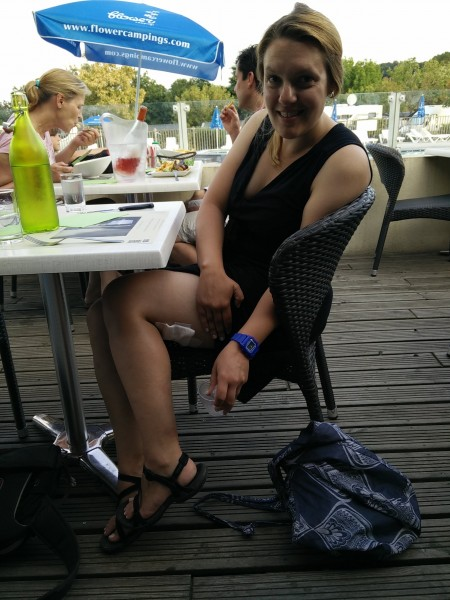

Today I (Dee) am guest posting about my experience biking with Rob for the first two weeks of his trip! So far we've traveled from St. Nazaire to Amboise; we're splurging and spending the night in a little bed and breakfast in Poce sur Cisse, France, which is a 4km bike ride from the main city. Today we plan to go into town to check out the chateau and Da Vinci's last residence after a leisurely morning of breakfast, washing things, and internet.

I'm really grateful that Rob invited me to join him for this beautiful stretch of France and I'm so happy that I accepted! Earlier this summer I was telling Rob that I had no idea what I would do for my "bar trip" (it's a post law-school tradition to do a big trip after taking the bar exam.) I knew it would be the last time for quite a while that I'd have three solid weeks with no responsibilities and I wanted to do something I couldn't do on a long weekend or week off. This has been perfect, plus it gave me a reason to make myself bike about 50 miles a week while studying for the bar so I'd be ready, which in all honestly probably kept me from going insane.

Even though I made sure to do some training this summer, this trip has been a real push for me. I thought we'd be doing about 40km a day, so I made sure to do that length at least once a week this summer. At this point our 40km days are our 'medium' length - we've done 55km+ at least three times so far and it feels really good! I'm hoping to try 70km or more at least once before I have to go home next week.

Last Sunday, August 9th, was probably the hardest day for me. We had done around 57km the day before, and we were about 55km again that day. It turned out to be incredibly hilly as well, which was a struggle for me because hills are my weakness. With Rob's help I worked on some hill strategies, such as standing while pedaling for short, steep climbs, or pedaling very, very slowly in a low gear for long climbs. At the end of the long day of climbing my thighs and knees were burning but I felt really accomplished. We found a McDonald's right at the end and enjoyed a parfait as a reward. (Note that this is the only McDonald's I've ever seen with dedicated bike parking.)

\[gallery type="rectangular" link="file" ids="629,628,627" orderby="rand"\]

At the end of the day I was feeling like I was becoming a real cyclist, and I was looking forward to using the muscles I knew I'd gain going forward. Then, I got in a bike accident. (I'm ok!) Between the hills, the length, and the accident, I feel like this day was truly the day I became a real cyclist, as I don't know a single serious cyclist who hasn't had some kind of scrape. Luckily, mine was very mild. I was following Rob around a roundabout and a motorcyclist apparently thought I was about to exit when I was not. He plowed right at me, but we saw each other a few feet away and both applied our brakes. By the time we collided, we were going extremely slowly and we really kind of tripped over each other. I walked away with a small bruise and burns in three places where my bare skin touched the motorcycle's engine.  Although the top one was pretty certainly a second-degree burn, based on its size, placement, and the Mayo clinic's first aid directions, we decided that cooling it down and keeping it clean was all that was necessary. Even the bikes weren't harmed and we have continued with only the added task of figuring out the best bandaging system. (Happily French pharmacists are very knowledgeable!)

That night we enjoyed the company of some fellow cyclists from England, with whom we shared a camper site, since all the other spots at the campground were full. We treated ourselves to a nice dinner at the nearby restaurant and then slept like dead people!

\[caption id="attachment\_630" align="alignnone" width="450"\] Enjoying dinner after patching up the burn from the motorcycle accident.\[/caption\]

Since that one big day I've noticed a huge difference in my ability to tackle big hills. Even though it still feels really hard sometimes (especially when it's really hot out,) I can get up pretty much every hill with just a few breaks and I haven't walked at all since that day. I'm looking forward to joining some cycling clubs in Boston when I return and doing some research to set up the bike of my dreams!

~Dee
