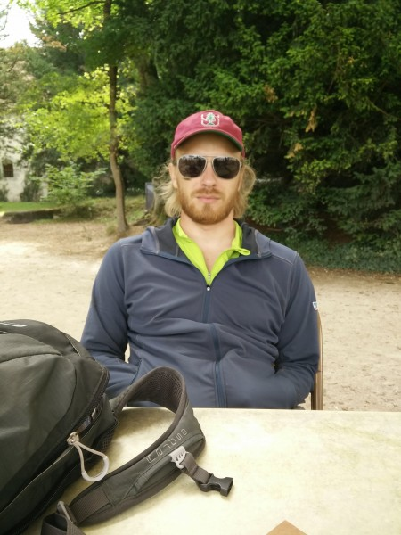
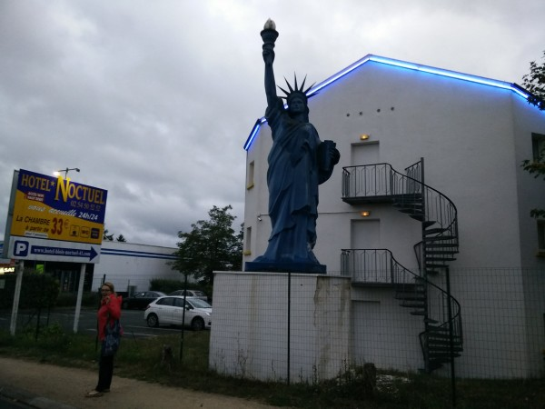
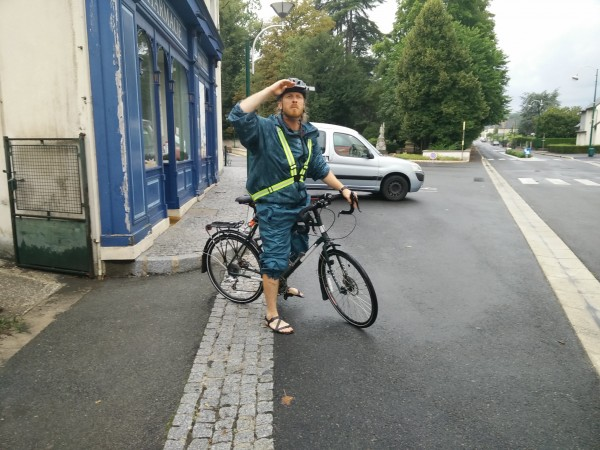
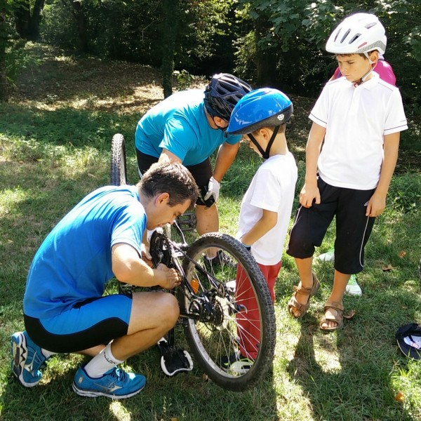
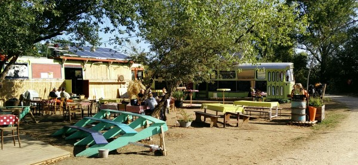
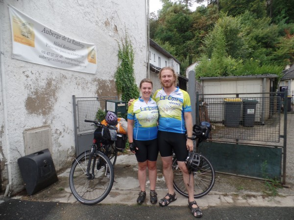
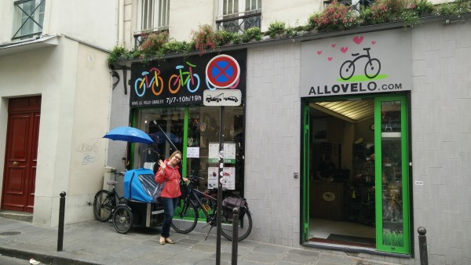

A few days ago, I rode with Dee to Paris to return her bike so she could fly back to the US. I am so glad that she was able to join me for those 2 weeks--we've always wanted to do a long bike trip together, and the Loire Valley was the perfect setting. The roads were safe, the hills were manageable, and the towns and chateaus were beautiful. It was great to have someone to share this section of the trip with, and it was impressive to see Dee improve her conditioning and start to tackle long hills with ease.

Of course, the route through the Loire valley is famous for its chateaus (castles)--I didn't realize just *how* famous until this trip. And boy, did we see a lot of them. Even the smallest towns seemed to have one, and the big castles were astonishing and timeless in their beauty.

\[gallery type="rectangular" ids="653,654,645,644,643"\]

Of course, after a couple of weeks of castling, one could get a little chateau-weary.

\[caption id="attachment_642" align="alignnone" width="450"\] Myself nearly asleep at yet another beautiful chateau. That blur is a bee flying in front of my nose.\[/caption\]

My favorite landmark on this part of the journey was Leonardo Da Vainci's house, known as the Chateau du Close Luce, in Amboise. Of course, Da Vinci was Italian, but he was invited to spend his last few years in Amboise. He helped to organize the building of a canal system, he produced art, he through huge parties, and he invented new machines. Because the King was a generous benefactor, Da Vinci seemed to have a very central role in the city, even though he died after only 3 years there.

I was stunned by the multitude of Da Vinci's interests, and I must admit that I was absolutely enamored with the mechanical machines he devised to do everything from pump water, to move cargo, to pivot bridges across canals to let boats through.

\[gallery type="rectangular" ids="655,651,650,649"\]

Of course, occasionally we had to take breaks from castle-watching to eat, sleep, and even bike. We camped most nights, but if it was going to rain we sometimes stayed in achingly low-budget hotels like this one:

\[caption id="attachment_647" align="alignnone" width="600"\] The glorious replica of the statue of liberty belies the spartan interior of this hotel.\[/caption\]

During the day, I braved storms and entertained onlookers with my monocolored Frogg Toggs rain suit which, unfortunately for my road visibility, was exactly the color of a bad rainstorm.

\[caption id="attachment_648" align="alignnone" width="600"\] Me in full rain-suit attire.\[/caption\]

At other times, we stopped to help other bike tourists in need. This poor boy had wedged his chain in his crankshaft so completely that it took three full-grown men to pull it out. We then managed to remove a bent link and patch up the chain, and miraculously, the bike was rideable again.

\[caption id="attachment_638" align="alignnone" width="600"\] We were briefly members of the 'Interational Bike Repair Core'\[/caption\]

The trail was peppered with surprising, interesting places, like this cafe and concert area that was run out of a pair of vintage school buses.

\[caption id="attachment_639" align="alignnone" width="600"\] Neat little cafe / concert venue we stumbled upon.\[/caption\]

At one point, the group synergy was so strong that we got matching tourist bike shirts.

\[caption id="attachment_646" align="alignnone" width="600"\] Dee felt that if we wore matching shirts, drivers would know we were together and be less likely to run her over in a roundabout. I'm not so sure...\[/caption\]

Of course, all good things come to an end, and Dee eventually had to return her trusty bike (actually, a men's bike that was way too big for her and not very well-tuned).

\[caption id="attachment_637" align="alignnone" width="600"\] Dee saying goodbye to her trusty bike.\[/caption\]

So, I'm now out here on the trail all alone. I wish Dee could have kept on going with me but, of course, she has real-world commitments to get back to: her new job starts in just a few days. And, the disappointment of her leaving is slightly tempered because she had to give me back the beautiful Brooks bicycle seat she had been borrowing. So, while my heart aches, my ass is much more comfortable. Meanwhile, I'm about halfway through France and I can't wait to get to Germany so I can start to speak English again.
