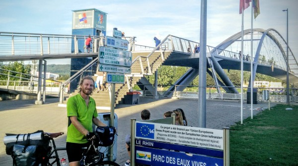

Last night I crossed over from France to Switzerland. I was in France for around 1200km (740 miles), which is about a third of the length of Euro Velo 6. It took me about three and a half weeks to do it, but I sped up  as time went on. I now average about 90km a day. At that pace, it will take another 25 days of biking to finish, and it will take even less if my mileage improves.

Entering a new country on bicycle is *really* different than doing it in a car, train, or plane. The anticipation builds for days as the countries' different architectures begin to mix, and as you notice distances to foreign cities marked out on signposts. As you get really close, you start to hear different languages and see joggers and bicyclists from the other country. By the time you hit the border, you've had so much time to think about it that it really feels like a momentous event, like a real accomplishment. The point where I crossed into Switzerland was the "Bridge of Three Countries" - one side was in France, and the other was at the border of Germany and Switzerland. It sure would have been an interesting place to be in WWII...

\[caption id="attachment_691" align="alignnone" width="600"\] Ready to cross the Three Countries Bridge into Switzerland\[/caption\]

I loved visiting France, and I'm so glad to have been able to spend so much time there. I will miss their vastly superior yogurt (allegedly, it is so superior because it is unpasteurized, which is of course ironic because Pasteur was French...). But even more than yogurt, I will miss the cheese.

The cheese in France redefined my idea of what cheese is. Every single one was unique--different tastes, smells, colors, and consistencies. Most of the had some type of 'skin' on them; some were massaged with champagne each day to add flavor; others had ash on the inside, or the outside, or had a unique mold or fungus in them. Often, they came in funny shapes resulting from the manufacturing process, or in some sort of imaginative packaging. I didn't even have to think  about what I would do for lunch most days: cheese and baguette, and maybe some jam to go with it. The only question was which of the beautiful picnic spots to stop at.

\[gallery type="rectangular" ids="685,686,684,683,688"\]

Of course, the trail in France was gorgeous. Last post, I talked about the many chateaus. However, the views along the canals and rivers were just as enjoyable.

\[gallery type="rectangular" ids="687,677,676,674,673"\]

The bike path in France has been awesome--it's safe, reasonably-well marked, and ridiculously flat. Businesses seem thrilled to have the bike path nearby, and nearly all of them display 'accueil velo' (cyclists welcome) signs. It seemed to me that, with the exception of the towns that are near the really first-class cheateaus, a lot of central France is a bit down on its luck, and the tourist facilities are underutilised. So, the towns seem to be investing heavily in these bike paths as a way to attract tourists. The hotels and restaurants were very accommodating of our bicycles, and the campsites in particular seemed to genuinely enjoy hosting cycle tourists. They often even gave me their business cards so I could advertise to cyclists coming in the other direction.

When the path didn't follow a canal or river, or when it was traveling between waterways, it usually meandered through farmland and vineyards. These were some of my favorite stretches, since they could be so isolated and calm. I enjoyed seeing the diversity of the crops being grown, and it was nice to see the livestock being treated reasonably well.

\[gallery type="rectangular" ids="681,678,682"\]

The biggest change in the last week or two has been that I've started to meet a lot of new people. I think part of it is traveling alone, which encourages people to approach me and also makes me more likely to approach them. Also, as I leave the most popular parts of the path in France, I'm encountering more of the hardy, long-distance types of cyclists, as opposed to the families out on holiday. Finally, people seem to speak more English as we approach Germany and Switzerland, so I'm able to connect much more easily.

\[gallery type="rectangular" ids="672,679,675"\]

As much as I've loved France, I'm entirely ready to be on to the next country, if for no other reason than to be able to communicate with people. I was disappointed by how few people spoke English in France. Of course, the young or college-educated people might be able to, but they've probably already moved to the city. It was an isolating experience to travel here alone. At least in developing countries, people have the time and interest to try to work out what you're saying with some combination of finger-pointing and charades. In France, a lot of people seemed genuinely annoyed at my pathetic, broken French, and weren't willing to try any broken English of their own, so it made me less likely to talk to people. In speaking with other travelers from the Netherlands, Germany, Romania, the UK, and Switzerland, I learned that I wasn't alone in feeling this frustration.

So, I'm really excited to be in Germany and Switzerland, where from what I've seen everybody speaks flawless English, as well as four or five other languages. (Not only that--they can actually tell from my accent that I'm American, and not English!) Next up is Lake Constance, but I'm going to try and keep up a good pace, because I'm hoping to spend a lot of time in Budapest and in Eastern Europe.
