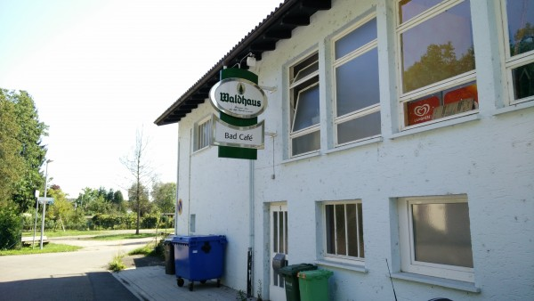

EuroVelo 6 is in Switzerland for only about 100 km total. Even during that time, it weaves in between Germany and Switzerland constantly. In fact, the only way I could tell which country I was in was to either ask someone, or to buy something and see what currency my change was in (Euros, or Swiss Francs). The border is baffling along the Rhine--the two countries fit together like puzzle pieces, and although the border has been one of the most historically stable in Europe, it seems capricious and often doesn't even follow an obvious geographical feature. But, the bike paths are great, the streets are safe for cyclists, and \*shock\* the businesses are actually open when you want to visit them.

Switzerland is drastically different than France. It is clean, well-ordered, multilingual, and business-focused. It is also very federalistic (is that a word?), in that its cantons (states) function like their own smaller governments. The cantons speak different languages (official languages include Italian, German, French, and Romansch), but Swiss-styled German in one dialect or another is the most common. They don't even have a real president--they have a seven-member Federal Council, and the presidency rotates between the members periodically. In contrast, France is incredibly centralized in Paris; its power is wielded primarily by a few key politicians; it holds the French language to be almost sacred on the basis of its self-evident superiority; and its commitment to orderliness and the rule of law seems moderate compared to Switzerland. And, of course, Switzerland is _famously_ expensive; prices were often twice as high in Switzerland as in France or Germany, even though the shops or restaurants could be as little as 100m away from each other across the border.

Overall, I enjoyed Switzerland in the way that a tourist does: visiting museums, eating out, and sightseeing. My favorite museum was a paper museum (Basel, Switzerland used to be famous for its paper mills). The museum was housed in a historic but working paper mill. It had a complete, historically accurate paper factory powered by a water wheel, and visitors (especially kids) could make their own paper.

The manager spent a ton of time explaining how the machines worked to me, and he beamed with pride as he described the improvements he has been making to the equipment. He makes all sorts of specialty paper that the museum uses at fundraisers, or sells for exorbitant prices in its gift shop. His favorite product was a rough, grainy, elephant-shaped type of paper that was used as decoration in a fundraiser: the paper was made out of elephant shit, sourced directly from the Basel zoo. Apparently this is a common source of paper-making material in Africa: it just takes a lot of boiling and chemical treatment to get the stench out.

\[gallery type="rectangular" ids="704,705,706"\]

However, I never felt at home in Basel, simply because it was so expensive and built-up. I knew I had to keep my visit short to protect my budget, so I only spent a day before heading on to Lake Constance.

One unexpected pleasure of this part of the trip has been following the Rhine, which is a famous river that starts in Switzerland, feeds Lake Constance (known to the Germans as Bodensee, which is a _much_ cooler name), and continues on through Germany. It is culturally important to the Germans, and I can see why. It is a luscious blue color with swiftly flowing clear waters. And the temperature (at least in summer) is perfect for swimming. It also has impressive industrial corridors along some sections (primarily chemical plants), but they are modern plants and they don't seem to pollute the area at all.

\[gallery type="rectangular" ids="701,702,698,697,699"\]

And of course, Bodensee was pristine and beautiful. I only saw one small part of it, but I'd love to go back again someday.

\[gallery type="rectangular" ids="708,709,710"\]

A final pleasure of being in a German-speaking country, of course, is the ridiculous signs. I think German is similar enough to English that more of their words match ours, but have different meanings (homonyms?). Many of them sound like bad, dirty puns, but this one just seemed like poor advertising:

\[caption id="attachment\_700" align="alignnone" width="600"\] Any takers?\[/caption\]

I will now briefly travel without a river as I cross from the watershed of the Rhine, to the watershed of the Danube, which I will follow for the remainder of the journey.
